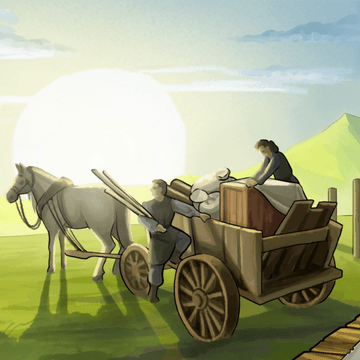
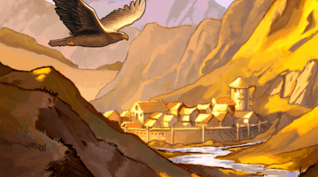
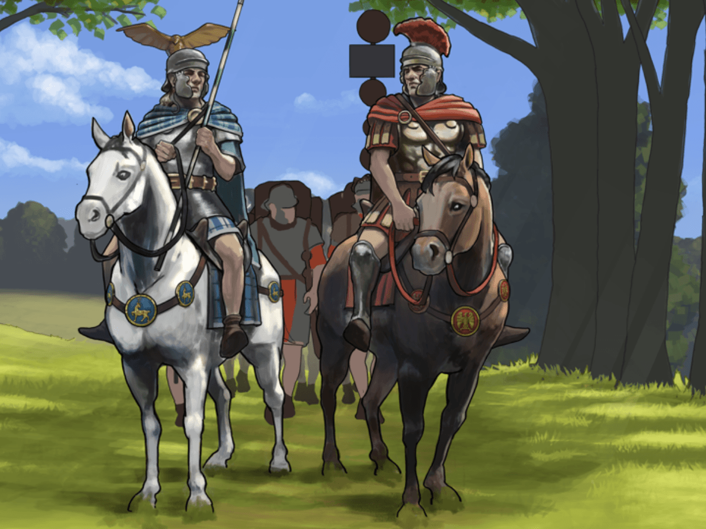

# Early development: Return on Investment

> Source: Unofficial Travian  
> URL: https://unofficialtravian.com/2025/01/09/early-development-return-on-investment/  
> Written on April 27, 2023

---

Welcome to the Thursday guides series! Last week we talked about how to pick proper capital, today we’ll talk about interesting development rule that experienced players use widely.

Most Travian players who maintain top-accounts operate (consciously or subconsciously) with what is called Return on Investment, or short form – ROI.

**Return on Investment is a ratio between income and investment. Or, in a more common Travian: Legends meaning, how soon you will get back resources you used to get a certain benefit before it would give you that benefit.**

And this is big part of what Travian: Legends (and almost any other strategy game) is about.

- **Should I conquer 3rd oasis to a non-capital 15-cropper?**
- **Which fields and in which order should I develop in my capital village?**
- **How early should I start training the army?**

All those questions pro-players answer by calculating ROI. And those are decisions that are to be taken daily.

#### **How does it work?**

Let’s look into the questions above and use them as examples.

##### **A player of x2 gameworld asks: should I conquer 3rd oasis (Crop +25%) to a non-capital 15-cropper?**

Let’s use ROI formula to calculate how fast this player will get their resources (investment) back and start getting a clear income.

Oasis +25% gives 2 100 of crop to player’s production (without gold bonus) and 2625 (with gold bonus) per hour for a fully developed (all croplands level 10) 15-cropper village.

Hero mansion upgrade from level 15 to lvl 20 costs 1 595 070 resources.

**1 595 070/2 625 = 607 hours**

That would mean that player’s investment will require 607 hours (~25 days) to only compensate upgrade of the Hero mansion to level 20 and only after that time it will give some “clear” income. Is it worthy investment?

Full economic development of a village (all resource fields to level 10, all resource buildings to level 5) will cost player around 1 350 000 resources in total and will give on x2 speed gameworld 16 800 (or more if there are oases/different cropper types) resources per hour.

**1 350 000/****16 800 = 80 hours**

Now the choice is obvious. A new village will start producing resources faster, will return investment earlier and also grant additional culture points and population.

Or, if the situation in a gameworld is risky, 1 595 070 resources will allow player to train let’s say 5,063 phalanxes. This is also decision that player can make.

##### **Which fields and in which order should I develop in my capital village?**

The famous made by players cropper developer calculator ([Cropper developer](https://blog.travian.com/wp-content/uploads/2024/10/Travian-Cropper-development-calculator.html)) is based on the same principle of ROI. It gives the most effective way to gain maximum resource income in the shortest time and optimal time.

##### **How early should I start training the army?**

The army should either give additional income that covers costs to their training and upkeep, or it should be trained when your economy is developed enough to train units without huge damage to your economy.

So, if you farm, best for start would be to use only your farm income for training additional units. 60% on army, 40% on developing your economy.

If you do not farm, we normally advise players (if there are no extreme circumstances and aggressive neighbours) to start training troops only when they have at least **2 fully developed** (all resources level 10, all resource buildings maxed up) villages. That way their economy won’t suffer early from the additional costs on army and will resist sudden damages and army losses.

And that’s a wrap! Hope that article will help you making meaningful decisions about your development in the game.

See you next Thursday for the next Guide!