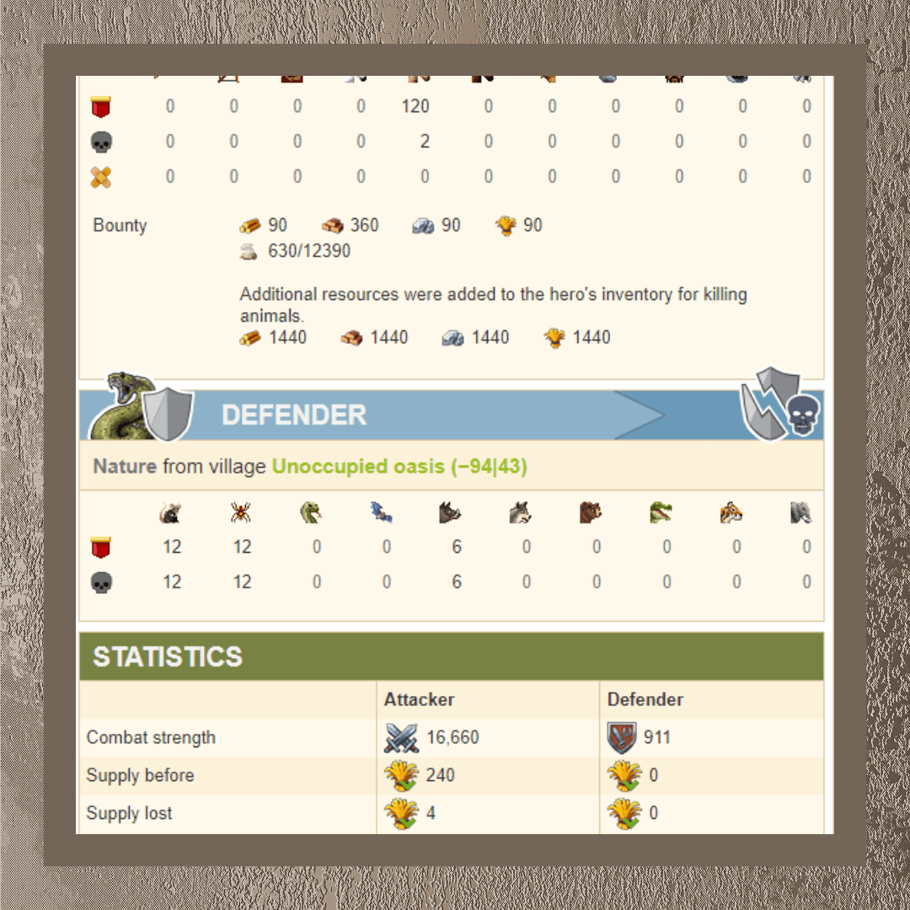
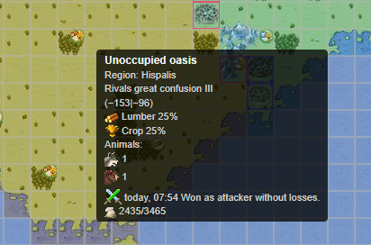
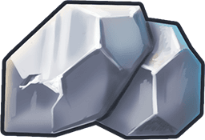

# Early game oasis farming ~ Feature description

> Source: Unofficial Travian  
> URL: https://unofficialtravian.com/2025/01/12/early-game-oasis-farming-feature-description/  
> Written on May 4, 2023

---

One of the most important changes in the game that happened within the last 2 years and affected the gameplay a lot is the introduction of oasis farming and granting rewards for nature unit kills.

#### **How the feature works:**

- **At the game start all oases are created without any resources but have some (in most cases rather weak) nature troops in it: 3 bats and 2 spiders, 4 boars and 1 bear etc.**
- Whenever a nature troop is killed, a certain bounty reward (40 of each resource type) is added to the hero inventory depending on the nature troop crop supply (see the table below). Those resources can be used whenever you need them to develop your village faster, just like task rewards.
- This extra bounty is clearly shown in the raid/attack report and in a combat simulator.
- Oases’ resource production starts once**all the nature units that originally spawned on the oasis are removed** – either through combat or capture.
- There is a special stage in the game that is called **initial protection of a gameworld**. **During this initial protection no new nature units would appear in oases after being killed.** You can still attack oases to get resources it produces (which will go normally into village warehouses and granaries you have sent your raid from).
- **Initial beginner protection of the gameworld****is a fixed period of time.** It depends on the speed of the gameworld and counts from the server start. Initial protection lasts 5 days for x1 speed, 3 days for x2 and x3 speed gameworlds, 2 days for x5 and 1 day for x10 gameworld.
- After the initial protection period is over, the new nature units would start appearing immediately and very fast! Watch closely and make sure you are prepared for that. Stop farming if you do that for resources to avoid losses and prepare for the initial “Rat hunt!”
- Players noticed that during the first couple hours (less on speed gameworlds) the appearing nature units tend to be rather weak: rats, boars, spiders. Only after a while the more dangerous units start to appear. Use this time to increase your hero resource stock!

#### **Important notes**

- The hero does not need to take part in the battle.
- The reward is granted even if all attackers – including the hero – are killed.
- You can see the number of nature units in unoccupied oases in a tooltip, so you do not need to open each one of those.

#### **Useful information**

##### **Oases types and units dependency**

There is a certain dependency on which nature units are more likely to appear based on oasis type.

|  | **Iron and Iron/Crop oases** | Rats,  Spiders,  Bats |
| --- | --- | --- |
|  | **Clay and Clay/Crop oases** | Rats,  Spiders, Wild boars |
|  | **Wood and Wood/Crop oases** | Wild Boars, Wolves, Bears |
|  | **Crop-only oases** | Rats, Snakes, Bears, Crocodiles, Tigers |

##### **Oases production**

All oases produce a certain amount of resources per hour, which is multiplied by the speed of the game.

Oasis produces 40 of focused resource (i.e Wood in Wood oasis, Crop in Crop oasis) and 10 of non-focused (i.e. Iron, Clay and Crop in wood oasis).

For example, oasis Wood 25%+Crop 25% will produce  40 10 10 40 per hour on 1x speed.  Doubled amount on 2x, triple on 3x etc.

##### **Types of nature units and reward**

| **Nature unit** | **Defence****against infantry** | **Defence****against cavalry** | **Reward** |
| --- | --- | --- | --- |
| Rat | 25 | 20 | 40  40  40  40 |
| Spider | 35 | 40 | 40  40  40  40 |
| Snake | 40 | 60 | 40  40  40  40 |
| Bat | 66 | 50 | 40  40  40  40 |
| Wild boar | 70 | 33 | 80  80  80  80 |
| Wolf | 80 | 70 | 80  80  80  80 |
| Bear | 140 | 200 | 120  120  120  120 |
| Crocodile | 380 | 240 | 120  120  120  120 |
| Tiger | 170 | 250 | 120  120  120  120 |
| Elephant | 440 | 520 | 200  200  200  200 |

And this is a wrap in terms of feature description. Come back next Thursday for the players pro-tips about how to farm oases most efficiently!