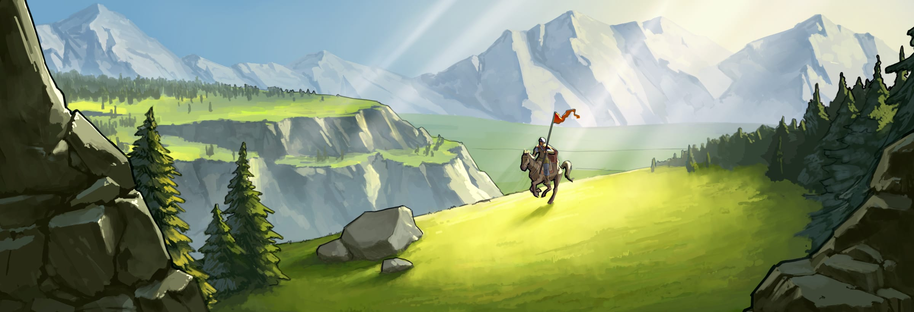

# Game Secrets ~ Advanced Start ~ Fast Fourth Village on x2 speed

> Source: Unofficial Travian  
> URL: https://unofficialtravian.com/2025/01/12/game-secrets-advanced-start-fast-fourth-village-on-x2-speed/  
> Written on June 19, 2024

---

The gameworlds with Advanced start become quite a regular option in the Travian: Legends. One of the upcoming worlds is Community week world where this feature will be present based on the community vote.

The advanced mechanics shortens the preparation time before the battles start. At the same time it requires more attention to this preparation stage and developing your economy. And what is more important than settling fourth village (likely your future capital) as fast as possible?

###### ***Disclaimer, this guide might not be the best of the best, yet it will provide you the general course of action. Feel free to adjust it as you see best based on your experience. We will be happy for all constructive feedback how to make it more optimal.***

##### **General advise and first steps in the game**

**Step 1 – Bonuses:** Activate 25% resource bonuses right after registration.

**Step 2 – Adventures:** Send hero to the first adventure. Complete other adventures as soon as hero is available. All points should be distributed to resources. (Optionally, if you spawned in area rich with oases, you can consider going on oasis hunting first and then distribute points into resources after your hero brings Book of Wisdom from the 6th adventure).

**Step 3 – Send your settlers to settle village 2 and village 3:** You can pick whether to settle them near your spawn village, or travel a bit further, the choice is yours. Long travel time might delay gaining enough culture points for settling fourth village, but might shorten travel time to the needed cropper.  More advise on that you can find in our previous article: [Game Secrets ~ Advanced Start](https://unofficialtravian.com/2025/01/12/game-secrets-advanced-start/)

##### **General settings:**

In this guide we consider starting tribe Egyptians, all hero experience points to resources and no oasis farming. Also, we consider that both village 2 and 3 are settled nearby and do not travel too long from the spawn.

- If your game supports “select second village tribe”, make sure you use that for more variety. You can send both sets of settlers with the selected tribe. Only first settled village will belong to the selected tribe though, second settled village will belong to avatar tribe.
- Use quests rewards to upgrade your hero after health losses, and make sure your hero is alive during the whole settling process. Don’t wait too long though, since your hero production is important in fastest settling village calculation.
- In the table below you might find lines like – Main building level 12. This doesn’t mean that you need to construct it fully to level 12 immediately. In general, construct cheaper buildings that give culture points when you are online, especially those that will provide you with quest rewards, and save resources for more expensive buildings during your offline hours. We recommend though to try keeping general order of buildings.

##### **Fourth settled village – Advanced start – Speed x2.**

- Reach 1525 points needed for the 4th village
- Get enough resources to run celebrations, train settlers and send them for the settling.

| **Spawn village** |  |  | **Settled Villages** |  |  |
| --- | --- | --- | --- | --- | --- |
| Woodcutter 5 x4 | 8 | 0 | Woodcutter 5 x4 | 8 | 0 |
| Clay Pit 5 x4 | 8 | 0 | Clay Pit 5 x4 | 8 | 0 |
| Iron Mine 5 x4 | 8 | 0 | Iron Mine 5 x4 | 8 | 0 |
| Cropland 5 x6 | 12 | 0 | Cropland 5 x6 | 12 | 0 |
| Main building lvl 12 | 18 | 12260 | Main Building 10 | 15 | 7150 |
| Rally point lvl 1 | 1 | 0 | Rally point lvl 1 | 1 | 430 |
| Cranny 10 | 6 | 5005 | Cranny 10 | 6 | 5005 |
| Marketplace 7 | 11 | 5620 | Marketplace 7 | 11 | 5620 |
| Barracks 3 | 2 | 2865 | Barracks 3 | 2 | 2865 |
| Academy 10 | 27 | 19675 | Academy 10 | 27 | 19675 |
| Embassy 1 | 5 | 540 | Embassy 1 | 5 | 540 |
| Wall 3 | 2 | 1565 | Wall 3 | 2 | 1565 |
| Warehouse 8 | 4 | 9295 | Warehouse 8 | 4 | 9295 |
| Granary 7 | 4 | 4475 | Granary 7 | 4 | 4475 |
| Workshop 1 | 4 | 1890 | Workshop 1 | 4 | 1890 |
| TownHall 1 | 4 | 4220 | TownHall 1 | 4 | 4220 |
| Extra crannies of level 3 x8 | 16 | 4080 | Extra crannies of level 3 x8 | 16 | 4080 |
| Crannies 7 x4 | 8 | 6540 | Crannies 7 x4 | 8 | 6540 |
| Smithy | 2 | 1090 | Smithy 1 | 2 | 1090 |
| Residence 1 | 2 | 1570 | Residence 1 | 2 | 1570 |
| Run Small Celebration at ~150 CP | 0 | 22360 | Run Small Celebrations in both villages at ~150 CP | 0 | 2 x 22360 |
| **End of development for Spawn and one of Settled villages untill 4th village settling** | | | | | |
|  |  |  | Residence 2->10(ONLY IN ONE SETTLED VILLAGE) | 12 | 59030 |
|  |  |  | Train 3 settlers |  | 63000 |
| Run second small celebration |  | 22360 | Run second small celebrations |  | 2 x 22360 |
| **Settle 4th village** | | | | | |

##### **COSTS and INCOME ~36-40 hours**

| Total costs | **447180** |
| --- | --- |
| Village production (2070 per village) | 223560 |
| Resource rewards for quests and adventures (approx from all 3 villages) | 120000 |
| Hero | 126720 |
| **Total Income** | **470280** |

