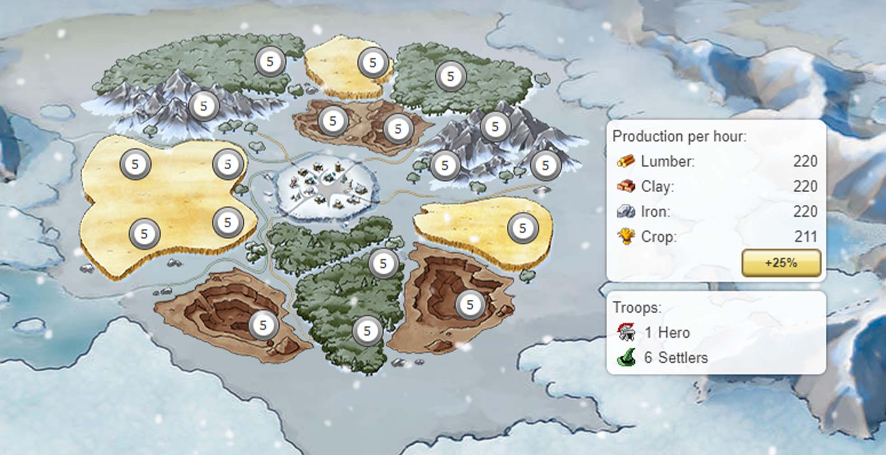

# Game Secrets ~ Advanced Start

> Source: Unofficial Travian  
> URL: https://unofficialtravian.com/2025/01/12/game-secrets-advanced-start/  
> Written on January 10, 2024

---

Welcome back to the [The Game Secrets](https://blog.travian.com/tag/thursday-guides/) series! The gameworlds with **[advanced start feature](https://support.travian.com/en/support/solutions/articles/7000082284-special-servers-advanced-start)** appear quite regularly and allow players to skip the “getting economy to a certain level” part and come to faster actions. And still we receive a lot of questions about it. Let’s look at the advanced start feature in more detailed and talk about what options it gives to the players.

##### **What is special about advanced start?**

- Your first village will start with all resource fields at level 5.
- You’ll already own **six settlers** and enough CP to settle**two additional villages**.
- 18-croppers, 15-croppers, and 9-croppers can’t be settled as second and third villages.
- You’ll be granted CP to settle two villages and 75% of the CP difference required to settle the fourth village (the bar will be filled to 3/4).
- Additional villages (starting from the 4th) will be settled with resource fields at level 0 as usual).

##### **What does “bar filled to 3/4” mean?**

| **Villages (settlement slots)** | **Speed x1** | **Speed x2** | **Speed x3** | **Speed x5** | **Speed x10** |
| --- | --- | --- | --- | --- | --- |
| Total CP needed for the 3rd village | 8000 | 3900 | 2600 | 1600 | 800 |
| Total CP needed for the 4th village | 20000 | 10000 | 6700 | 4000 | 2000 |
| Difference between 3rd and 4th villages | 12000 | 6100 | 4100 | 2400 | 1200 |
| Advanced start CP for the 4th village. | 9000/12000 | 4575/6100 | 3075/4100 | 1800/2400 | 900/1200 |

##### **Interesting facts about advanced start**

- **What happens if I settle 3rd village not from the spawn, but from the second one?**

*It doesn’t matter from which village you settle your third one. In this case first 2 settled villages will have fields level 5 and it also won’t be possible to settle 18-, 15- and 9-croppers. However, you will be able to settle any 4th village with your initial “spawn” settlers, including a cropper.*

- **What happens if I settle the second village, then make a chief and conquer the third? Will I be able to use a second set of settlers from my spawn to settle a cropper?**

*In this case you will be able to settle 4th village (including croppers) with your settlers. It will also have all fields level 5.*

##### **Where should I send my initial 2 sets of settlers?**

*There are 3 options for that.*

**First option is to settle 2 villages immediately next to your spawn.** The benefit of this method is that you will start developing your villages straight away and get passive Culture Points earlier than if you send them far away. Also, there is less chance to get bounced. After that you can focus on getting enough points for your 4th village as fast as possible to get the better cropper.

**Pros:** Earlier access to Passive Culture Points, easier development. Less chances to bounce and lose time.

**Cons:** If spawn area is not safe, there is a certain risk at a later stage of losing those villages. No close early villages next to your future capital.

**Second option is to select a preferrable area where you plan to establish your future base and settle directly there.** This way when you settle your capital, you will already have 2 half-developed resource villages next to it. However, you need to be realistic about your capabilities. For example, if the cropper you selected is one of rare (18-cropper in the gameworlds with that feature, or a 15-cropper with 150% oases etc) there might be other players that might do the same and you will be involved in the early game fight for the valuable spot.

**Pros:** Resource villages next to your capital, better established future base.

**Cons:** Higher risk that someone would settle before you, and bigger chances of the early game fight for the selected cropper.

**Third option** might be the preferrable one for new and returning players. **Settle your future capital straight away on a good 7 cropper.** For example, 7-cropper+150% really close in resource production to 9-cropper +75% and in certain cases even higher. So, if you are unsure which capital to pick and do not want to risk early fights, it’s the best way to go.

**Pros:** Settling your capital as one of early villages with all fields level 5, easier development. Resource village next to the capital.

**Cons:** Only possible if player selects 7-cropper as a capital.

##### **Advanced start tips and tricks**

- **Focus on passive culture development**, using one of the [fast settling guides](https://blog.travian.com/2022/12/guides-fast-2nd-second-village/) to for the cheapest buildings that give culture points. Main building 10, Warehouse 8, Granary 7, Wall 1, Barracks 3, Academy 10, Townhall 1 Workshop 1, Marketplace 1-5, Embassy 1-3, 1x Cranny level 10 and few crannies level 3 or 7 is the usual set of cheapest and fastest Passive Culture points.
- **Run celebrations when villages will produce around 150 CP for speed worlds, 200+ for x1 worlds**.
- **Do not build residence above level 1 in your spawn village early game since both slots are taken**. Later you can reconsider that decision if you decide to build it for passive culture points but early game you will need resources for further development.
- If you selected the third option for [your future capital](https://blog.travian.com/2023/04/types-of-capitals-and-their-development/), just follow the [usual development guide](https://blog.travian.com/2023/04/developing-your-first-villages/) for your future villages.

##### More early game development guides you can find here:

- [Detailed guide on developing your first villages](https://blog.travian.com/2023/04/developing-your-first-villages/)
- [Types of capitals and their advantages](https://blog.travian.com/2023/04/types-of-capitals-and-their-development/)
- [Fast settling guides](https://blog.travian.com/2022/12/guides-fast-2nd-second-village/)
- [Passive Culture points – what is it?](https://blog.travian.com/2023/10/game-secrets-culture-points/)
- [Defensive account – Balancing Military and Economy](https://blog.travian.com/2023/11/defense-account-balancing-military-and-economy/)
- [Oasis farming tips and tricks](https://blog.travian.com/2023/05/oasis-farming-tips-and-tricks/)