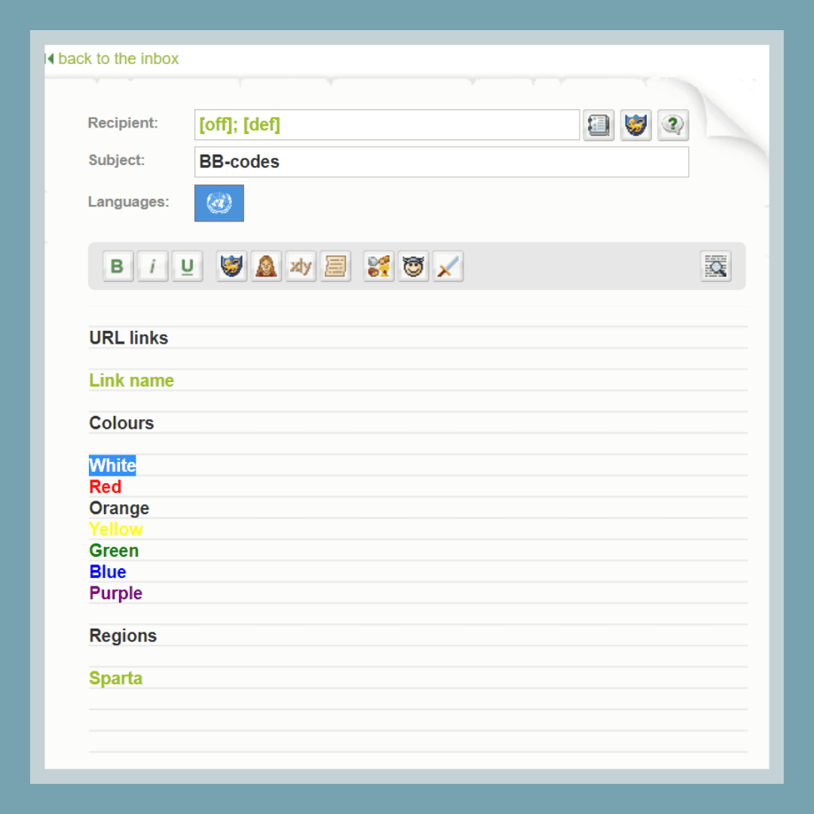
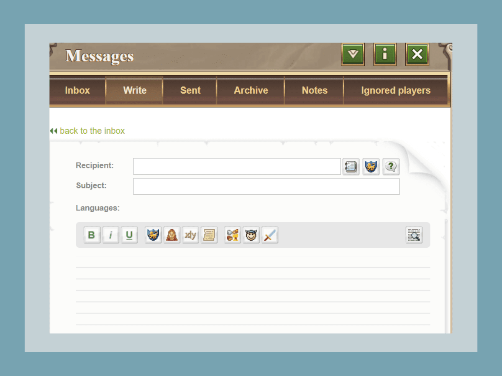

# Game Secrets ~ BB-codes

> Source: Unofficial Travian  
> URL: https://unofficialtravian.com/2025/01/12/game-secrets-bb-codes/  
> Written on July 13, 2023

---

Welcome to the Thursday guides series. Today we’ll cover a small topic that we still believe might be useful for you especially if you an alliance leader who has to send messages regularly – the BB-codes.

#### **What are bb-codes?**

**BB-code** stands for**Bulletin Board Code and it’s** used as a way for formatting posts made on message boards, blogs and more. In Travian: Legends bb-codes are used for example to give direct link to exact coordinates, player name and alliance in the ingame messages, to display alliance diplomacy in the alliance profile or add useful information to alliance internal page.

Most bb-codes can be added using **special buttons** in the game, profiles or in-game messages.

Today we will talk about those that are either less visible or do not have visual interface.

###### **In-game messages:**

###### **Recipient codes**

**[ally]** – allows to send message to the whole alliance if you have respective permissions.

**[off]** – allows to send messages only to selected group based on set **⚔️“offensive”** specialization in alliance profile.

**[def]** – allows to send messages only to selected group based on set **????️“defensive”** specialization in alliance profile.

###### **Colours:**

######

**[colour=white]White[/colour]**

**[colour=red]Red[/colour]**

**[colour=yellow]Yellow[/colour]**

**[colour=green]Green[/colour]**

**[colour=blue]Blue[/colour]**

**[colour=purple]Purple[/colour]**

###### **Url links****:**

**[url=http://link]Link name[/url]**– allows to make a clickable link

###### **Annual special only:**

**[region]ID or Name[/region]** – creates a link to the region page

###### **Internal page information**

**[stats]strength[/stats]** – displays the stats regarding the strength of own alliance and compares it to previous data.

**[stats]fighting points[/stats]** – displays how many points have been gained (attack and defence) during the day

**[news]10[/news]** – shows recent news (invitations, joining, leaving alliance, conquering, founding and losing villages). You can select how many news per page you want to get displayed ranging from 1 to 50.

**[losses]Alliance ID[/losses]**– A very useful statistic during war times. It displays how successful your fight is against a certain alliance. Number of destroyed troops and stolen resources.