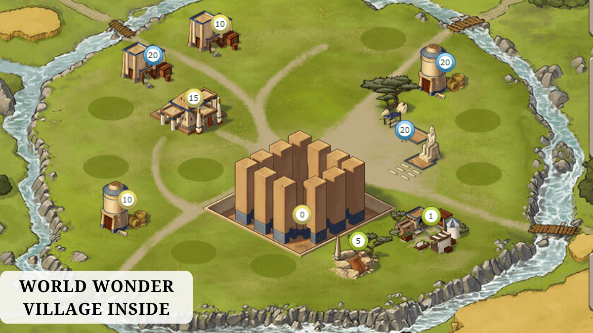
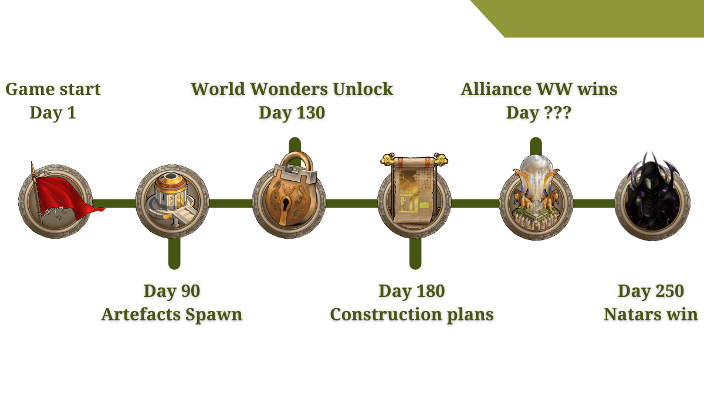
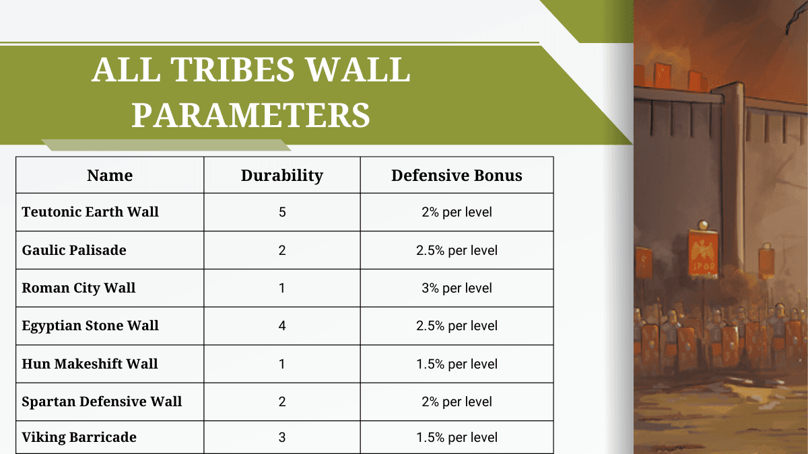
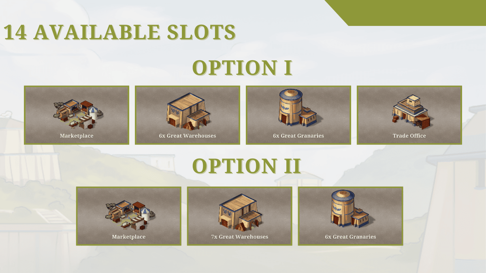
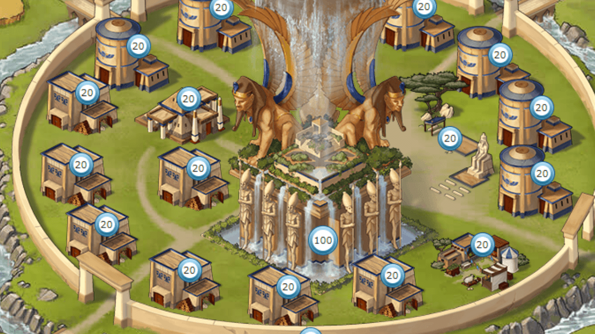

# Game Secrets: Building a World Wonder (Text version)

> Source: Unofficial Travian  
> URL: https://unofficialtravian.com/2025/01/12/game-secrets-building-a-world-wonder-text-version/  
> Written on October 9, 2024

---

In Travian: Legends, building a World Wonder (WW) is the ultimate team achievement that determines the winning alliance. To construct it, alliances must conquer a World Wonder village from the Natars and work together to build it up to level 100.

In this guide we will take a deeper look into what a World Wonder is, how to conquer it, how to build it efficiently, and what preparations your alliance should make. For those who prefer video over text, please visit our previous blog post on that matter: [**Guide on building a World Wonder (video version)**](https://blog.travian.com/2024/10/game-secrets-guide-on-building-a-world-wonder-video-version/)

#### **What is a World Wonder?**

A **World Wonder** is a special Natarian village, and the alliance that first builds it to level 100 wins the server. Once this happens, the game stops, the winner is announced, and players can start the game from the very beginning in the next round.

#### **What is important to know about the World Wonder / gameworld timeline?**

- First 130 days on x1 gameworld World Wonders are locked for any actions. You cannot scout, attack or anyhow else interact with World Wonder.*
- To build the World Wonder beyond level 0, you **must have a Construction Plan**: one Construction Plan is required to build up to **level 49**. From **level 50 to level 100**, you will need **two Construction Plans**— one held by the Wonder’s owner and one by a co-ally.
- Construction plans count as small artefact, and that means, that on top of that player can have only 2 active artefacts, one of which can have avatar-scope effect.
- Construction plans appear on x1 gameworld on day 180.*
- Instant construction, Master builder and NPC do not work in a World Wonder village. However, you can still use Travian Plus for queues, resource bonuses, Gold club and other gold features there.
- World Wonder village doesn’t produce any culture points, both inside and outside  of the grey area.
- World Wonder that belongs to Natars doesn’t have walls or residences and therefore does not require rams or catapults for their conquering.
- Artefacts do not have an effect on the World Wonder building itself, yet, they affect other buildings in a World Wonder village. The best artefact for the World Wonder protection are Great or Unique Architects.
- You can’t make World Wonder your capital, leave it as the only village on your avatar or build a treasury there.

**For other speed versions please check the table below:*

|  | **Construction time x1** | **Construction time x2** | **Construction time x3** | **Construction time x5** | **Construction time x10** |
| --- | --- | --- | --- | --- | --- |
| **World Wonders Unlocked (day)** | 130 | 65 | 43 | 26 | 13 |
| **Construction plans Appear (day)** | 180 | 90 | 60 | 36 | 18 |
| **Time gap in days** | 50 | 25 | 17 | 10 | 5 |

#### **How to Conquer a World Wonder**

To conquer a World Wonder, your alliance must carefully plan their actions way before the World Wonders are unlocked.

- **Choose your Wonder**: Your alliance should select a World Wonder as early as possible. Decide which Natar World Wonder you will target, settle and develop villages around it and build alliance infrastructure. You need to prepare long before the Wonders unlock on day 130. Clear World Wonder surroundings, develop villages, upgrade marketplaces.
- **Prepare your armies**: You’ll need to define the World Wonder building avatar, prepare chiefs (ideally not far from the selected World Wonder). The main army (or armies) must be ready to strike at the right moment. Since World Wonders do not have walls and residence you can clear World Wonder Natar defence from further distances with just infantry and cavalry army or even with cavalry only!
- **Conquer the Wonder**: When the World Wonders unlock, launch attacks to clear Natarian defenders and reduce the World Wonder’s loyalty. Take control of the village.

#### **Which tribe to Choose?**

Even though the World Wonder can be built by any tribe, most alliances prefer to turn them into **Egyptians** (where this tribe is present) by chiefing due to **wall durability and defence bonus ratio**, or **Teutons/Gauls** (on 3 tribes gameworlds). The final decision on the tribe is normally based on estimation of known Ram armies in a certain gameworld.

#### **World Wonder Infrastructure**

Once your alliance has conquered a World Wonder, building and defending it becomes a monumental task that will occupy your gameplay till the very end of the round. You will have a time gap (which depends how soon you conquered a World Wonder after it is unlocked) which you should use on growing World Wonder village infrastructure.

In the World Wonder instant completion doesn’t work, so, your alliance needs to make sure that World Wonder is well-defended, and that construction of the World Wonder village never stops.

What buildings and in which order is it better to build? There are 14 slots in a World Wonder village where the owner can construct something (in addition to the Main building, Rally Point and the Wall). Even though some of those slots are occupied, they’ll need to get reworked for maximum efficiency.

**Most popular World Wonder options for those 14 slots:**

| **Option I** | **Option II** |
| --- | --- |
| Marketplace lvl 20 6x Great Warehouses 6x Great Granaries Trade office 20 lvl to manage overflows and keep resources | Marketplace 1 lvl to monitor deliveries7x Great Warehouses 6x Great Granaries |

You can temporarily construct other pre-required buildings and of course you can also adjust the given options. Do not forget, that you need 1 million of each resource to build World Wonder level 100, so you can’t have Warehouse capacity less than that. Also, it won’t hurt to have some extra capacity so that rival attacks would not cause immediate damage to your infrastructure even if they attack it.

#### **Building order**

***Tip:** Use existing Natar infrastructure to help you construct needed buildings, but do not forget to slowly demolish unnecessary buildings through Main building to free up slots.*

- **Build the Residence**: This should be your first priority. Building the Residence helps prevent other players from capturing the village with just chiefs.
- **Upgrade the Main Building**: The Main Building speeds up all other construction. Get it to level 20 as fast as possible.
- **Defensive Wall**: Build and upgrade the Wall for extra defence.
- **Increase Crop Production**: To be able to build further buildings you need your croplands to be upgraded to full levels.
- **Marketplace** to level 20 to manage deliveries (or level 1 for option 1).
- If you go with option I, build Barracks 3, Academy 10, Smithy 3, Stables 10 and then **Trade Office level 20**. Demolish “pre-requirement” buildings. For option II start upgrading **Great Warehouses or Great Granaries**.
- **Great Warehouses and Great Granaries**: These are essential for storing the large number of resources and crop needed to build and defend the World Wonder. You’ll need multiple Great Warehouses and Great Granaries at maximum levels. Unlike regular villages, you do not need an artefact to build them in World Wonder one.

#### **Final Tips and Tricks for Building a World Wonder**

Here are some extra tips to ensure success in building your World Wonder:

- **Build a few so-called “NPC-exchangers” next to the World Wonder  village.**NPC-exchanger village is usually built by a World Wonder owner, sometimes by their sitters. It’s a village filled with Great Warehouses and Great Granaries to exchange coming resources to crop for World Wonder. Other necessary buildings in there are Marketplace, Trade Office, Residence and Treasury if the village holds an artefact for Trade Routes option.
- **Coordinate with your alliance**: Make sure everyone in your alliance contributes resources and reinforcements to protect the World Wonder. You will need millions of resources and defence to achieve your goal!
- **Set up Trade Routes**: Those players who have Gold club activated should set up optimized trade routes from supporting villages. Make sure crop and resources are constantly flowing into the Wonder village or one of the NPC-exchangers.
- **Optimize Trade Routes:** Do not send resources directly from your capital. Capital -> Multiple villages nearby -> Resources to World Wonder/Exchanger get delivered with a certain interval (not at once). Too many resources sent at once have bigger chances to create overflow and resources will simply be lost.
- **Set duals and sitters**. Constructing a World Wonder is a task for a group of people, it’s not a solo action. This village needs to be monitored 24/7.
- **Use Artefacts**: Make sure to conquer at least one of the **great architects** (ideally Unique) to increase durability of the buildings in the World Wonder village.
- **Alliance bonuses:** Upgrade Metallurgy and Commerce bonuses ideally to the max levels to make your defences more resistant and your merchants more powerful.
-

#### **Useful Table for World Wonder Construction**

Below is a full breakdown of the time it takes to construct each building related to the World Wonder at various speeds.

| **Building** | **x1** | **x2** | **x3** | **x5** | **x10** |
| --- | --- | --- | --- | --- | --- |
| Main Building lvl 16-20 | 18:10:10 | 9:05:05 | 6:03:23 | 3:38:02 | 1:49:01 |
| Residence lvl 1 for loyalty | 00:08:20 | 00:04:10 | 00:02:47 | 00:01:40 | 00:00:50 |
| Stone Wall | 28:20:40 | 14:10:20 | 09:33:33 | 05:44:08 | 02:52:04 |
| Great Warehouse lvl 20 x6 | 84:14:20 | 42:07:10 | 28:04:47 | 16:50:52 | 08:25:26 |
| Great Granary lvl 20 x6 | 68:16:10 | 34:08:05 | 22:45:23 | 13:39:14 | 06:49:37 |
| Marketplace | 26:45:00 | 13:22:30 | 08:55:00 | 05:21:00 | 02:40:30 |
| Barracks lvl 3 | 00:33:00 | 00:16:30 | 00:11:00 | 00:06:36 | 00:03:18 |
| Academy lvl 0-10 | 04:25:10 | 02:12:35 | 01:28:23 | 00:53:02 | 00:26:31 |
| Trade Office lvl 20 | 36:19:50 | 18:09:55 | 12:06:37 | 07:15:58 | 03:37:59 |
| **Total Construction Time** | ~45 days | ~22 days | ~14.7 days | ~9 days | ~4.5 days |