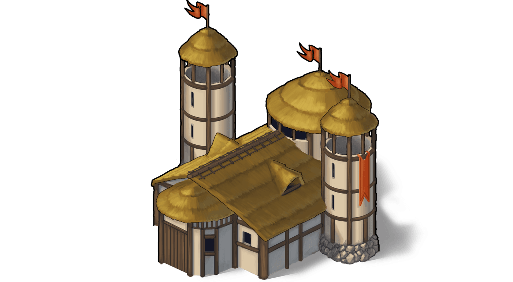

# Game Secrets ~ Combat bonuses: own village defense

> Source: Unofficial Travian  
> URL: https://unofficialtravian.com/2025/01/12/game-secrets-combat-bonuses-own-village-defense/  
> Written on October 4, 2023

---

***Disclaimer:** This article is entirely the work of [Kirilloid](http://travian.kirilloid.ru/) translated by English users from old travian.com and travian.us forums. Written back in 2009, this article didn’t lose its relevance and gives one of the most advanced explanations on how battle works in Travian: Legends. We’ll publish all parts of this guide with some updates based on recent changes in the game. You can find previous part [**here**](https://blog.travian.com/2023/09/game-secrets-combat-system-formulas-written-by-kirilloid/).*

1. wall: gives extra bonus percent to defense, up to +80%
2. basic defense: adds an absolute value to defense, +10
3. residence/palace: adds some absolute value to defense, up to +800

First 3 points we will cover in today’s blog post, and the other 3 – next Wednesday!

#### **Wall**

**The wall gives the defender an extra percentage bonus, which depends on the tribe of wall and its level:**

- 1.020^L for the Teutonic Earth wall;
- 1.025^L for the Gallic Palisade;
- 1.030^L for the Roman City wall.
- 1.025^L for the Egyptian Stone Wall
- 1.015^L for the Hun Makeshift Wall
- 1.020^L for the Spartan defensive wall.

where **L** is level of corresponding building.

E.g. a level 15 Roman city wall gives this bonus: 1.03^15 = 1.558 or 55.8%. At level 20 the bonus is a bit more than 80%. Therefore, the wall is a cornerstone in a village’s defense.

*Consider 150 swordsmen attacking 100 praetorians and 25 legionnaires behind a level 15 city wall.*
*Since swordsmen are infantry we will use only defense against infantry values.*
*offense points will be: 150 · 65 = 9750*
*defense points will be: 25 · 35 + 100 · 65 = 7375*
*But we have a wall, which could greatly increase defense points: 7375 · 1.558 ≈ 11490*

*11490 is greater than 9750, so in this example the defender will win.*
*casualties = 100% · (9750 / 11490) ^ 1.5 = 78.17% which result in 78 praetorians and 20 legionnaires lost.*
*If there’s no wall, the attacker would win. You may check it with the combat simulator.*

***Watchtowers:** In Annual Special scenario with the city feature there is possibility to enhance wall with the Watchtowers. Each level of watchtowers adds an additional 1% of defense bonus to all units defending the city. This is a flat bonus added separately from the wall bonus. This means that for example on level 10 it increases defensive units strength by exactly 10%.

#### **Basic village defense**

**Even an empty village with no fortification has a small defense value (10).** Moreover, this value is also affected by other bonuses, like the wall. I was not completely honest with you, omitting this value in previous calculations. This was done for the sake of simplicity and because such small value rarely can affect result of average combat.

*E.g. 2 phalanx attacks empty village.*
*offense is 15·2 = 30*
*defense is 10*
*2 · (10/30)^1.5 ≈ 0.385 which leads to no casualties.*
*But if we build in an empty (I mean no troops) roman village a 5th level wall, the combat result will change.*
*defense become 10·1.03^5 or 12 points*
*2 · (12/30)^1.5 ≈ 0.506 which will be rounded to 1 and will mean 1 dead phalanx.*

**Also there’s one extra tricky aspect. There’s a known phenomenon that one unit will always die against even an empty village, unless it was a strong cavalry unit. It *could* be described by basic defense. However, why does one imperian with 70 offense points die and 2 phalanx with total 30 offense points don’t?**

That’s because there’s an extra check for every combat with a lone attacker.
If unit’s offense points are less than 83, unit will die disregarding of defender’s losses. This check is applied for both attack types: normal attack/raid.

#### **Residence/Palace/Command Centre**

Residence/Palace (we will use just “Palace” hereinafter, since all 3 buildings are equal in their defending abilities) also help in combat, but its contribution isn’t much. The Palace doesn’t add percent-based bonus, but just adds some absolute defense value: e.g., on 20th level Palace will give only 800 defense points (both against infantry and cavalry). This addition is expressed by the following formula:

**2 · n^2 (6)**where**n** is the level of the palace.

As we could see, first levels give you nearly nothing. E.g., 1st level Palace adds only 2 points, 2nd level — 8pts, 3rd level — 18pts, etc.

Against large armies, even 800 points is a tiny value, but against small squadrons it may be useful. If 10 imperians attack a village with a 20th level palace, they all die! (700 < 800+10). Of course, it is not easy to obtain the benefits from these buildings, since even a level 5 residence isn’t very cheap. And when you have enough resources, armies are far stronger than 10 imperians.

**Hint**: Defense given by palace and basic village defense *is* affected by the wall bonus just like troops.
15 phalanx attacks village with 6th level residence and 6th level roman wall.
offense is 15 · 15 = 225
defense is (Residence + base defense) · Wall bonus = (2·6^2 + 10) · (1.03^6) ≈ 82 · 1.194 ≈ 98

Attacker wins, but since the residence can’t be destroyed by regular troops, the attacker loses something while the defender loses nothing.
100% · (98/225) ^ 1.5 ≈ 28.7% or 4 phalanx

And this is a wrap! Come back[**next Wednesday**](https://blog.travian.com/tag/thursday-guides/) where we will talk about other bonuses (smithy, hero weapon, brewery for Teutons etc) that might affect the game result in the game.