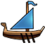

# Game Secrets – Conquering Travian: Northern Legends

> Source: Unofficial Travian  
> URL: https://unofficialtravian.com/2025/01/12/game-secrets-conquering-travian-northern-legends-2/  
> Written on August 21, 2024

---

Welcome to a special annual edition – the Northern Legends scenario in Travian. Every year the annual special gameworlds introduce new features and therefore provide different gameplay experience in the Ancient Europe setting. Whether you’re leading an alliance to victory or carving out your path as a solo player, the key to success lies in adaptability, strategic planning, and effective teamwork.

**Today we collected pro-tips that will help you and your alliance members to craft your strategy for the upcoming gameworlds.**

## **Early Game Pro-tips**

- **Utilize the Respawn Feature for a Strategic Reset**
If your initial spawn location isn’t ideal, don’t hesitate to use the respawn feature early in the game. This allows you to relocate to a more advantageous position, closer to key resources or powerful alliances, without losing much progress.
- **Be Mindful of Non-Refundable Gold Uses**
When using the respawn feature, remember that non-refundable gold actions like NPC trades or instant completion won’t be compensated. Plan your gold spending carefully to avoid starting a new avatar with a negative gold balance.
- **Focus on Resource Optimization Early**
Efficient resource management is crucial in the early game. Prioritize upgrading resource fields and constructing buildings that boost production. A strong economic foundation will enable you to build troops faster and expand more aggressively.
- **Farm-Village in Mountain Chains**
If you aim to build a strong resource base early, focus on settling one of the first villages near mountain ranges like the Alps or the Carpathians. These areas are rich in iron and iron-crop oases. Hero inventory resources are also quite important for quick taking over regions at a later stage. The game gives an option to pick a tribe for your first 3 settlings, it won’t hurt to use one of them to settle a Hun village in a place rich with lots of oases for a solid resource flow.
*Oasis farming tips and tricks can be found here:*[Oasis-farming-early-game](https://unofficialtravian.com//wp-content/uploads/2025/01/Oasis-farming-early-game.png)
- **Universal Harbor**
In the early game, a universal harbor might be a good option. Build a few warships for reinforcements, raid ships for distant farming, and trade ships to bolster your resource transport capacity. You can always change harbor specialization later by demolishing the ships and replacing them with the needed types.
*More information:*[Game Secrets – Harbors and Ships](https://unofficialtravian.com/2025/01/12/game-secrets-harbors-and-ships/)
- **Find an Alliance via Wise Settling**
If you haven’t found an alliance before the game starts, settle in regions with early-game valuable powers like small boots or eyes.
This increases your chances of joining a strong alliance, setting you up for a more secure and resource-rich expansion.

## **Military Development**

- **Diversify your Gameplay**
Don’t rely on just one type of gameplay. In annual special possibility to effectively defend and attack proves to be more effective strategy. Build a balanced avatar with equally developed offensive and defensive armies. This flexibility allows you to respond effectively to different threats and seize opportunities as they arise.
*More information about hybrid accounts you can find here:*[Game secrets: The Path of the Warrior ~ Hybrid Account](https://unofficialtravian.com/2025/01/11/game-secrets-the-path-of-the-warrior-hybrid-account/)
- **Operational Hammers come forward**
Since this scenario doesn’t have World Wonders, it also in most cases doesn’t require huge World Wonder killer armies. Easy trained-easy recovered operational hammers play a more important role in the alliance strategies.
*More information about what an operational hammer is and what it takes to train it can be found here:*[Game Secrets: The path of the warrior ~ An Operational Hammer](https://unofficialtravian.com/2025/01/11/game-secrets-the-path-of-the-warrior-an-operational-hammer/)

## **Strategic Expansion and Regional Control**

- **Prioritize Culture Points and Production**
The Northern Legends scenario, just like few others before, is heavily Culture points/Population oriented. The regions are held by population, so you need culture points to invade other regions or resist rival invasion. That’s why building good resource villages with high culture point production is as essential as your attacker/defense skills.
*Resource village development and Culture points guides can be found here:*[Developing resource villages – condensed guide](https://unofficialtravian.com/2025/01/09/developing-resource-villages-condensed-guide/)

- **Be Wary of Overextending Early On**
Expanding too quickly can leave your villages vulnerable to attacks. Make sure your defenses are solid and that you have enough troops to protect your holdings before pushing into new regions or taking on aggressive conquests. Keep balance between own development and alliance goals: make sure to build your villages in clusters of at least 3-4 nearby so that you can use defense forwarding feature to defend them successfully.
- **Watch for Regional Power Shifts**
Regions can change hands quickly in Northern Legends. Monitor the map for power shifts and be ready to capitalize on weakened enemies or defend your own regions when they come under threat.
- **Regularly Check Player and Alliance Rankings**
Regularly monitoring the rankings helps you gauge the strength of other players and alliances, aiding in resource planning, forming alliances, and preparing for potential threats.
- **Adapt to the Evolving Meta**
The strategies that work early in the game may not be as effective later. Stay adaptable, learning from your experiences and from the strategies of top players. This flexibility will help you stay competitive as the game evolves.
- **Mutual Coordination**
Align your strategies with your alliance’s goals. Whether it’s holding strategic regions or launching coordinated attacks, coordination is key to securing victory.

By following these strategies and tips, you’ll be well-prepared to conquer the ancient world of Travian: Northern Legends.

Good luck on your journey to become a legend in the Northern Lands!