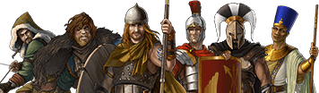
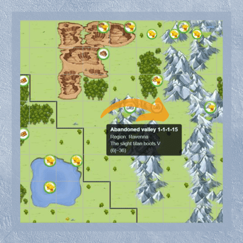

# Game Secrets ~ Diving into Shores of War scenario

> Source: Unofficial Travian  
> URL: https://unofficialtravian.com/2025/01/12/game-secrets-diving-into-shores-of-war-scenario/  
> Written on April 3, 2024

---

*This guide aims to help solo players new to the Annual Special setup enjoy the Shores of War scenario and better understand the gameplay. While this guide will focus on the Shores of War, most of it can also be applied to World Wonder gameworlds. For this guide purpose, we assume you are already aware of Travian: Legends, have probably played it a few years ago, and have returned after a break. Or, you’ve played casually but want to go to the next level of strategic experience.*

*So, it begins. You came across a Travian: Shores of War Spring Round ad, received a newsletter, and decided to give it a try. What is the checklist that you need to go through? Let’s do it together!*

## **I. Pick the correct tribe**

In Travian: Shores of War, you can play one of **six tribes**, each with its unique characteristics and preferable playstyle. Do you favor a more aggressive playstyle? Then the **Huns** or **Teutons** are the best choices here. For all defensive players out there, **Egyptians**and **Gauls** are more suited. All-rounder **Romans** are ideal for players who do not seek immediate results but like the play until the end. Also, their development is one of the fastest due to their unique ability to construct internal buildings and resource fields at once as long as they have enough resources. And finally – the **Spartans**. A mid and endgame tribe with excellent upkeep characteristics but relatively slow training that will come into full force somewhere after the first month of a gameworld.

*Pro-tip: Remember that in the Shores of War scenario, you can always conquer other tribe villages, have option to settle ANY tribe second village and even create a personal All-Tribes-Empire. So,****the hero’s unique abilities, preferable early playstyle, and tribe advantages****are the only things that really matter for your choice.*

 *More information about Keep Tribe on Conquer feature you can find here: **[Keep Tribe on Conquer](https://unofficialtravian.com/2025/01/12/keep-tribe-on-conquer-feature-tips-and-tricks/)***

## **II. Pick a starting location**

Unlike the classic scenario, where spawning starts in the center, in Shores of War you end up somewhere in the middle of [**one out of 4 quadrants**](https://blog.travian.com/2023/07/travian-shores-of-war-map-and-spawn-order/).

Based on a chosen strategy, you can start as soon as the gameworld opens or wait for a few hours until other regions (closer to the ones you want to settle in) become available.

Since the whole map is not available for settling at once and might take days until the last region is unlocked, therefore, **getting culture points early is not as crucial for Annual special** as it is in classic gameworlds. So **you might as well settle your future capital as a third or fourth village.**

*Pro-tip: If you haven’t found an alliance before the game round and want to increase your chances of getting accepted into a good one, consider spawning and settling your other villages in one of the valuable early game regions with village-scope powers: small boots, eyes, storage. The recruiters of big alliances might notice you and invite you to the alliance to get control over the region. The*[***the order in which regions are open***](https://blog.travian.com/2023/07/travian-shores-of-war-map-and-spawn-order/)*for spawning will help you in this choice.*

## **III. Pay attention to the map**

One of the main features of the Annual Special is the ancient [**European map**](https://i0.wp.com/blog.travian.com/wp-content/uploads/2023/07/CommunityMap_AS2023.jpg?ssl=1). The map follows the actual shape of the ancient world, centered on the Roman Empire. However, it goes further to distant provinces stretching between Hibernia to the North and the African continent to the South. Therefore, unlike the classic map, this one contains vast water masses of the Mediterranean and Atlantic and vast mountain chains filled with iron and iron-crop oases. All in all, this setup brings new challenges and opportunities to the gameplay.

*Pro-tip: If your strategy highly depends on an early oasis farm, follow real-world mountain chains: The Alps, Carpathian Mountains, or the Pyrenees to find a good spot for your spawn village. If you mainly focus on production, the plain areas will attract fewer farmers. Therefore the early game pressure won’t be that intense.*

## **IV. Follow the start guide for settling a second village**

The game changes, but some things are kept untouched. No matter which playstyle, tribe, gameworld speed, and scenario you pick, the fast settling of your second village is key to a successful round.

*Pro-tip: In Travian: Shores of War you can pick the tribe of your second village for your very first settlement and enjoy having 2 different tribes right after the start.*

**You can find the guides for different speeds here:**[Game Secrets ~ Advanced Start](https://unofficialtravian.com/2025/01/12/game-secrets-advanced-start/)**.**

## **V. Read about Harbors**

One of the game-changing mechanics for Shores of War is introduction of the naval battles. You can read more about how they work in those blog posts: [Harbors](https://unofficialtravian.com/2025/01/12/game-secrets-harbors-and-ships/)

*Pro-tip: Make sure to send your ships on the way when there is the risk the building might get destroyed – losing a harbor building will result in losing your ships also. But! Only those that are home, not on the way. Make sure to rebuild harbor at least to level 1 before they return and you can use them again!*

## **VI. Settle correct capital**

As much as Egyptian croppers with 3x 50% crop oases around seem to be every player’s obsession, we would highly recommend starting with more casual ones for newer and returning players. **For example, 15-cropper +100% or 9-cropper +125%** will be easier to develop, require fewer Gold investments, and not attract much attention during the early game. So save chasing the best cropper for another round!

In the Shores of War scenario, turning your capital into a **City** is entirely worth it. With Watchtowers adding a 20% defense bonus to the walls and 3 additional slots for construction, they will give you enough space to build the capital of your dreams and even train a hammer there without worrying much about it being destroyed during the night.

*Pro-tip: If you plan to play a game round until the end, invest in the Gold Club early. The Gold Club feature will provide you whole-round advantages, such as capital automatic troop evasion, cropper finder, farm lists, and trade routes, making your game experience much more enjoyable. More information about capital development you can find here: **[Capitals.](https://unofficialtravian.com/2025/01/09/types-of-capitals-and-their-development/)***

**VII. Find an alliance**

*Remember, Travian: Legends is a game with a powerful social component. Soon, your neighbors will pay close attention to you and even try to raid you.*

***Joining an alliance will push you to the next level of gameplay****and bring you into combined attacks and defense operations, alliance goals, and settling strategy. Playing in an organized alliance is a real game-changer.*

Don’t worry about making a mistake while picking an alliance, though. Typically, not all alliances are strong enough, nor will they exist until the end of the game. Like in real life, many alliances are easily formed and broken. For example, suppose you are active and keep developing your villages, protecting them from raids. In that case, recruiters from much stronger alliances will likely contact you. Or contact them yourself.

*Pro-tip: Discuss with alliance recruiters their internal rules to ensure they suit your playstyle. Some alliances might have diverse internal rules and restrictions regarding settling in certain regions, online times, conquering villages, non-written pacts, and agreements, population vs. army ratio, turning villages into cities, etc. Make sure you share the goals of the team you will play with. Don’t be shy to ask – most leaders value it when players ask the right questions and are willing to follow the chosen strategy.*

## **VIII. Join community channels**

If you were absent from Travian: Legends for a while, you would have many questions about the game. The Discord community offers various around-the-game activities and is a valuable source of information. Participate in Discord events to get a chance to win in-game rewards, participate in discussions, and ask questions. In addition, discord offers talks in various languages. Visit the #pick-your-language channel and unlock channels in your preferred language.

**[Join The Unofficial Discord](https://discord.gg/4PjjYpaAam)**

## **IX. Read the manuals!**

If you are reading this guide, you are already on a good course! However, the better you understand the game and its specifics, the easier it would be to find your space. Therefore, for the Shores of War scenario, we recommend you first go through the [Game Secrets ~ Diving into Shores of War scenario](https://unofficialtravian.com/2025/01/12/game-secrets-diving-into-shores-of-war-scenario/) so that you know better what it is all about.

## **X. Consider making a hybrid account**

This last piece of advice might sound most controversial for pro-players. Yet I firmly believe that hybrid accounts are one of the best options for returning players or those new to the game due to their diversity and the option to try different playstyles, finding the one style you find most interesting.

A hybrid account balances defense and offense without focusing specifically on one side of the game. For example, it’s not a bad idea to train an attacking army in your capital and develop a few villages nearby focused on defense. Do not train both offensive and defensive armies in one village, though! Village specialization is one of the basics that still needs to be respected.

