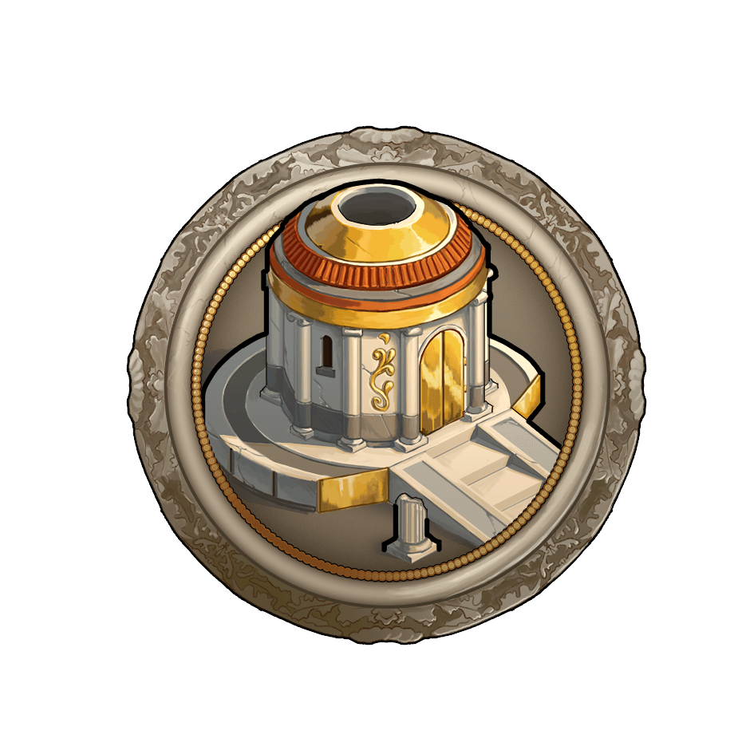

# Game Secrets ~ Frequently asked Questions about artefacts

> Source: Unofficial Travian  
> URL: https://unofficialtravian.com/2025/01/12/game-secrets-frequently-asked-questions-about-artefacts/  
> Written on November 15, 2023

---

**Question:** Does the bonus given by my “Stronger Buildings” artifact apply to my wall as well?
**Answer:** Yes it does.

#####

**Question:** I own 2 artifacts of the same type, i.e. “Faster Troops”. One has the scope village and one has the scope account. What happens?
**Answer:** The effects are not added. The village containing the Village “Faster Troops” artifact will use its bonus for that village (and therefore overwrite the bonus given by the artifact with the scope account). All other villages will use the bonus of the artifact with the scope account.

#####

**Question:** Can I capture and own more than 3 artefacts on my account?
**Answer:** You can have as many artifacts as you want on your account. At any one time, each player is only allowed to use a maximum of three artefacts, of which only one can be account-scope. Village-scope artefact overrides the account-scope artefact of the same effect. Therefore those effects do not stack.

#####

**Question:**You said that village-scope artefact overrides account-scope. But what about some Unique that have greater power than the small one? Unique architect, Unique eyes and possible greater effect of the Artefact of the Fool?
**Answer:**Unique artefacts count as account-scope artefacts. Even in those cases small account effect overrides unique power. That means that if you for example own Unique eyes (x10) and small eyes (x5) and send scout operation from a small eyes village, the scouts will have x5 effect.

#####

**Question:** My Artifact of the Fool changed its scope to account. But I own a unique/account scope artifact already. What happens? **Answer:** In such case, the time when artefacts were gained matters, and the artefacts gained earlier have a preference.

#####

**Question:** I conquered a fourth artifact. It is an account scope artifact. My other 3 artifacts only have a village scope. Will my new artifact work after 24 hours?
**Answer:** Yes, it will. The oldest account-scope artefact and the 2 oldest village-scope artefacts can be active. If there are no account-wide artefacts, then the 3 oldest village-scope may be active.

#####

**Question:** I conquered two account scope artifacts and one village scope artifact. When I conquer another village scope artifact now, what happens? Will I have 3 working artifacts (account +village + village scope) after 24 hours?
**Answer:** Yes you will.

#####

**Question:** Does an artifact travel with the troops/hero that captured it?
**Answer:** No, artifacts teleport instantly to the treasury when capture conditions are met.

More information about Artefact effects, capturing them and artifact limitations can be found in our **[Travian: Legends Knowledgebase](https://support.travian.com/en/support/solutions/articles/7000060687-artefacts)**!

Detailed description how to prepare for the artefact release can be found in our [**Previous guide regarding Artefacts**](https://blog.travian.com/2023/06/how-to-get-ready-for-the-artefact-release/).