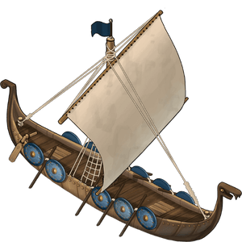
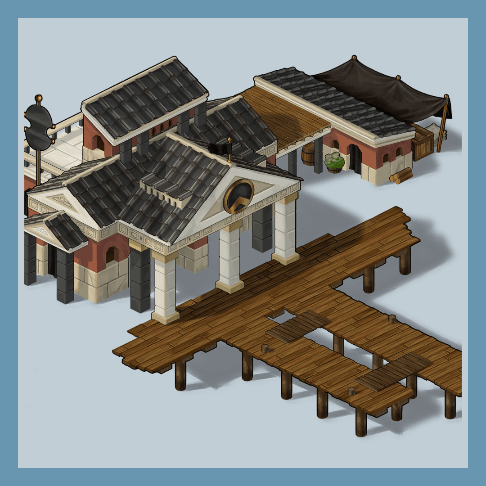
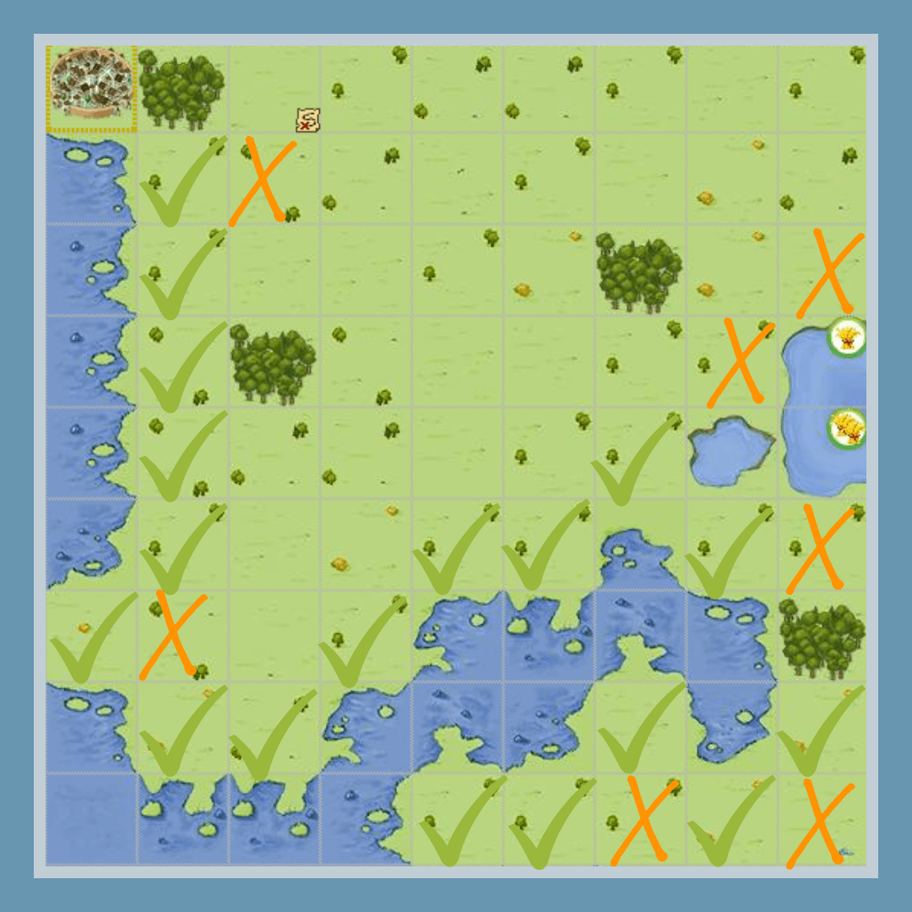
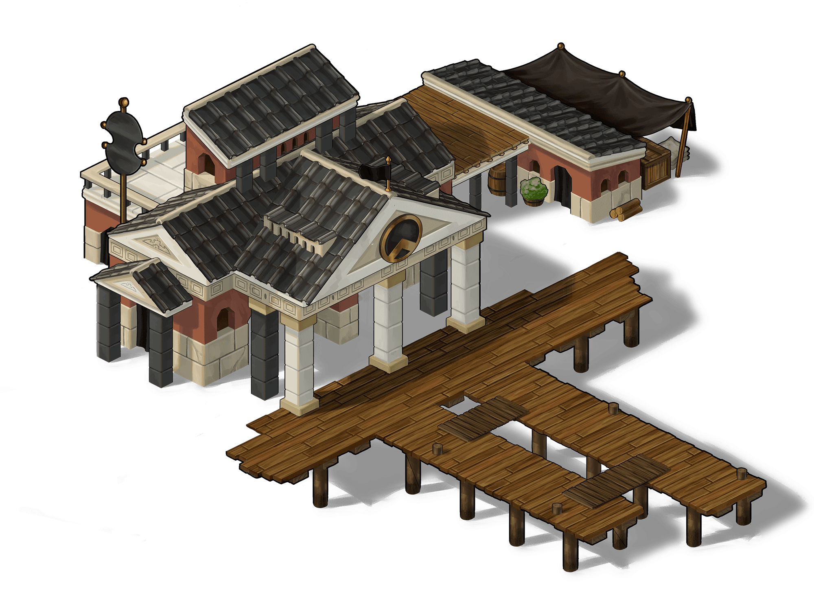
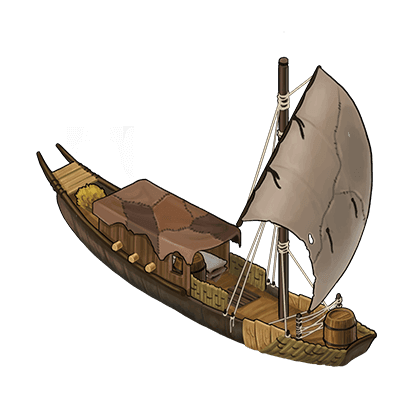
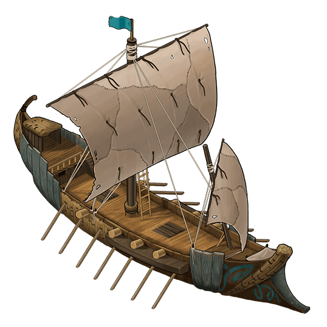
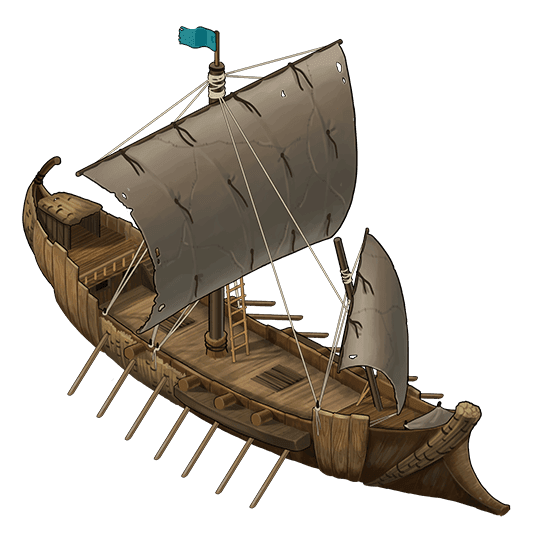
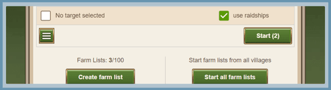

# Game Secrets – Harbors and Ships

> Source: Unofficial Travian  
> URL: https://unofficialtravian.com/2025/01/12/game-secrets-harbors-and-ships/  
> Written on July 29, 2024

---

Harbors and ships are a feature currently available only on special game worlds (Annual Special, New Year’s Special, and some Community Week game worlds).

**The harbor is a building where ships come to life and your naval saga begins! Harbors are used for building ships.**

| **⚓Harbors⚓** |
| --- |

#### **General information about harbors**

- **Harbors**take an additional building slot (like the rally point), and no other buildings can be built there.
- The village becomes a harbor village as soon as it is settled.
- An actual harbor (building) can be built once the other requirements are met.
- Harbor villages can be upgraded into cities.
- A harbor can be destroyed as usual via the main building and with the catapult attacks.
- Scout operations against the harbor (for defenses and troops) will show the level of the harbor building. The number of ships will not be visible.
- You can build up to 210 ships with a fully upgraded harbor.

#### **Deep waters and abandoned shores**

- Harbor villages can only be built next to **deep water** – oceans, seas, main rivers, and lakes that reflect the actual landscape of ancient Europe **(but not “random” lakes)** on a special village tiles called “**abandoned shores**“.
- The village becomes a harbor village as soon as it is settled.
- Even if the harbor building is destroyed (or never built), the village status doesn’t change.

**Harbor building requirements:**

- Main building at level 10
- Rally point at level 10
- Settled on an abandoned shore

**????️Full harbor parameters per level????️- click here**

| Level |  |  |  |  |  |  |  |  |  |
| --- | --- | --- | --- | --- | --- | --- | --- | --- | --- |
| 1 | 1440 | 1370 | 1290 | 495 | 1:06:40 | 5 | 3 | 1 | 3 |
| 2 | 1870 | 1780 | 1675 | 645 | 1:22:20 | 6 | 5 | 3 | 2 |
| 3 | 2435 | 2315 | 2180 | 835 | 1:40:30 | 7 | 7 | 6 | 2 |
| 4 | 3165 | 3010 | 2835 | 1090 | 2:01:40 | 8 | 9 | 10 | 2 |
| 5 | 4115 | 3915 | 3685 | 1415 | 2:26:00 | 10 | 11 | 15 | 2 |
| 6 | 5345 | 5085 | 4790 | 1840 | 2:54:20 | 12 | 13 | 21 | 2 |
| 7 | 6950 | 6615 | 6225 | 2390 | 3:27:20 | 14 | 15 | 28 | 2 |
| 8 | 9035 | 8595 | 8095 | 3105 | 4:05:30 | 17 | 17 | 36 | 2 |
| 9 | 11745 | 11175 | 10525 | 4040 | 4:49:50 | 21 | 19 | 45 | 2 |
| 10 | 15270 | 14530 | 13680 | 5250 | 5:41:10 | 25 | 21 | 55 | 2 |
| 11 | 19850 | 18885 | 17785 | 6825 | 6:40:40 | 30 | 24 | 66 | 3 |
| 12 | 25805 | 24555 | 23120 | 8870 | 7:49:50 | 36 | 27 | 78 | 3 |
| 13 | 33550 | 31920 | 30055 | 11535 | 9:10:00 | 43 | 30 | 91 | 3 |
| 14 | 43615 | 41495 | 39070 | 14990 | 10:43:00 | 51 | 33 | 105 | 3 |
| 15 | 56700 | 53940 | 50790 | 19490 | 12:30:50 | 62 | 36 | 120 | 3 |
| 16 | 73710 | 70125 | 66030 | 25335 | 14:36:00 | 74 | 39 | 136 | 3 |
| 17 | 95820 | 91160 | 85840 | 32940 | 17:01:10 | 89 | 42 | 153 | 3 |
| 18 | 124565 | 118510 | 111590 | 42820 | 19:49:30 | 106 | 45 | 171 | 3 |
| 19 | 161935 | 154065 | 145065 | 55665 | 23:04:50 | 128 | 48 | 190 | 3 |
| 20 | 210515 | 200285 | 188590 | 72365 | 26:51:30 | 153 | 51 | 210 | 3 |

####

| **????Ships????** |
| --- |

**There are four types of ships are available in the game.**

|  | **Trade ships** are used only to carry resources. |
| --- | --- |
|  | **Warships** can contain any numbers of troops and can be used for attacks, raids, and reinforcements. |
|  | **Decoy warships** are very similar to warships, but can carry only up to 60 units. |
|  | **Raid ships**can be used for raids only and can carry up to 200 units. These are the only ships that can be added to farm lists. |

**With a harbor at level 20, you can build up to 210 ships in total.** The ship types are not limited (so you can build 210 trade ships, or 52 of each type or any other ratio you choose).

#### **Trade ships**

Trade ships provide additional trading capacity to your harbor village. They do not need merchants to transfer resources and are not limited to 20 units. For example, if you decide to use your harbor mainly to supply other villages, you can send up to 210 trade ships from your harbor at once in all possible directions!

Trade ships travel at a speed 18 fields per hour on 1x speed game worlds for all tribes. When traveling by land, they take the regular speed of the tribe that owns the harbor village. Trade ships can be destroyed if you do not need them anymore.

**The commerce alliance bonus now enhances both the capacity and speed of merchants and trade ships**. This dual bonus will transform trade routes, making them more efficient and lucrative.

- The bonus will grant an additional 30/60/90/120/150% to merchant/trade ship **capacity and speed** depending on the alliance commerce bonus level.
- This bonus will also affect return times.

| **Harbor village tribe** | | Trade ship capacity(multiplied by speed for speed game worlds) | Speed in deep water and on land(multiplied by speed for speed game worlds) |
| --- | --- | --- | --- |
| Gauls |  | 2750 resources | 18 fields per hour in deep water or merchant tribe speed (24 fields per hour) when traveling on land |
| Teutons |  | 3000 resources | 18 fields per hour in deep water or merchant tribe speed (12 fields per hour) when traveling on land |
| Romans |  | 2500 resources | 18 fields per hour in deep water or merchant tribe speed (16 fields per hour) when traveling on land |
| Egyptians |  | 2500 resources | 18 fields per hour in deep water or merchant tribe speed (16 fields per hour) when traveling on land |
| Spartans |  | 2750 resources | 18 fields per hour in deep water or merchant tribe speed (14 fields per hour) when traveling on land |
| Huns |  | 3000 resources | 18 fields per hour in deep water or merchant tribe speed (20 fields per hour) when traveling on land |
| Vikings |  | 3000 resources | 18 fields per hour in deep water or merchant tribe speed (18 fields per hour) when traveling on land |

####

#### **Warships and decoy warships**

Warships and decoy warships are used for sending armies (attacks, raids, and reinforcements) at increased speed – 18 fields per hour on x1 speed game worlds – when they travel in “deep waters”, which allows travel times to be shortened over longer distances. The slower the troops and the longer the distances are, the greater the effect they provide.

| **Warship** | **Decoy warship** |
| --- | --- |
| **Warships can carry any number of troops.** | **Decoy warships can carry up to 60 units.** |
| Both warships and decoy warships have a speed of 18 fields per hour on 1x speed game worlds (36 fields per hour for x2, x3 and x5 speeds, and 72 fields per hour for x10 speed) in “deep water”.The speed in deep water is not affected by any bonuses (hero items except for the map, artifacts, and tournament square).When ships travel on land, however, all bonuses are applied as usual.The return time of the ships is the same as the travel time to the target, unless the hero uses the map.The ships are destroyed if all the transported troops die in battle.When the player sends an army and orders it to use a ship, the ship types are chosen based on the selected troops and availability of the ships. That means if there is a decoy warship available in the village and there are less than 60 troops selected, then a decoy warship will be used by default. If there are no decoy warships left, a warship will be used instead.Neither decoy warships nor warships can be used in farm lists. | |

#### Raid ships

######

With Northern Legends, we are introducing a fourth type of ship: **raid ships and additionally the possibility to integrate ships into the farm list**. Those ships are available for all tribes, though the Vikings’ raid bonus increases their speed to 24 compared to the usual 18 fields per hour for the other tribes on x1 game worlds.

- Raid ships can carry up to 200 units and can only be used for raid missions.
- It’s possible to use only raid ships in your farm list. If you don’t have enough ships for raiding, the farm list will send other farms with the usual unit speed on land.

#### **Costs and building times**

| Ship type |  |  |  |  |  |
| --- | --- | --- | --- | --- | --- |
| Trade ship | 2,835 | 1,235 | 1,985 | 750 | 1:15:00 |
| Warship | 18,500 | 8,355 | 12,275 | 7,500 | 3:45:00 |
| Decoy warship | 950 | 350 | 750 | 350 | 0:35:00 |
| Raid ship | 750 | 450 | 450 | 150 | 0:20:00 |

