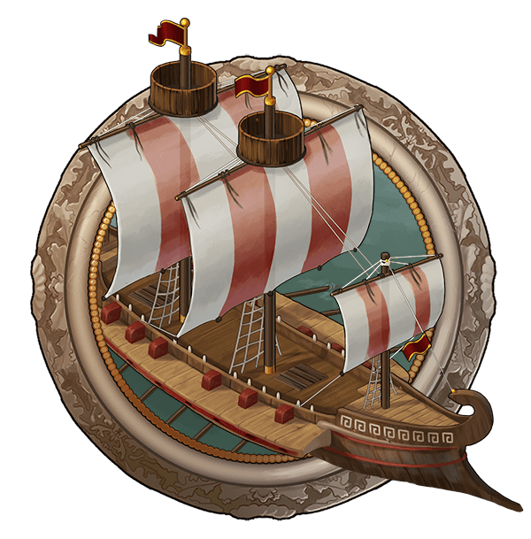

# Game Secrets ~ Harbors and their specialization

> Source: Unofficial Travian  
> URL: https://unofficialtravian.com/2025/01/12/game-secrets-harbors-and-their-specialization/  
> Written on August 17, 2023

---

Welcome to Thursday guides series! **Travian: Shores of War** is coming to us in September, bringing new and exciting features, such as naval movement and a new building – **Harbor**

Harbors allow us to build 3 types of ships: **Warships and Decoy ships** for troop movement, **Trade ships** for supplying villages with resources. Harbor level 20 allows to build up to 210 ships in total.

**Harbors, especially strategically located, make a huge difference in the pace of actions and in general bring more activity to the gameworld. Based on how you plan to use them, we can talk about 3 main specializations.**

#### **Attacking harbor**

Highly depends on how exactly you or your alliance performs offensive operations. In general, makes sense to build **24-32 warships, rest fill with decoy ships**. That would be enough to send multiple real attacks and needed number of fakes.

- If the attacking army dies in attack, the ships are also destroyed.
- If you plan to use your harbor for attacks, it’s better to keep clear specialization for it. Focus only on war and decoy ships and do not build trade ships there at all. However, for emergency situations and forwarding selected big packs of reinforcements (especially after incoming attacks) it’s fine to use warships from the pure offensive harbor as well.

#### **Defensive harbor**

One of the options for the harbor is to use it as def-hub.

*When you forward troops from a harbor village with ships available, you can allocate one of those vessels to the selected reinforcements enabling them to travel faster. It doesn’t matter whether the troops belong to you or the other player or whether they originate from a harbor or a regular village. After reinforcements arrive at the target village, the ships reappear in the harbor village immediately.*

Focus on Warships (~40-50) and rest fill with trade ships if needed. If your alliance has control over a diet artefact, it makes sense to enable diet in a harbor village and keep troops there.

- It’s up to the player whether they should train troops in harbor itself. However, if alliance owns 2 small artefacts – small boots and small diet, it might be better to make harbor solely a transport base and def-hub, and train troops in other villages where there is an option to enable different artefacts.
- The harbor in this case is used as a transport base. Enough warehouse and granary capacity, high level harbor and closest location to the capital would make it one of the best options.

#### **Trade harbor**

This specialization is quite simple. Just 210 trade ships and nothing else. Or, in case you want to make harbor more universal, you can make 10-20 warships for sudden forwarding task and rest fill with trade ships. No decoy ships there.

**Trade office and alliance bonus effects are applied to trade ships also**. That’s why perhaps the best results in terms of effective supplies will give **Gauls** (due to fastest travel time over lands) and **Roman** (biggest effect from the trade office) harbors, yet **any tribe would be effective**.

#### **General notes:**

Keep an eye on the attacks on harbors! If harbor (the building) is destroyed, all ships that are currently in the harbor, will also be destroyed. All ships that are currently on the way will be saved, though. Do not forget to build harbor at least level 1 before they come back.

The slower the troops are, the higher speed bonus is given by harbors. Therefore making farm-harbors is not really efficient.

Currently it’s only possible to forward single reinforcements (without using bulk forwarding feature). The bulk forwarding feature is in development though. Still, the rule will stay the same: one reinforcement – one ship.

You can’t allocate ship when sending back troops to the home village. Still, you can allocate ship to the forwarded troops. So, if you want to send back someone’s reinforcement home faster, just use forwarding feature.