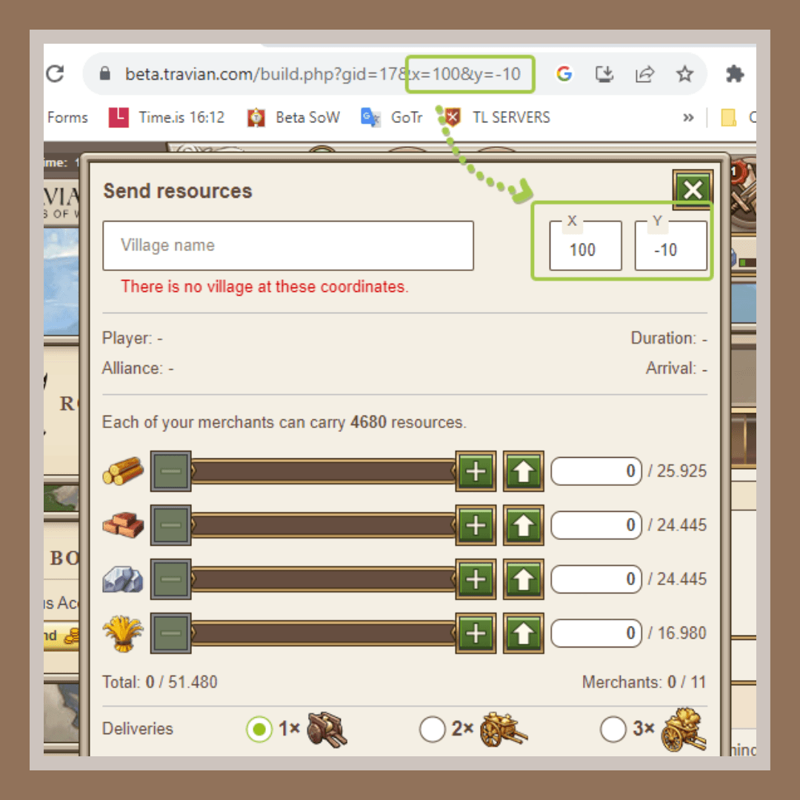
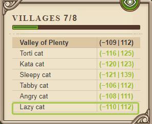
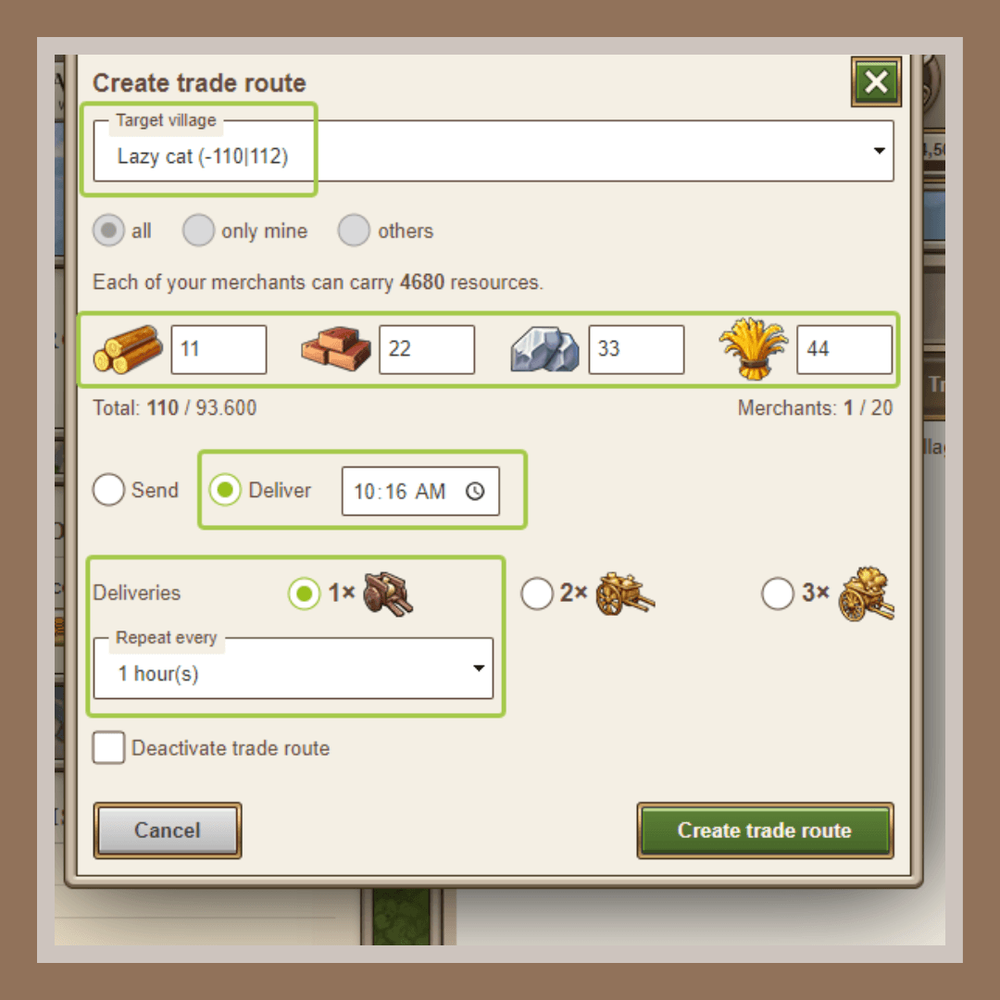

# Game secrets ~In-game links you might not know about

> Source: Unofficial Travian  
> URL: https://unofficialtravian.com/2025/01/12/game-secrets-in-game-links-you-might-not-know-about/  
> Written on August 31, 2023

---

**Welcome to [Thursday guides](https://blog.travian.com/tag/thursday-guides/) series!**

##### **Did you know that certain game actions can be set in the game via special links?**

Today we’ll make a small recap of the links that are not explicitly visible in the game, but you might find handy.

**Important note:** *All links that will be given in this article are set for beta Shores of War gameworld. In order to use it on your gameworld, you’ll need to replace first part: **https://beta.travian.com/** with your gameworld link.*

*For example, if you play on **Europe 30**, your links should start with **https://ts30.x3.europe.travian.com/***

##### **Position details**

https://beta.travian.com/position_details.php?x=100&y=-10

**Action:** Opens tile overview with inserted coordinates (100|-10) in this example.

##### **Marketplace**

https://beta.travian.com/build.php?gid=17&x=100&y=-10&t=5

**Action:** Opens marketplace with inserted coordinates (100|-10)

##### **Send troops**

https://beta.travian.com/build.php?id=39&tt=2&x=100&y=-10

**Action:** Opens “send troops” window  with inserted coordinates (100|-10). This link doesn’t contain pre-selected troops in there and opens with a default troop movement type (Reinforcement)

##### **Send exact troops**

https://beta.travian.com/build.php?id=39&tt=2&x=100&y=-10&troop[t1]=19&troop[t8]=1&c=3&gid=16&eventType=3

**Action:** Opens rally point -> Send troops window with inserted coordinates (100|-10), pre-selected movement type (Attack: Normal) and troops: **19x tier 1 [t1] units**and **1x catapult** [t8]).

The troop tiers, numbers etc can be adjusted to whatever you need by adding/replacing needed troop tiers and values in this part: &troop[t1]=19&troop[t8]=1

- [t1] – first (base) unit of any tribe. i.e Clubswinger, Phalanx, Legionnaire etc
- [t2] – second unit
- [t3] – third etc
…
- [t7] – rams
- [t8] – catapults
- [t9] – settlers
- [t10] – chiefs
- [t11] – hero

*For example, if you want to send 20000 clubswingers, 5000 Teutonic Knights, 2000 rams, 700 catapults and a hero, this part of the link will look like this:*

troop[t1]=20000&troop[t6]=5000&troop[t7]=2000&troop[t8]=700&troop[t11]=1

The type of movement is adjusted in eventType part

- eventType=2 – Reinforcement
- eventType=3 – Attack
- eventType=4 – Raid

##### **Redeploy hero**

https://beta.travian.com/build.php?id=39&tt=2&x=-100&y=-10&troop[t11]=1&c=3&gid=16&eventType=2&redeployHero=1

**Action:** The link allows to redeploy hero to the needed coordinates. Some players add this to their link list when they often move hero between the villages.

##### **Gold club feature ~ Trade route**

https://beta.travian.com/build.php?gid=17&t=3&did_dest=30958&r1=11&r2=22&r3=33&r4=44&trade_route_mode=deliver&hour=10&minute=16&repeat=1&every=1&action=traderoute

**Action:** Allows to fill trade routes (only for gold club users) with one link. The link contains target village, pre-selected resources, delivery settings

**Link variables****:**

- did_dest – village ID (you can find it by selecting a village in your village list or in [**map.sql**](https://blog.travian.com/2023/06/game-secrets-what-is-map-sql/) file)
- r1-lumber, r2-clay, r3-iron, r4-crop
- trade_route_mode=deliver – sets trade route mode on deliver at (time). Another option is =send
- hour=10&minute=16 Sets time when trade route should deliver resources ***(you need to use 3, but not 03, 0 and not 00 etc. here for hours and minutes).***
- &repeat=1 Repeats trade route 1 (2, 3) times
- &every=1 Sets trade routes that start every 1 (2, 3, 4, 6, 8, 12, 24) hours

*In this example it will set trade route that arrives at 10:16 server time, with 11 lumber, 22 clay, 33 iron and 44 crop. Trade route will be set to repeat every 1 hour  (meaning, it’ll create 24 trade routes in total), and will deliver resources once per route.*

And that is a wrap! Do you know some other useful in-game links that help you perform actions? Share them with us in our [**official Discord**](https://discord.gg/travianlegends)! Come back next Thursday for more tips and tricks about how to play Travian: Legends!