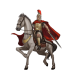
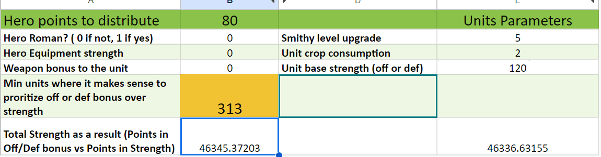

# Game Secrets ~ Maximizing Hero Experience and Growth

> Source: Unofficial Travian  
> URL: https://unofficialtravian.com/2025/01/09/game-secrets-maximizing-hero-experience-and-growth/  
> Written on January 31, 2024

---

Welcome to the [**Game Secrets**](https://blog.travian.com/tag/thursday-guides/) series! In Travian: Legends, every battle, adventure, and quest is an opportunity for your hero to grow in strength and skill.

Let’s have a closer look into the hero experience.

##### **Hero experience in the battles**

When your hero participates in battles, the amount of XP gained is directly tied to the losses inflicted upon the enemy army. Each point of supply of the killed unit grants one XP. **Whether in offensive or defensive battles, your hero earns XP based on their contribution to the combat effort.**

And if in attack the hero experience is clear: all 100% of gained experience will belong to the attacker’s hero, in defense it’s more complicated.

*The hero’s experience in defense with multiple armies depends not only on the own hero strength but more importantly on **the crop consumption** of the army accompanying the hero.*

**Example:**

(Let’s assume for simplicity that all 3 participating heroes will be non-upgraded with base Strength = 100)

**Player A** attacks with 1000 clubswingers + hero (1000×40+100 = 40100 attack)
**Player B** defence is 2000 mercenaries (base defence against infantry =40) + hero (2000×40+100 = 80100)
**Player C** reinforces with 4000 slave militia (base defence against infantry = 20) and a hero. (4000×20+100= 80100)

**What will be gained hero experience?**

Player A will get 630 points (for 210 killed mercenaries and 420 slave militia), even though the hero will die in a battle.

Player B will receive 1/3 of the experience (approximately 335), and Player C,  due to double crop consumption of their army, will earn 2/3 of the experience (about 671).

**That’s the fact: Even though both defending armies have absolutely same defence value, the one that consumes more crop will grant more experience to their hero.**

##### **Other sources of hero experience**

Those are Adventures, **Daily Quests, Village tasks, Hero Items like scrolls** (that will immediately give 10 experience upon use) and **Helmets** (that do not generate experience on their own, but increase experience gained in any way.

#####

If we again look at the example above and imagine that all 3 players’ heroes were wearing **Helmet of Awareness** (+15% experience), their XP gains would have been ~ 725 for Player A, ~385 for Player B and ~ 772 for player C.

##### **Hero experience in Unoccupied oasis farming**

There is one source also that we need to mention separately.

**Attacking unoccupied oases with the hero is a great source to boost your hero experience, get better skills and gain resources into your hero inventory.**

*When you attack an unoccupied oasis with your hero and defeat Nature units there, your hero will receive one XP for each theoretical crop consumption of the Nature unit and additionally 40 of each resource.*

*You can find hero experience and resource gain in the table below:*

| **Nature unit** | **Hero XP** | **Defence****against infantry** | **Defence****against cavalry** | **Reward** |
| --- | --- | --- | --- | --- |
| Rat | 1 | 25 | 20 | 40  40  40  40 |
| Spider | 1 | 35 | 40 | 40  40  40  40 |
| Snake | 1 | 40 | 60 | 40  40  40  40 |
| Bat | 1 | 66 | 50 | 40  40  40  40 |
| Wild boar | 2 | 70 | 33 | 80  80  80  80 |
| Wolf | 2 | 80 | 70 | 80  80  80  80 |
| Bear | 3 | 140 | 200 | 120  120  120  120 |
| Crocodile | 3 | 380 | 240 | 120  120  120  120 |
| Tiger | 3 | 170 | 250 | 120  120  120  120 |
| Elephant | 5 | 440 | 520 | 200  200  200  200 |

And this is a wrap in terms of feature description. Come back next Thursday for the players pro-tips

**Pro-Tip:**

Equip your hero with the following gear for maximum efficiency in oasis farming

- **Horse and Small Spurs**: Increases hero speed for swift engagements.
- **Small Map**: Facilitates faster return from expeditions into oases.
- **Right-hand Weapon**: Enhances hero’s combat strength.
- **Helmet of Awareness**: Accelerates hero experience gain and leveling.
- **Light Scale Armor**: Reduces damage taken and aids in health regeneration.
- **Bandages i**f you attack hero with the cavalry (expensive units worth using the items)
- Don’t forget to have some **ointment** in hero inventory for urgent health recovery to use it after the battle. Use it after the battle only.

**Pro-Tip 2:**

- Use task rewards and other “easy on health” ways to **level up your hero** if their health is too low. The hero gains full health after the level up.
- Sometimes you send hero to oasis and it suddenly bursts with strong units. Veteran players keep**some cages** to avoid hero loss for that cases. Just equip one cage while hero is on the way, the battle won’t happen and grateful hero will bring you a new pet as a reward.
- You can send hero alone or with the troops. In any case, all experience gained in such expeditions will belong to your hero.

##### **Level Progression and Attribute Points**

As your hero accumulates XP, they progress through levels, unlocking additional attribute points that can be allocated to various abilities.

We already talked about hero points allocation during beginner protection, let’s now look into the more advanced stage.

######

**Resource production:** An early game priority unless you’re a very experienced player. Put few points into strength not to lose too much health in adventures and that’s it.

**Strength:** Upgrading this parameter highly depends on whether you use your hero for oasis farming and attack/defense or not. If you are not too much into the battles, keep resource production as priority as long as possible.

**Off bonus:**Increases the attack value of the whole army by 0.2% per point (maximum of 20%). This bonus only applies if the hero is attacking with the army.

**Def bonus:**Increases the defence value of your whole army (means all own troops defending – the village where they come from is unimportant) by 0.2% per point (maximum of 20%). This bonus only applies if the hero is defending with the army. Other defending troops which are not under your control, will remain unaffected by this bonus.

**One of the most frequent players are asking when it makes sense to prioritize off or def bonus vs hero strength.**

We created a small calculator for you where you can check this. The calculator is based on the Kirilloid’s battle formula, so might slightly vary from the game results. Yet, we hope it will give you a small guidance.

**How to use it****:**

Let’s assume you’re a Hun player and have Steppe Riders level 5. You want to attack some hard target and want to make maximum damage with your attack. Your hero has 80 points that you want to allocate. After how many units will the hero off bonus in this case give you more advantage than hero own strength?

Let’s insert those values into the calculator:

*Without any strength from the hero equipment the off bonus would give more than hero strength if you have not less than 313 Steppe Riders. The more units you will have, the bigger will be the difference. The calculator works similar way with the defence bonus and units.*

**Link to calculator:** [Off/Def bonus vs Hero Strength](https://docs.google.com/spreadsheets/d/16mLXpMcZ8CMcI-C-MJ4r6vd_bn6-R1LcIkDPBjigZMY/edit#gid=1353677783)

And this is a wrap for today! Don’t forget to participate in a [**Thursday Tactician**](https://blog.travian.com/2023/09/thursday-tactician-contest-galore/) and come back next Wednesday for the next guide in the [**Game Secrets**](https://blog.travian.com/tag/thursday-guides/) series!