# Game Secrets ~ Medals

> Source: Unofficial Travian  
> URL: https://unofficialtravian.com/2025/01/12/game-secrets-medals/

---

The medals appeared in the game far far ago with the implementation of Travian 3.1 in 2008.

Since then the medals became an essential part of the game decorating the profiles both players and alliances. Let’s look into variety of them and remember good old times. Note! Some of the medals didn’t end up in the game after all and exist only as a project. Will you be attentive enough to find them in our collection?

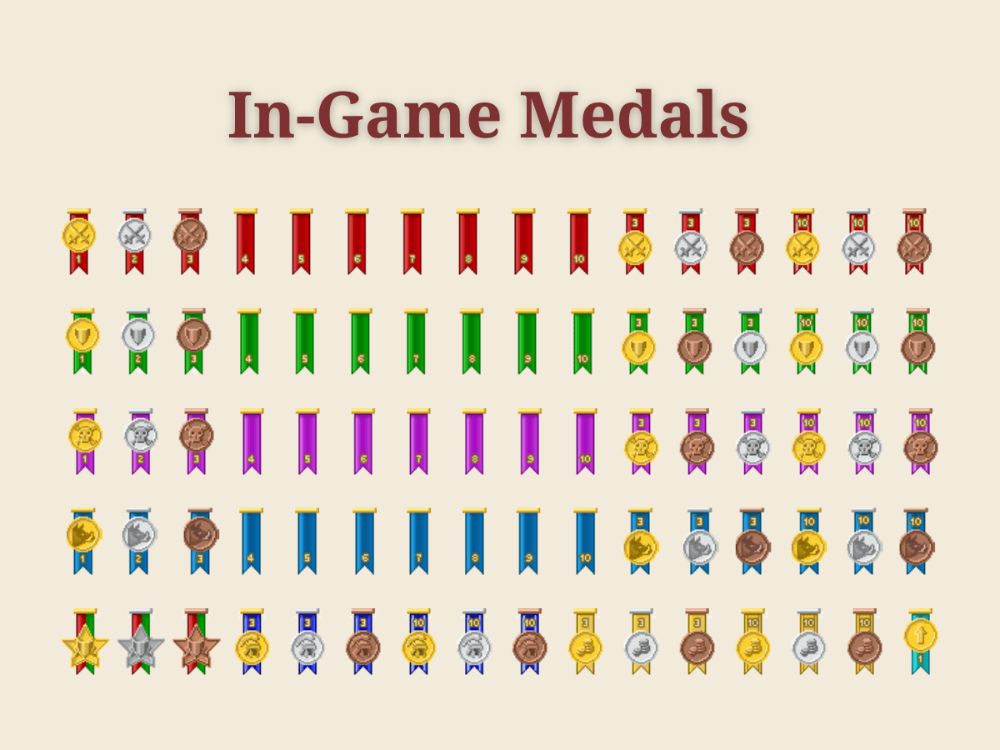
In-Game Medals are awarded every Monday 00:00 server time. Players can receive the following medals for the current round achievements.

- Top-10 Attackers
- Top-10 Defenders
- Top-10 Raiders
- Top-10 PvE (against Natars and Unoccupied oases)
- Top-3 best in same category of the week 3, 5 or 10 times throughout the server (not consecutive)
- Top-10 best in the same category of the week 3, 5 or 10 times throughout the server (consecutive)
- Top-10 both attackers and defenders of the week 1, 2 or 3 times throughout the server (consecutive)

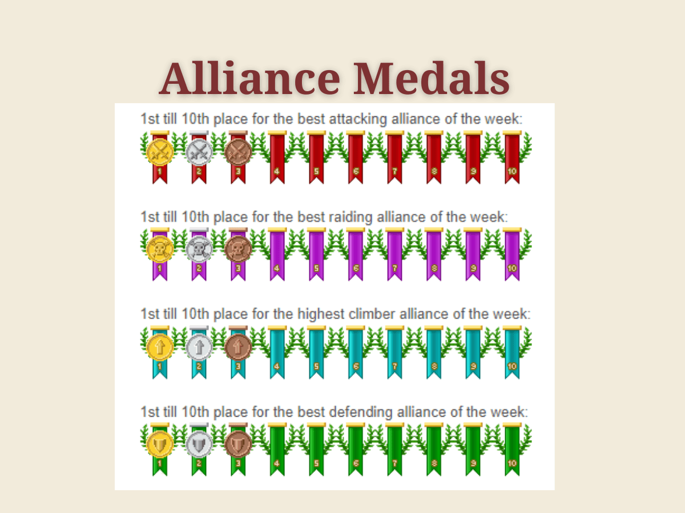
Alliance top-10 medals are similar to players medals, with the exception that instead of PvE Alliances are awarded with Climbers (most population growth). Alliance medals have laurel branches around them.

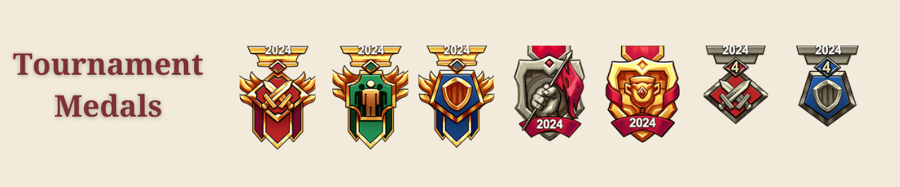
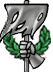
Tournament Medals are given for the participation in Tournament Qualifications and Finals: attack, defence, population, World Wonder, and Survivor medal which is given to those who played till the end. The medals have recently been reworked and received a nicer look in compare to previous version.

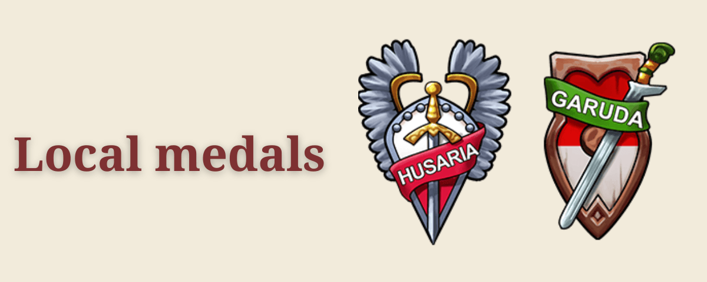
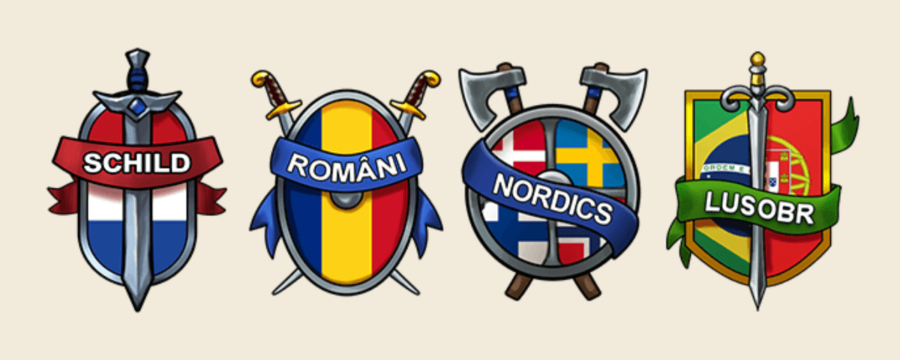
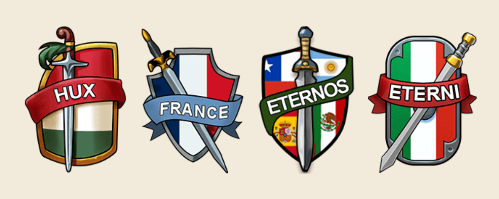
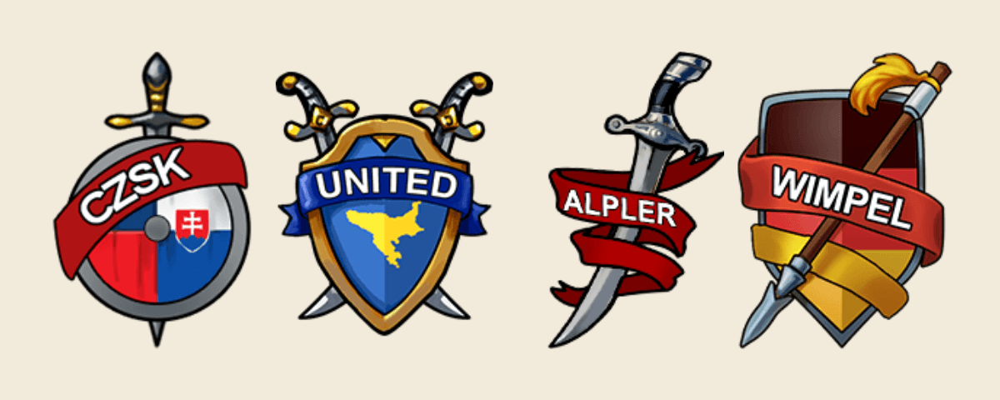
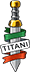
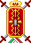
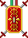
Local medals is a relatively new category. Medals are awarded for participation in Local gameworlds. First local world with special medal was Titani – Italian gameworld where the medal has been created based on community description.

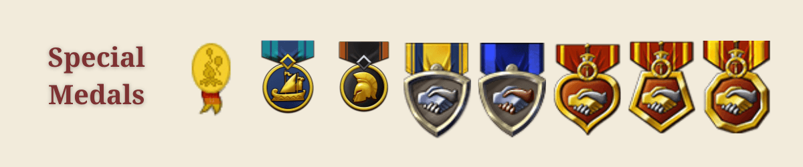
Last, but not the least is a special medals category. The medals that are given for participation in Special test gameworlds (Loyal Legend medals), to the winners of Glory of Sparta, Shores of War gameworlds, and also veteran ones for 3, 5 and 10 years of playing.
One medal stands out from this list – **Hammelburg meeting medal,**one of the most rare medals in the whole game. This  medal was issued to players who turned up to the Travian ‘Players and Team’ Meeting in Hammelburg, Germany in 2009 and was never awarded again.

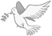
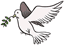
The first medal of all the times though was… the dove of peace. A little bird holding an olive branch was given to all players under beginner protection. Once the beginner protection ended, the dove faded away.