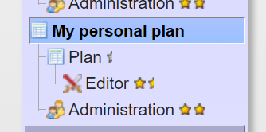
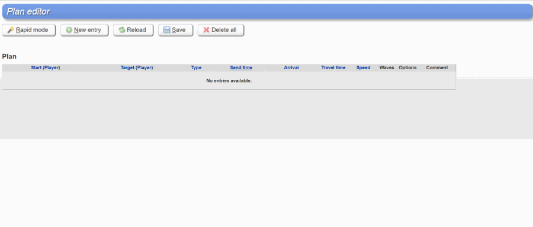

# Game secrets ~ Personal plan in Gettertools

> Source: Unofficial Travian  
> URL: https://unofficialtravian.com/2025/01/12/game-secrets-personal-plan-in-gettertools/  
> Written on December 6, 2023

---

Welcome to the [**Game secrets**](https://blog.travian.com/tag/thursday-guides/) series!

Today we will talk about one of the most famous external tools that Travian players use to plan and execute attacks. We are sure a lot of you used that for sending attacks prepared for you by off-coordinators. Yet, less players know that you can easily create personal plans on your own.

Let’s look into [**Gettertools**](https://www.gettertools.com/en/)attack planning feature!

##### **Stage 1 – Preparation**

In order to use [Gettertools](https://www.gettertools.com/en/) for personal attack planning you need:

| Create gettertools account | |
| --- | --- |
| Select your gameworld there | |
| Select full functionality for your account |  |
| Fill the troops and Tournament square level | |
| Select server time (or the time you normally play Travian: Legends) |  |
| If you own an artefact that affects troop movement or play on the gameworld where you can use it, if your alliance controls the region, add this artefact to the village. |  |
| Activate personal plan |  |

When you do all this above, an extra menu will appear where you can make your own plans:

##### **Stage 2 – Adding targets**

It’s quite common practice to “mirror” fake and real attacks the way they look similar under eyes artefact and arrive at the same time. Gettertools provides option to add targets 2 different ways:

###### **Add entries one by one**

Selecting start village -> Target village -> Speed and waves -> Time of attack etc -> Save)

|  |  |  |  |
| --- | --- | --- | --- |

###### **Add entries in a batch “Rapid mode”**

The advantage of Rapid mode is that you can once set the attacking village, number of waves, time, speed etc, select all players whose villages will be used as target and quickly add real target (marked red, added first) and fakes (added blue). It’s also possible to edit everything after, so don’t worry if you made a mistake. The quick overview of rapid mode you can see in the gif below.

