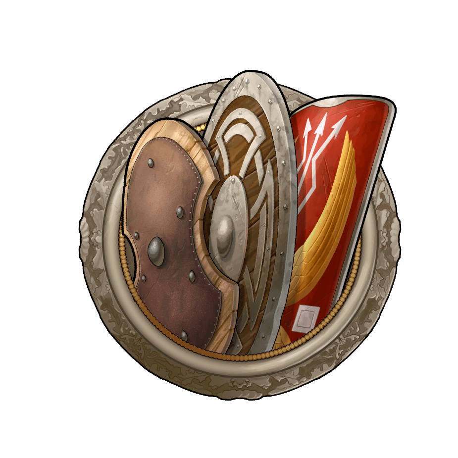

# Game Secrets ~ Playing with a defense account

> Source: Unofficial Travian  
> URL: https://unofficialtravian.com/2025/01/11/game-secrets-playing-with-a-defense-account/  
> Written on February 28, 2024

---

In the unforgiving realm of Travian: Legends, where every move can tip the scales of victory, defense emerges as the unsung hero of server domination.

##### **General expectations from a defensive player**

- Sending defensive support when required.
- [Snipe waves](https://blog.travian.com/2023/09/game-secrets-sniping-waves/) upon request.
- High online either on their own or via sitter access. Being available during critical hours to counter opponent operations.

## **Defence Account Specialization**

Defensive players developed various tactics of how to succeed in the chosen path. Here are a few most common examples of defense specialization.

**Based on alliance situation, possible threats and even picked tribe, players can select one (or a few) of account specializations:**

| **Specialization** | **In which situation this tactic works best** | **Notes on development** |
| --- | --- | --- |
| **Infantry only** Prioritizing infantry units for their defensive capabilities, almost no cavalry units | ·       As preparation to the World Wonder and artifact defense.·       Early game when account economy is still not fully developed, and distances where defense should travel are short.·       During intense battles when defense numbers are more important over their speed. | Training defense (only infantry) in almost each village.Fully developed barracks and hospital, but no stables.Tournament square ~ 15 level |
| **Cavalry only** Focusing solely on cavalry units for defense, leveraging their speed and versatility. | ·       In highly populated gameworlds or where alliance is spread over the map·       Works best for highly active experienced players. | Training defense cavalry in every second-third village.Fully developed stables and hospital, but no barracks.Tournament Square ~ 15 level |
| **Mix of Infantry and cavalry** Striking a balance between infantry and cavalry units for a well-rounded defense. | ·       Balanced version which fits almost any gameworld situation·       Not ideal for early game due to lack of resources and development | Training and upgrading both infantry and cavalry in the same defense village.Can be combined with other tactics (i.e. out of all defense villages only few selected train both infantry and cavalry) |
| **Hybrid account** Focus on defense play, but having an attacking army in one of the villages to participate in the alliance operations and local skirmishing. | ·       Advanced version of previous specializations and perhaps one of the most interesting to play because it allows to explore both sides of the game: attack and defense.·       In most cases beneficial for the alliance.·       For accounts with good economic development.·       In general, requires bigger gold investments. | Attacking village with both infantry, cavalry, rams, catapults and chiefing units.Defensive villages follow one of the previous defense specializations. |

Keep in mind, that defense players rarely follow only one of the selected paths. It’s not uncommon to have few “infantry only” villages combined with couple “cavalry-only” or “mixed”. Always follow the gameworld situation and your account development and pick the path that suits you best.

##### **Account development**

We already looked into balancing economy vs military development on a defensive account, you can read a separate guide on that [here](https://blog.travian.com/2023/11/defense-account-balancing-military-and-economy/).

**Let’s repeat the main points though and adjust them to the defense specialization.**

- Keep ~ 40% of your resource production for your future development.
- Don’t start training troops before you have at least one (better 2) fully developed village.
- Ignore previous rules if you live in aggressive surrounding.
- It’s recommended to start game with “infantry-only” specialization to get the needed pool of early defense without sacrificing economic development too much.
- Capital villages in most cases do not have enough space neither for offensive, nor for defensive specialization, so, it would be best to have there bigger warehouse/granary capacity to optimize costs and gold usage and grant defensive role to one of nearby villages.
- Defensive players need more variety in hero equipment to maximize hero bonus. You can find our recommendations on the hero items [here](https://blog.travian.com/2024/02/game-secrets-hero-inventory-packages/).

##### **Regular vs Special gameworlds**

Even though both game versions (regular World Wonder and Special) are same in their core, special gameworld features need some adjustments to defense tactics. Let’s look into more prominent of those.

**Special feature – Troop merging and forwarding**.

Forwarding troops (option to move defense from one village to another without necessity to send them home) gives defensive players option to establish their base further from the center (and therefore active game actions). Usual tactics on gameworlds with forwarding feature enabled is to settle mainly far but keep 1-2 villages in the “hot” area to react fast on threats.

**Special feature – Ancient powers**

In gameworlds with the ancient powers that players can activate in any of their villages, it’s mandatory to have treasury level 10 in each defense village. This rule, of course, works only if your alliance controls at least some small ancient powers.

**Special feature – European map and region control**

Even defensive players need to support alliance invasions to establish regional control. Accounts, both offensive and defensive therefore start being a bit more spread over the map. In this case it would be best to settle in “clusters” – a group of nearby villages. Once you will have a cluster that consists of 4 villages, you can start training defense in that area.

*More recommendations on the regular defense tactics you can find in our content creator guide [here](https://blog.travian.com/2023/05/def-guide-t4-6/).*

##### **To sum up**

The defense account in Travian: Legends holds a critical position in the server’s dynamics. Beyond numbers and ratios, successful defense hinges on strategy, coordination, and adaptability. Whether specializing in only infantry, only cavalry, or a mix of both, the key lies in contributing as much defense as possible to fortify the collective walls. As a defender, you play a vital role in the server’s narrative, safeguarding yourself and your allies.

*May your walls be unyielding, and your defense unwavering!*