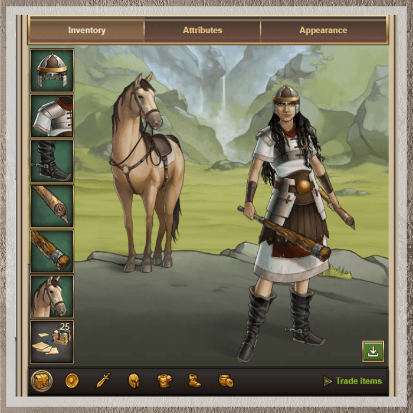
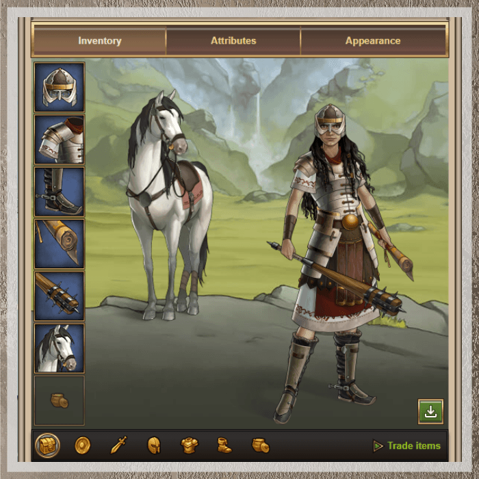
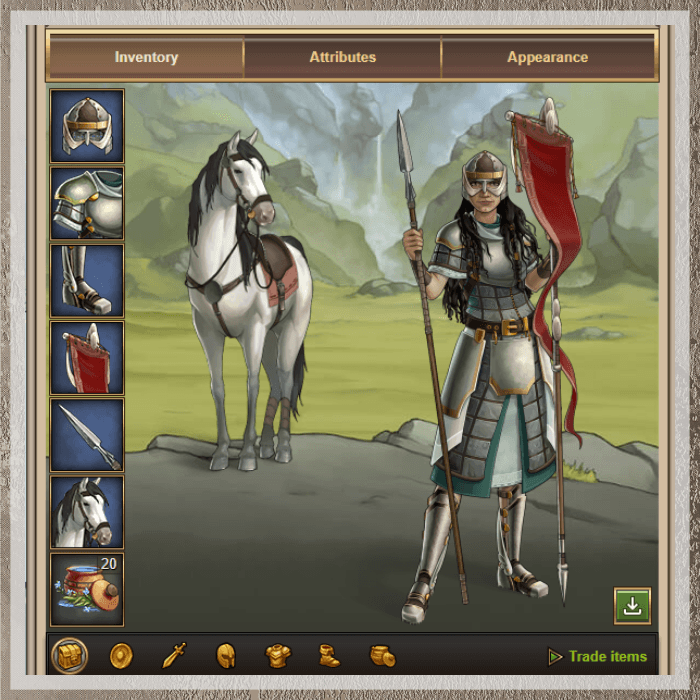
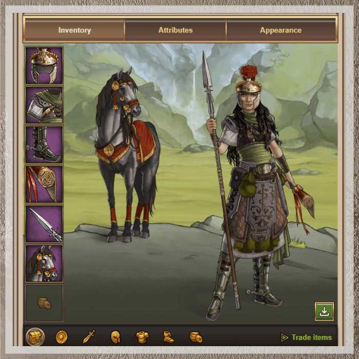
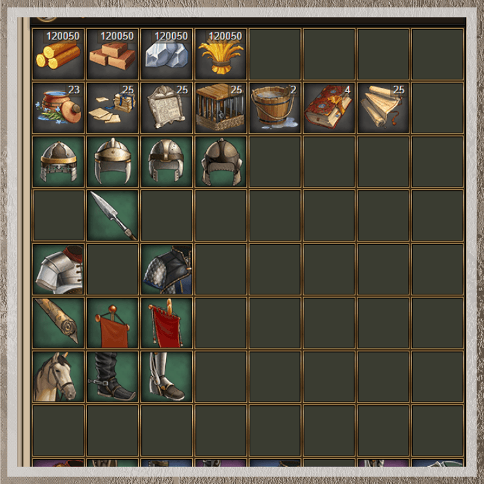
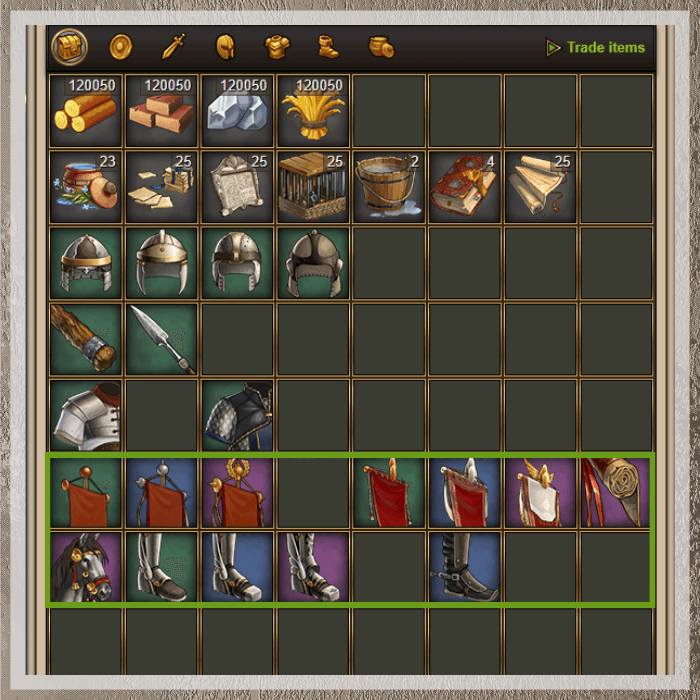

# Game Secrets ~ Pro-tips on Hero inventory

> Source: Unofficial Travian  
> URL: https://unofficialtravian.com/2025/01/09/game-secrets-pro-tips-on-hero-inventory/  
> Written on February 7, 2024

---

*Welcome to the [**Game Secrets**](https://blog.travian.com/tag/thursday-guides/) series! With this blog we finalize our hero adventure and will look into which items are must-have for hero.*

The heroes can be equipped with items which make them stronger and give an additional bonus. Hero can find items in adventures or player can buy them in auction for silver.  [Travian Knowledgebase](https://support.travian.com/en/support/solutions/articles/7000064021-hero-item-overview-and-mounts) provides a nice overview of all the variety of items that player can have.

In this blog article we’ll give some advice on **which items players should focus on depending on the stage of the game and their playstyle**.

##### **General information about items and tiers**

There are 3 tiers of the items in the game **Tier 1** (Green background) appears in the game from the start,**Tier 2** (Blue background) are same items but with bigger bonuses, and**Tier 3** (Purple background) are late-game items. Consumable items appear in the game either from the start (ointments, cages) or at later point (tablets of law, bandages, artworks etc).

You can find information about when you can expect next tier to appear in your gameworld.

| Speed: | X1 | X2 | X3 | X5 | X10 |
| --- | --- | --- | --- | --- | --- |
| Item tier 3 appears after: | 140 days110 days on AS | 70 days55 days on AS | 46.6 days36.6 days on AS | 28 days22 days on AS | 14 days11 days on AS |

Even though it’s indeed good to have the newest and most modern armour, weapon and other equipment, it’s also ok to just use any tier item if you are unlucky in the adventures and do not have enough silver to buy. The auction prices tend to be the highest at the game start and when the next tier items appear, then they go down. After some time you can buy items even for their base price. So, if you do not have that much silver, you can wait a bit for the better price.

Below you will find some hero equipment sets that are recommended to have for certain game actions and general development.

##### **Early game attacker and oasis farming set of equipment**

- **Helmet of Awareness**: Accelerates hero experience gain and leveling. This is important both for the upgrading of bonuses and gaining more experience from the village tasks.
- **Light Segmented or Light Scale Armor**: Reduces damage taken and aids in strength/health regeneration. Damage reduction in most cases works better than adding pure strength.
- **Small Spurs** to increase your mounted hero speed.
- **Small map** so that hero returned home faster and could go on another expedition.
- **Hero weapon** for your most used (biggest presence) attacking unit
- **Horse** to increase speed
- **Bandages** if you attack with hero and the cavalry (expensive units worth using the items)

##### **Mid-end game attacker set of equipment**

Not huge difference from the early game farming set. Still mainly same items. If you have chance to get tier 2 items, use it, but if not, tier 1 items still would work just fine.

During mid-game the first alliance operations might start which will require sending hero with the army. We still recommend in general keep using spurs instead of increasing army speed boots of mercenary though in order not to give rivals hint by increased speed of your army.

For endgame you can change the items to the bigger tier (tier 2 or tier 3).

##### **Mid-late game defender set of equipment**

- **Helmet of Awareness**: Yes, both attackers and defenders need to increase hero experience to get full scope of bonuses.
- **Segmented /Scale/Breast plate Armor**: Reduces damage taken and aids in strength/health regeneration.
- **Boots of Warrior** to increase your defensive army speed. Like we said, if in attack those boots work against you in most cases, for the defender it’s one of the most useful boots in the game. It’s good also to have spurs if you have considerable number of cavalry defense.
- **Standard**to increase speed when travelling between alliance members**and Pennant**in case you send hero to your own villages**.**
- **Hero weapon** for your most used (biggest presence) defending unit. It would be nice to have hero weapon to any units you ever send in defence (for example, Pike of Spearman + Paladin hammer. The later is needed ONLY if you train paladins).
- **Horse** to increase speed
- **Ointment (optional)** to keep hero alive if there are multiple waves of attackers coming.

##### **“I am home” set of equipment**

When hero is home and doesn’t participate in the battle, it’s good to focus on peaceful abilities of the hero and on health.

**Gladiator helmet** (of any tier) that adds Culture points, and **health regeneration** (if needed) items would be best to use.

Rest pretty much the same.

##### **Consumables and other sets**

Let’s now look into the hero inventory. There is no single defined set of the needed equipment, you should always adjust your hero gear to your current needs.

So, what else is important to have at any time and use upon necessity?

- **“Emergency resources”**After beginner protection keep some resources in your hero inventory for emergency cases such as: feeding reinforcements for a while in case of attacks, building up wall or residence etc.
- **Ointment** to urgently increase your hero health if needed.
- **Bandages** if you need to go for some risky expedition (doesn’t matter attack or defence) with your cavalry only. Bandages can also be used for infantry, of course, but this is a bit expensive.
- **Tablets of Law**. At some point someone will definitely want one of your villages. Keep some tablets of law to increase loyalty of your citizens fast.
- **Cages.** If you are defensive player, they will help you to clean oasis from the animals you plan to conquer. Also you can use cages to catch strong nature units (bears, tigers, crocodiles and elephants) that will help you defend your village. Cages are important mainly early game though.
- **Water bucket**to revive your hero fast.
- **Books of Wisdom** to redistribute your skill points in case someone attacks you or you need to attack (ideally more than one so that you could return your hero into resource production mode after). Needed only until hero reaches lvl 100.
- **Scrolls.**Sometimes you might miss just few experience points to level up your hero and get full health. Scrolls will help you.

- **Helmets** reducing training time of infantry and cavalry are especially useful for attackers, but won’t hurt also for defenders. **Helmet of Awareness** and **Gladiator helmet** to get bigger experience and additional culture points.
- Weapon and all possible left hand items and boots that reduce travel times.

##### **Last piece of advice for defensive players**

While for attackers the most useful boots are spurs and most needed left-hand item is map, for defenders it’s recommended to have **the whole variety of left hand items and increasing speed boots**.

It’s quite normal practice when defender is asked to cut waves of catapults to reduce damage or send defense as close to the attack times as possible. If you don’t want to wait too long with alarm, you can just try sending defense with all possible combinations of increasing speed items. For example Map + Boots of regeneration for slowest movement (and at the same time one of the fastest returns), or Boots of Archon + Great Standard for the fastest option. Adjust, try and calculate travel times to become best defender ever!

#####

And this is a wrap. Don’t forget to participate in a [**Thursday Tactician**](https://blog.travian.com/2023/09/thursday-tactician-contest-galore/) and come back next Wednesday for the next guide in the [**Game Secrets**](https://blog.travian.com/tag/thursday-guides/) series!