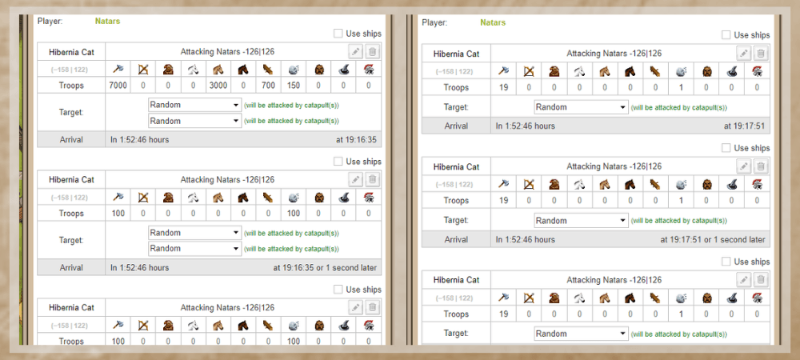
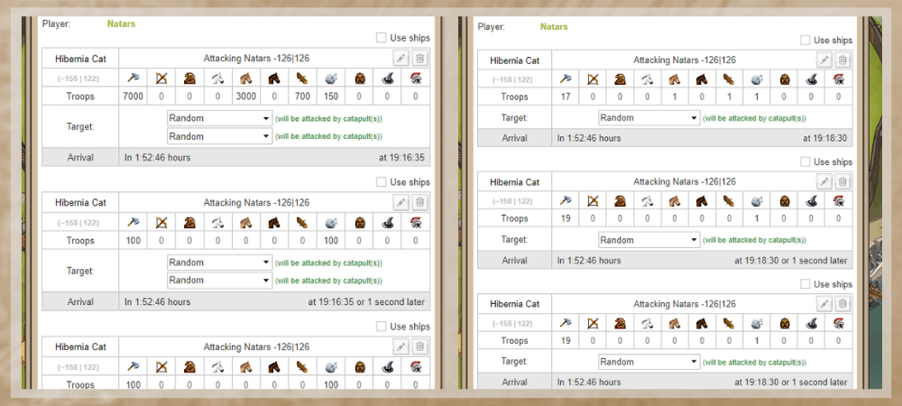
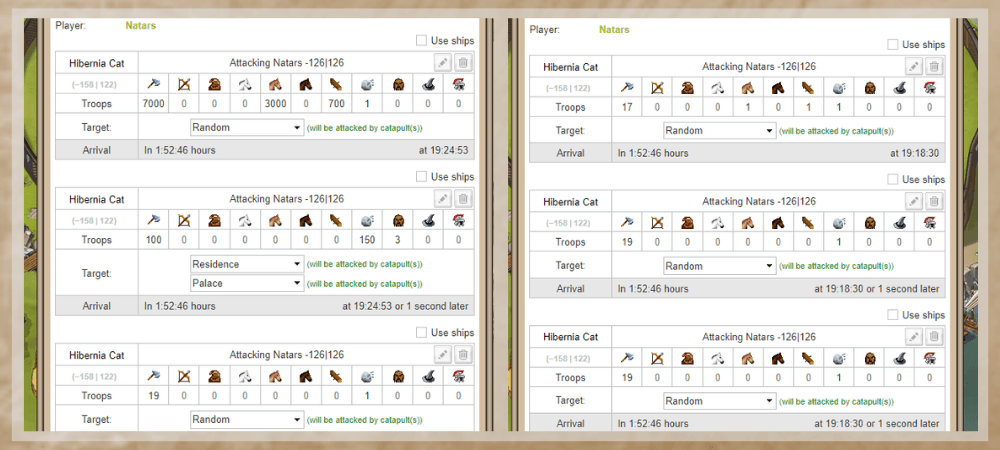

# Game secrets ~ Real attacks and fakes

> Source: Unofficial Travian  
> URL: https://unofficialtravian.com/2025/01/12/game-secrets-real-attacks-and-fakes/  
> Written on November 29, 2023

---

Welcome to the “Game secrets” series. This guide might not reveal you any secrets, yet, it might help you to take more significant role and participate in the off-operations helping your alliance on their way to victory.

**Off-operation is alliance combined activity or a solo operation where player needs to send real attacks and fakes to the targets to the exact time. It’s important to stick to the provided plan as close as possible and respect times, quality and number of fakes vs reals.**

- Best option would be to calculate travel times and send your real attack with fake ones as close in arrival time time as possible. If it’s alliance operation and your off coordinator gives you exact time of arrival, you should stick to it and ideally land at exact given second.
- In general there are ways to send attacks without wavebuilder, but we would recommend to use one if you are new to the game.
- Make sure you know the artefact effects that players might use: there is a difference how real attacks and fake attacks should look if the player has active Eagles eyes artefact. Also, if the defending player uses architect or confusion, this might affect your catapult number or selected targets.
- Do not send whole off, catapults and rams in your real attack in case you still have fake attacks that you will need to send after. Calculate min number of units you need to send as fakes. For example, if after your attack you still need to send 4 fakes per 4 waves, make sure to leave not less than 304 infantry units (19*4*4) + 16 catapults(1*4*4)
- Always assume, that your defending target has Rally point 20, so, your fakes should be not less than 20 units.
- If you send attack with hero, make sure to change their outfit to attacking one. Do not use boots that increase speed (Boots of Mercenary, Warrior, Archon) if you send your catapult waves with hero.
- Number of infantry units in real attack is case to case player decision. Some players add just 1 unit or send only catapults (in case the defender cannot have eyes artefact) others prefer to reduce catapult losses and add some units for support.
- It’s important to make a habit of doing proper fakes against an eyes artefact, that fully mirror the real attack disposition.

| Targets | Real attack | Fake attack |
| --- | --- | --- |
| Zeroing village, no eyes artefact | **First wave** – Attacking infantry, attacking cavalry, rams, catapults, hero (optional)**3x following waves** – some attacking infantry + 200-400 catapults (the number depends on your targets, whether the village is a capital or not).More information about how many catapults you need to destroy a certain village can be found [**here**](https://blog.travian.com/2023/10/game-secrets-the-use-of-catapults/). | 4x waves of 19 cheapest units + 1 catapult |
| Zeroing village, eyes artefact | **First wave** – Attacking infantry, attacking cavalry, rams, catapults, NO hero**3x following waves** – some attacking infantry + 200-400 catapults* (the number depends on your targets, whether the village is a capital or not).*Note:* *It’s important to set 2 targets per wave!* | First wave – 17 attacking infantry units, 1 attacking cavalry unit, 1 ram, 1 catapult3x following waves – 19 attacking infantry, 1 catapult |
| Chiefing an active target | **First wave** – Attacking infantry, attacking cavalry, rams, 1 catapult, hero (optional)**Second wave** – 100-300 infantry, 100 catapults*, target – residence/palace/command centre (based on your previous scouting) + chiefs.**Third and fourth waves** – optional 19 infantry +1 catapult*Note: If you want to be 100% sure you chief a village, set all 3 administrative buildings in first and second waves. This will require more catapults per target.* | 4x waves of 19 cheapest units + 1 catapult or same fakes as above |

*Number or catapults required depends on their smithy level and attacked target. You can look how many catapults you need [**here.**](https://blog.travian.com/2023/10/game-secrets-the-use-of-catapults/)

##### **Bonus**

For those who prefer to see rather than read here are examples:

###### Real vs fakes against regular village (no eyes artefact)

###### Real vs fakes against regular village (eyes artefact)

###### Chiefing fakes (one of options)

