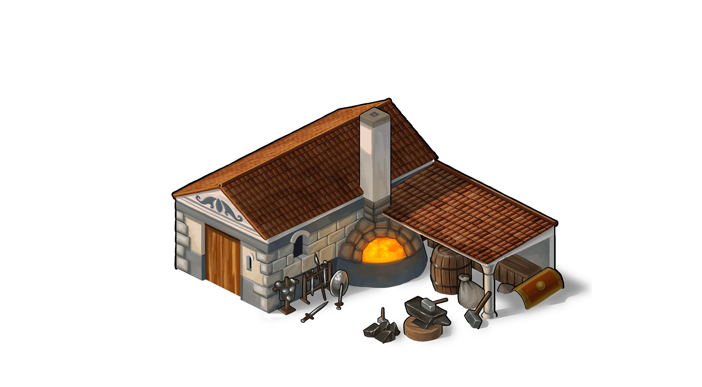

# Game Secrets ~ Smithy and total strength of an army

> Source: Unofficial Travian  
> URL: https://unofficialtravian.com/2025/01/12/game-secrets-smithy-and-total-strength-of-an-army/  
> Written on October 11, 2023

---

***Disclaimer:** This article is entirely the work of [Kirilloid](http://travian.kirilloid.ru/) translated by English users from old travian.com and travian.us forums. Written back in 2009, this article didn’t lose its relevance and gives one of the most advanced explanations on how battle works in Travian: Legends. We’ll publish all parts of this guide with some updates based on recent changes in the game. You can find previous part [**here**](https://blog.travian.com/2023/09/game-secrets-combat-system-formulas-written-by-kirilloid/)and* [***here***](https://blog.travian.com/2023/10/game-secrets-combat-bonuses-own-village-defense/).

#### **Smithy upgrade formula**

**improved_value = BASE_VALUE + (BASE_VALUE + 300 · UPKEEP / 7) · (1.007^LEVEL – 1)**

It is correct for every stat (offense, def. against infantry, def. against cavalry), for any tribe and for any unit.

**Note: Base upkeep is always used.** Neither artifacts, the WW village, nor the Horse Drinking Trough affects Smithy upgrades.

**As always, consider an example:**

20,000 clubswingers, fully upgraded in smithy (lvl20) attack 12,000 non-improved praetorians.
According to formula above

- improved_value = 40 + (40 + 300 · 1 / 7) · (1.007^20 – 1) ≈ 40 + (40 + 42.8571) · 0.149713 = 52.4048
- offense points will be: 20,000 · 52.4048 = 1,048,096
- defense points will be: 12,000 · 65 = 780,000
- total amount of troops is 32,000, so according to immensity of battle will be
K = 2 · (1.8592 – 32,000^0.015) = 2 · (1.8592 – 1.1684) = 2 · 0.6908 = 1.3816
losses will be 100% · (780,000 / 1,048,096) ^ 1.3816 = 66.486% or 13297 clubswingers

#### **Other bonuses**

**Apart from the smithy upgrades the game has various other bonuses and even one malus that might affect the game result. The formula of the total army strength is based on a simple multiplying.**

**Total strength for a certain unit** = (smithy’d base attack + weapon bonus) * amount of units

**Total strength for an army** = (total strength for each unit in this army + equipped hero strength) * hero attacking or defensive bonus * Natar horn bonus (if a Horn of Natars is present and it’s attack against Natars) * brewery attack bonus (if a player has a Teuton capital with an active brewery celebration) * alliance metallurgy bonus * 0.5 payment ban 50% penalty (if a player is banned for payment).

5

6

4