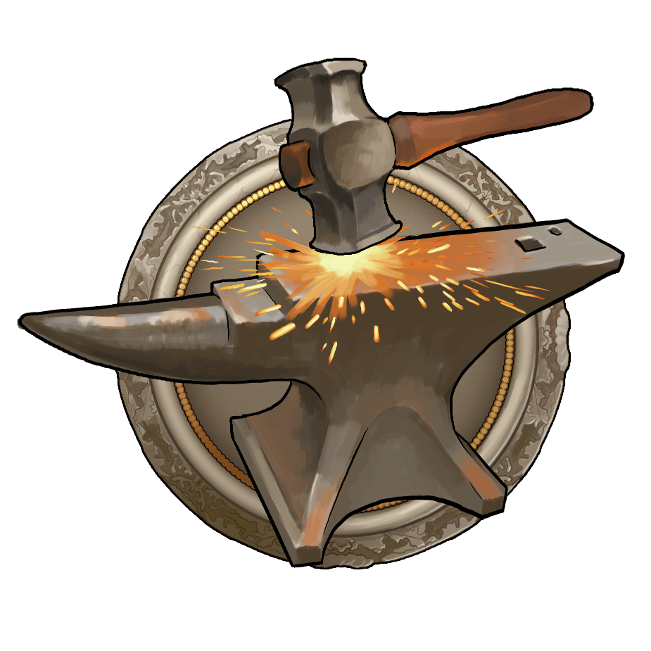
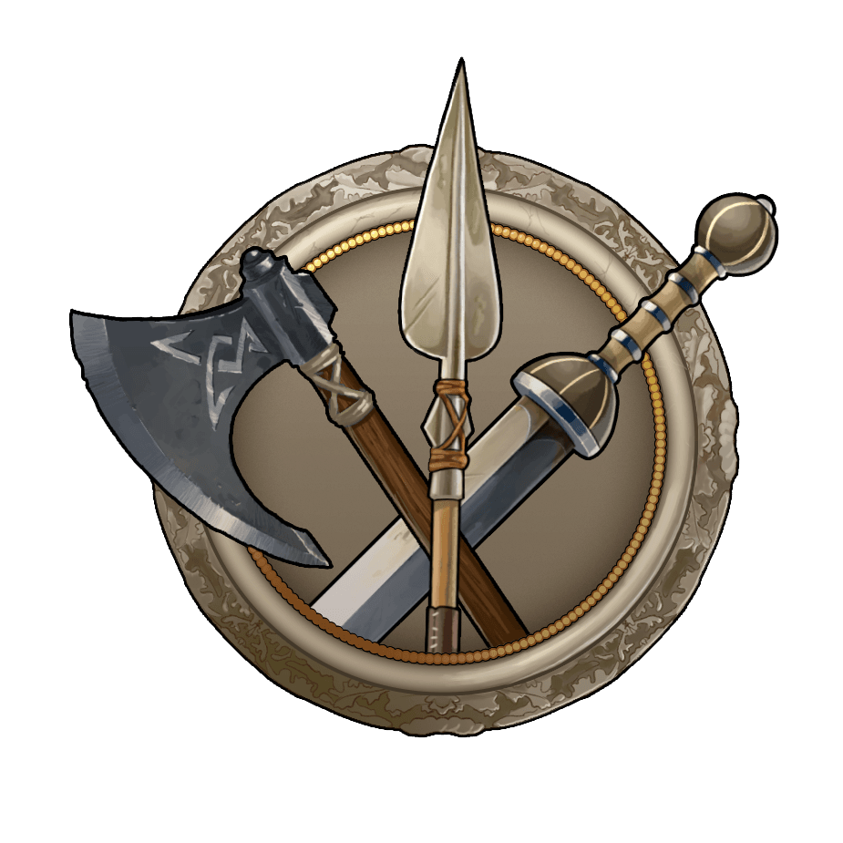
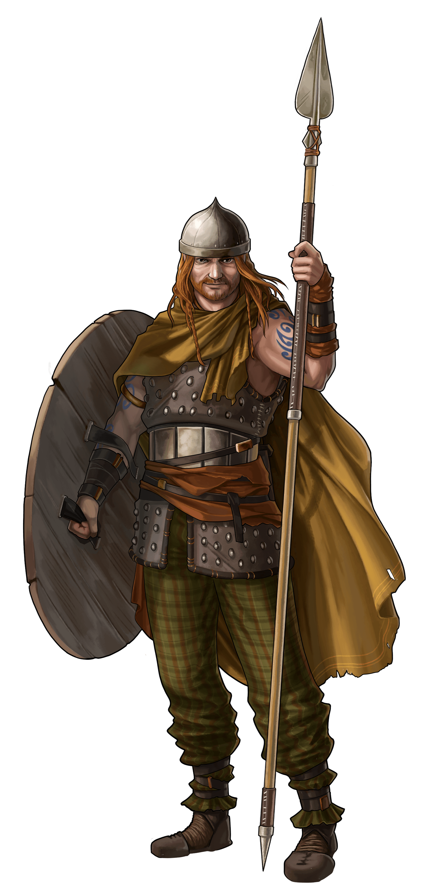

# Game Secrets ~ Sniping waves

> Source: Unofficial Travian  
> URL: https://unofficialtravian.com/2025/01/12/game-secrets-sniping-waves/

---

**Welcome to [Thursday guides](https://blog.travian.com/tag/thursday-guides/) series!**

As you can see from the title, today’s topic is a very popular technique used by a lot of players. A while ago we already published a video guide about sniping waves, this blog is an extended an updated version of it. You can still watch the video here: [**Sniping waves**](https://blog.travian.com/2021/04/ask-travian-34-sniping-waves/).

Let’s talk about so-called “sniping waves”, “cutting waves” or “insert” technique (different communities have various names for the same action).

Regardless of terminology, it’s one of the most important defense tactics that you really have to master if you want to be a successful defender. This has saved important villages not once!

##### **What is “sniping” waves?**

**With the term “sniping” we mean when defensive troops land into a very small time gap between two attacks – literally one second or so.**

The snipe should ideally hit on the same second as the first attack or any seconds in-between the next attack.

Why so? **When troops are sent to a target hitting right on the same second, they will land exactly in the same order as they were sent.**

The game uses the “First In, First Out” principle: actions that are scheduled to happen in the same second will happen in the order in which they are scheduled.

Therefore, since the actual attack was sent first, it will also land right before the snipe.  And if you manage to insert some defence  between 2 waves of attacks, it will make the second attack hit the defense.

If the snipe is successful, the attacked village won’t take further damage from catapults and the overall damage is decreased.

To make it even clearer, let’s go through this example:

|  |  |
| --- | --- |

As you can see, in second option you still lose the first 4 targets BUT by placing your defense between the second and the third wave you save the other 4 and you kill 400 catapults of your enemy. Isn’t it much better?

As a rule of thumb, most attacking players will place the biggest part of their hammer in that first wave in hopes of clearing out any stacked defense and allowing the rest of their catapult waves to hit a village empty of defenders.

As a defender, if you know that you won’t be able to stack a big enough defense to kill the hammer with minimal losses in time, this is definitely the most interesting alternative.

##### **What can be considered as a “good snipe” in early game?**

**300 – 800 units** are considered a good snipe, but of course that number will increase with the game progressing.

##### **What about mid-game and end-game?**

First of all, a side note. Attackers who attack with 8 waves, which is the maximum allowed by the wave-builder, are perfectly aware that late waves can be sniped. Even waves sent perfectly on time can only come 4 per second.

It’s not unusual for them to use the so-called “mid-cleaner” or “baby hammer” to the 5th wave to prevent catapults from being sniped.

Normally this consists of 5-10% of their main hammer.

As a result, in the mid-game the reasonable defence would be**2-3k defense units**, if you expect only catapults with small support or even **up to 10-20k if you expect your opponent to use a “mid-cleaner”.**

##### **Pro-tips and tricks about sniping waves**

**In your defense village train troops of as many various speed as possible and, if you use hero, buy all possible tier items that make troops travel faster.**

It’s not unusual for experienced defenders to train 5-10 rams and catapults as well as other units of various speed in their defensive villages. First, it allows to send needed defence as close to the required time in order not to give the defending player an extra burden of taking care and feeding troops.  Second, in case of the sniping waves, you will have as many attempts to cut waves, as many various speeds you can apply to your army.

***Let’s take this as an example:***

*You are a Gaul defender on a x1 gameworld, who has phalanx-druidrider army and you need to snipe waves in your co-ally village 10 fields away, that arrives in exactly 4 hours at 4:00:00.*

*If you have only phalanx and druidriders in that village, you will have exactly 2 attempts to “snipe” wave.*

- *Phalanx speed (7 fields per hour) – sending 1:25:43 before attack*
- *Druidrider speed (16 fields per hour) – sending 0:37:30 before attack*

If you have trained at least 1 ram, 1 catapult, 1 swordsman in the village you can also attach the slower unit to your army and receive extra attempts

- *Catapult speed – sending 3:20:00 before attack*
- *Ram speed – sending 2:30:00 before attack*
- *Swordsman speed – sending 1:40:00 before attack*

Let’s agree that 5 attempts is better than 2, right? And give more chances to succeed.

**Train “sniping army” in a few villages if possible**

Same reasoning: The more variety you will have in terms of distances and travel times, the more attempts you might make and the more possible real attacks you can snipe.

**Practice sending snipe waves in advance**

This goes without saying. The more practice you will have, the more successful you will be in real battle. During “calm” times try sending reinforcements to one of your close villages so that they would come at the exact time. The numbers here do not matter, yet, the experience means a lot!

**Use “exact time” site or at least refresh your prepared snipe tab regularly**

If you keep prepared tab with snipe wave for too long (i.e. longer than a few minutes), the time left might be shown incorrectly. Refresh it regularly and make sure to do that at least 30 seconds before sending to update the time. Additionally, you can use exact time site for planning, which might be more correct, for example <https://time.is/>

And that is a wrap! Hope this will help you to save your villages and villages of your co-allies not once! Come back next Thursday for more tips and tricks about how to play Travian: Legends!