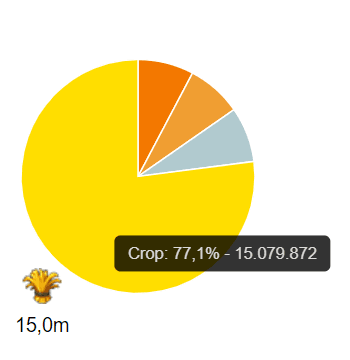

# Game secrets ~ Some basic questions about the game

> Source: Unofficial Travian  
> URL: https://unofficialtravian.com/2025/01/09/game-secrets-some-basic-questions-about-the-game/  
> Written on November 8, 2023

---

Welcome to game secrets series. Today we would like to give answers to the most frequent questions from the community. Read questions and answers session and tell us what other topics you want to get covered in more details in our regular guides series.

##### **Early game questions**

**I am totally new to the game, what this game is about?**

See **[What is Travian Legends](https://blog.travian.com/2023/02/what-is-travian-legends/)** blog post to get an idea about this topic.

**What is my first goal when I register in the game?**

Expand your empire, or, in other words, settle your second village of course! Various **[guides on that topic](https://blog.travian.com/2022/12/guides-fast-2nd-second-village/)** will help you with that. Just select the correct gameworld speed and follow the guide. If you are new to the game, it will give you better results than trying to invent your own way.

**What if someone else sends settlers to the same place I do?**

The first settlers to reach the valley will settle it. When it happens, all other settlers that are on the way to the same valley will turn around and head home. After they come back, you can re-send them to another coordinate.

**How should I develop my villages?**

There is an extensive guide on **[developing your first villages](https://blog.travian.com/2023/04/developing-your-first-villages/)**.  It’s more a recommendation for the optimal development, general canvas to follow. Of course, you can always make adjustments to this development guide if you need.

**What village should I make my capital?**

A cropper with good oasis bonuses. You can have a look here some advice on **[which cropper fits best your game style](https://blog.travian.com/2023/04/types-of-capitals-and-their-development/)**.

**How can I change my capital?**
Build a palace in the desired village (Remember, only one per account! If you have it already built in another village, you need to destroy it first.) and click on the “Make this village my capital” link on the building overview page.

**How do I get more resources for my development?**

One of the good ways to get more resources is farming unoccupied oases. This way you won’t go into conflict with the others and also will get precious resources into hero inventory. You can find **[oasis farming tips and tricks](https://blog.travian.com/2023/05/oasis-farming-tips-and-tricks/)**in our previous blog guides.

##### **Questions about conquering**

**I do not want to settle anymore, how do I conquer a village?**

To chief a village you need to have a special unit – administrator (Roman senator for Romans, Chieftain for Gauls, Chief for Teutons, Nomarch for Egyptians, Ephor for Spartans and Logade for Huns). You also need to destroy an administrative building in a village you plan to chief (residence, palace, or a command centre), if there is one, with catapults. Then attack with the administrative unit till the loyalty of the village goes down to 0.

More detailed information about conquering can be found **[here](https://support.travian.com/en/support/solutions/articles/7000064014-conquering-villages).**

**How can I prevent my village from being conquered?**

There is a detailed explanation to methods of preventing conquering in our Travian Knowledgebase. You can find it **[here](https://support.travian.com/en/support/solutions/articles/7000060247-preventing-conquering)**.

**What happens if I conquer my own village?**
Should you conquer your own village, either by mistake or to move ownership around, you will suffer most of the negative effects of normal conquering. Your wall will disappear, all troops will vanish, all researches are undone, and any queues (building or troop) will be cancelled.

##### **Interaction with others**

**How do I get into alliance?**

Build an embassy and look into the first tab. Here you will find alliances that have villages within 50 fields. It’s best, if you came to the gameworld alone, first try to join an alliance from your surrounding in order to use better combined defence. Just write an alliance leader and ask for the invitation. It would be a good tone to define your game experience and specialization in the game. Don’t be afraid to say you’re a new player and willing to learn.

The important thing about joining an alliance is about **[not getting farmed](https://blog.travian.com/2023/05/how-to-avoid-getting-farmed/)**, though. It also helps if you follow the general **[Travian etiquette](https://blog.travian.com/2023/07/game-secrets-travian-etiquette/)** and position yourself as a team player.

**I am getting farmed, what can I do?**

There are 4 main points that will help you to avoid getting farmed early in the game.

- Be active.
- Keep your development in line with others.
- Train troops and upgrade a wall.
- **Do not keep lots of resources in your resource villages**when you are offline.

More detailed guide how to avoid getting farmed can be found **[here](https://blog.travian.com/2023/05/how-to-avoid-getting-farmed/)**.

**I am in alliance! An alliance leader asks me to send 1 hour production to another player for some alliance purpose. Is there an easy way to find out my hour production?**

- Open**General statistics** , find the circle with the percentage of your production per day.
- Hover over the yellow part (crop) and find out the numbers and percentage.
- **Use this formula:*****Total amount of crop x100 ÷ percent of crop ÷ 24 hours.***
- The number you receive will be your total hour production.

**Example****:**

Crop production here is 15 079 872 and it’s 77.1% from the total resource production.

15 079 872 x100 ÷ 77.1 ÷ 24 = 814 952

One hour production of the player in the example is 814 952 resources per hour.

2

2