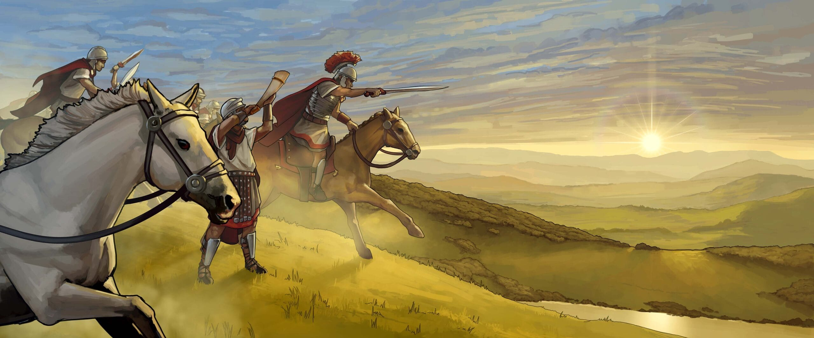
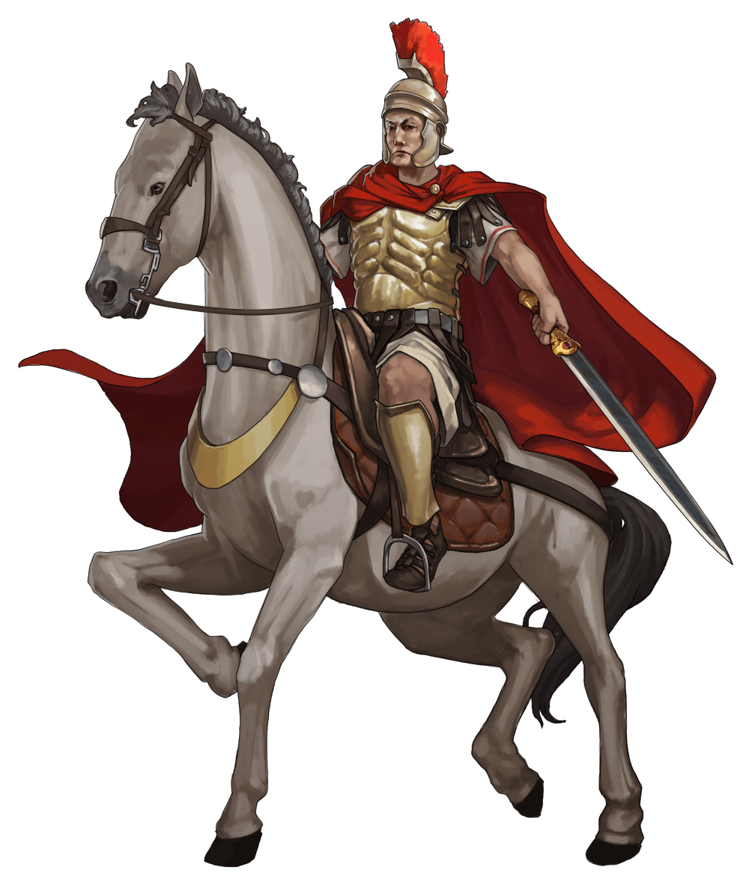
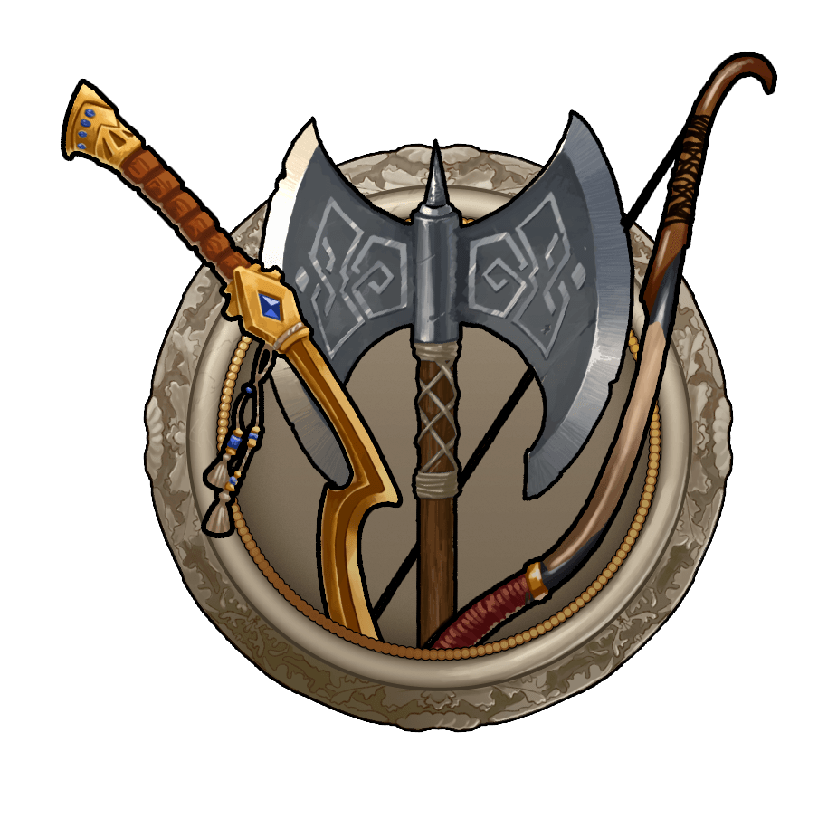
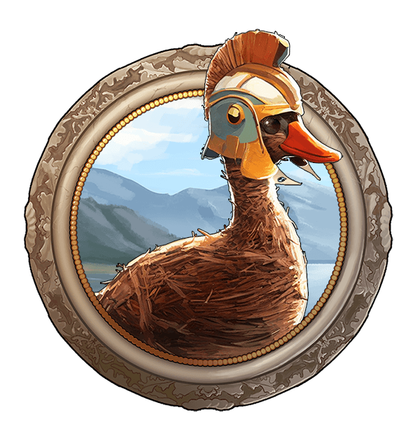
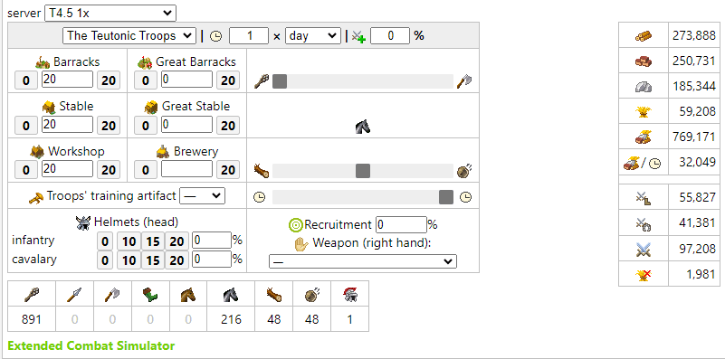

# Game Secrets: The path of the warrior ~ An Operational Hammer

> Source: Unofficial Travian  
> URL: https://unofficialtravian.com/2025/01/11/game-secrets-the-path-of-the-warrior-an-operational-hammer/  
> Written on April 10, 2024

---

Welcome to the **Game secrets** series.

*Travian: Legends is a strategy game, which most reminds chess. Just like in chess round, you have to think ahead and plan your moves carefully to win. And it’s especially important when you choose the path of an offensive player. Even though it might look complicated to a newcomer, it’s one of the most interesting interactions in the game, and today we will look deeper into the basics which you can use and transform based on your vision, strategy and gameworld situation.*

#### **Offensive playstyle**

The war cannot be won only in defense. Every successful alliance has to combine offense and defense operations to expand their influence, clear territories, conquer artefacts and fight arch-rivals. As an offensive player in Travian Legends, your main focus in the game will be on building a military force to attack, destroy and conquer other villages. Your main goal will be to dominate the game by aggressively expanding your empire through conquest and warfare.

And for that you need an offensive army.

**Most common basic offensive army of an offensive player is so called Offensive operational  army also known as Operational or Working hammer.**

**”Hammer” – an unofficial but a widely used name for any attacking army in Travian: Legends. Big defensive pack in turn is called “Anvil”.*

#### **What is Operational (Working) hammer?**

A mid-sized army, normally trained only in Barracks, Stables and Workshop (without Great Stables/Great Barracks) and which is used in everyday offense operations. An army that can be trained for ~1/8 of the server length depending on speed (i.e. 1 month for the x1 gameworlds, 2 weeks for x2 and 10 days for x3 gameworlds).

**If we talk about numbers, it’s around:**

- 25000-35000 offensive infantry
- 6000-12000 offensive cavalry
- 1500-2000 rams
- 1500-2000 catapults

By its definition, the **Operational hammer is something you can use every day** for conquering surrounding, going in attacks against the low-risk targets or as a supportive force in alliance operations. Outside of the battles, same army can be used for farming inactives/oases.

This type of hammer is the one we recommend to start with if you’re new to the game, had a long break or played only as a defense player before and want to try more aggressive style in the game.

| Tribes | | Offensive infantry | Offensive cavalry |
| --- | --- | --- | --- |
| **[Gauls](https://blog.travian.com/2023/03/5-things-to-consider-about-gauls/)** |  | Swordsmen | Haeduean, Theutates Thunder |
| **[Teutons](https://blog.travian.com/2023/03/5-things-to-consider-about-teutons/)** |  | Clubswingers, Axemen | Teutonic Knights |
| **[Romans](https://blog.travian.com/2023/03/5-things-to-consider-about-romans/)** |  | Imperians | Equites Caesaris, Equites Imperatoris |
| **[Egyptians](https://blog.travian.com/2023/03/5-things-to-consider-about-egyptians/)** |  | Khopesh Warriors | Resheph Chariots |
| **[Spartans](https://blog.travian.com/2022/07/5-things-to-consider-about-spartans/)** |  | Twinsteel Therions | Corinthian Crushers |
| **[Huns](https://blog.travian.com/2023/03/5-things-to-consider-about-huns/)** |  | Mercenaries, Bowmen | Marauders, Steppe riders, Marksmen* |
| **[Vikings](https://blog.travian.com/2024/08/5-things-to-consider-about-vikings/)** |  | Tralls, Berserkers | Valkyrie’s Blessing |

**Important note:** Some tribes have more than one option for offensive infantry (like Teutons and Vikings) or offensive cavalry (Gauls, Huns, Romans). It’s highly recommended to select early the unit you prefer and stick to it. This would save costs for smithy upgrades and increases hero bonus. Click on the tribe names to find more tips for each tribe.

#### **When should I start training my hammer?**

**Not too early! In one of [the early guides](https://blog.travian.com/2023/04/developing-your-first-villages/) we gave advice that economy should always come first.** It’s quite a common mistake when players have too many resources that they have nowhere to use. Another even more common mistake is that players start too many projects on their accounts and struggle with them due to lack of resources.

***Training full offensive army makes sense when your economy is on the right path and starts providing you enough resources which you can use on your army.***

The “starting point” of your future army highly depends on your chosen tactics and income. If you farm, you can start training farming units first to increase your resource income, and then slowly balance your army with the other units, adding siege equipment last.

If you don’t farm, you should start training army not before you have enough income to support non-stop queues in Barracks, Stables and Workshop, at the same time leaving 40-50% of your income on economic development.

**Some numbers**

- An average **fully developed “regular resource” village** costs around 4 – 4.5 millions of resources in total. This includes full economic development and necessary [**passive culture points.**](https://blog.travian.com/2023/10/game-secrets-culture-points/)
- **Defense village** costs almost twice as much, from 7.5 to 8 million of resources due to Hospital, Barracks, Stables, Smithy, Tournament square and Smithy upgrades. We already gave calculation for the defensive account in a separate blog post, you can read it [**here**](https://blog.travian.com/2023/11/defense-account-balancing-military-and-economy/).
- **Offensive village**costs 9+ million resources to get prepared and way more than that to keep going. Therefore, costs calculation here is even more important.

**Let’s take Teuton offensive village as an example and calculate the costs.**

#### **Teuton offensive village investments in detail**

| **Expenses** | **Costs in total (approx.)** |
| --- | --- |
| **Resource development** | |
| All resource fields to lvl 10, all resource buildings to lvl 5 | 1 350 000 |
| **Infrastructure development** | |
| Main building 20 | 93 915 |
| Residence 20 | 775 920 |
| Warehouse 20 x2 | 207 570 x2 |
| Granary 20 x2 | 133 440 x2 |
| Marketplace 20 | 168 030 |
| Trade office 10 | 167 100 |
| Townhall 10 | 162 875 |
| Palisade 20 | 197 680 |
| Rally point 20 | 212 520 |
| Other possible buildings (Hero’s Mansion, Embassy, extra Granary, Academy, Treasury etc.) | 700 000 |
| **Cost of resource and infrastructure development** | **4 342 960** |
| **Military offense buildings development** | |
| Barracks 20 | 360 785 |
| Stables 20 | 355 840 |
| Workshop 20 | 934 080 |
| Tournament square 15 | 815 315 |
| Hospital 15 | 194 995 (682 020 for lvl 20) |
| Smithy 20 | 538 690 |
| Total costs of military buildings | **3 199 705** |
| **Smithy Upgrade costs** | |
| Clubswinger 0-20 | 294 465 |
| Teutonic Knights 0-20 | 477 365 |
| Rams 0-20 | 535 385 |
| Catapults 0-20 | 422 345 |
| **Total upgrade costs** | **1 729 560** |
| **Total cost of the offense village** | **9 272 225** |

As you can see, getting fully ready offense village is an [**expensive task**](https://blog.travian.com/2023/04/early-development-return-on-investment/), especially for the early game when resources are still scarce.

#### **Keeping the queues**

Now let’s look at how many resources you will need for keeping queues in barracks, stables and workshop non-stop.

In this post we will take strictly **basic numbers (no helmets, no recruitment bonus)** to give a general idea of the costs. For siege equipment we will use**~50/50 ratio for rams and catapults**.

**Note:** With bonuses, helmets and training artifacts the numbers will be different. For more precise calculations of your costs you can use offense calculator **[here](http://travian.kirilloid.ru/off_calc.php#b=20,0,20,0,20,0&p=0,100,0&r=2&t=1&s=1.45&po&art=100)**.

**All in all, Kirilloid offense calculator gives us those approximate numbers for x1 gameworld:**

**For 24 hours on a x1 gameworld you will be able to train 891  Clubswingers, 216 Teutonic Knights, 48 rams and 48 catapults. If you want to keep queues non-stop in your fully developed offence village, you will need approximately 274+251+185+59 = 769k (769 171) resources a day or 32 049 per hour.**

**Therefore, you should start training your army  when your income (own resource production + farm) is minimum 65 000 – 85 000 resources per hour. On average, training starts when players settle and develop minimum 3 full villages (one of which can become a Working hammer village) in addition to the capital.**