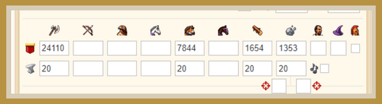
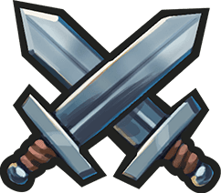
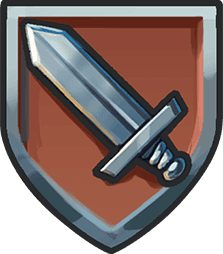
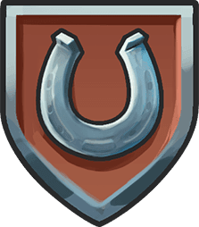
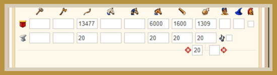
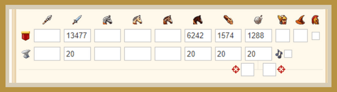
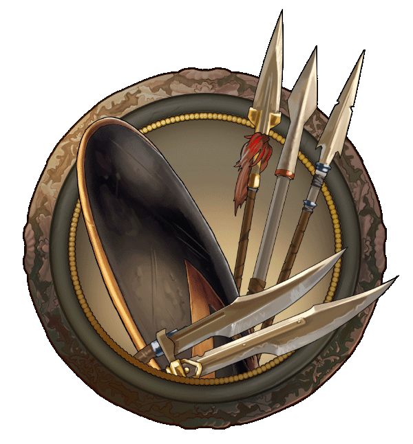

# Game secrets: The Path of the Warrior ~ Hybrid Account

> Source: Unofficial Travian  
> URL: https://unofficialtravian.com/2025/01/11/game-secrets-the-path-of-the-warrior-hybrid-account/  
> Written on May 8, 2024

---

In the dynamic world of Travian: Legends, players often find themselves torn between specializing in offensive or defensive strategies. However, there exists a third path – the so called “hybrid” account capable of both offense and defense, offering flexibility and strategic advantage.

#### **Why playing Hybrid Account**

- **Balanced game**: A hybrid account balances offensive and defensive capabilities, allowing players to adapt to various situations and enjoy both sides of the game.
- **Versatility**: By cultivating both offensive and defensive strengths, hybrid accounts can swiftly switch roles as needed, maximizing effectiveness.
- **Strategic Advantage**: Universal specialization makes hybrid accounts formidable adversaries.

###### Before we go into details, we need to understand that not all tribes equally complement both offensive and defensive playstyles. Each tribe offers unique strengths and weaknesses, so select one that aligns with your preferred approach.

It’s never late to turn into hybrid play later in the game regardless of each tribe you play, yet, it’s no surprise that some tribes are better suited for that than others.

### **Building Your Hybrid Account**

**There are 2 main ways of developing your hybrid account.**

**One is clear village specialization**, when players have both defensive and offensive villages and upgrade/use them independently.

That’s a good path that doesn’t limit players in their choices. For example, an aggressive Teuton can also have let’s say 2 defensive villages that are specialized on spearmen. Or a Roman that trains praetorians in some villages and an attacking army in an offensive one. This path is simple, available to get turned at any stage of the game. The only downside is that independent villages and separate defensive and offensive armies require quite high resource income.

**Second way is to train a “hamvil”.****“Hamvil”** is a coined word made out of 2 words: **ham**mer (usual term for an offensive army) and an**vil** (big single village pack of the defensive army). Therefore hamvil means an army that can be used both for offensive play and defense.

Pros: Less resource income is needed. You need to upgrade less villages fully, and it’s also a bit less gold-consuming.

Cons: Not every tribe has a possibility to train hamvil. If you train attacking army for killing a World Wonder, hamvil is not the best choice.

#### **Top-3 choice for the Hamvil armies are:**

Please, note, for all calculations below we take Operational hammer definition from our [previous blog posts](https://blog.travian.com/2024/04/game-secrets-the-path-of-the-warrior-what-is-the-best-hammer-for-my-tribe/):

*Army trained for 1 month on x1 gameworld (~1/8th of length for the other speed versions) on 20 level barracks, stables, workshop, without great barracks and great stables, and calculated without any additional bonuses. Rams and Catapults are trained in 55%/45% ratio to support sufficient number of both. Used as support army for alliance operations and day-to-day army to clear-conquer surrounding.*

##### **HUNS: Mercenaries + Marksmen Hamvil**

Still more “offensive” than defensive, this tribe provides those who picked it one of the unique options: Mercenary-Marksmen army.

Both units are all-rounders and can be successfully used in attack and in defense. The cheapest “Hamvil” in the game in terms of training and almost same effective both ways.  An operational fully upgraded in the smithy Mercenary-Marksmen hammer values are:

-  Total attack (with rams and catapults) 2.492.840
-  Defense against infantry (without siege equipment) 2.083.924
-  Defense against cavalry (without siege equipment) 1.716.543
-  Costs per hour for x1 gameworld 30.378

##### **EGYPTIANS: Khopesh Warriors + Resheph Chariot Hamvil**

Resheph chariots are attacking Egyptian cavalry that has impressive defensive characteristics.

An operational fully upgraded in the smithy Khopesh Warrior – Resheph Chariot army values are:

-  Total attack (with rams and catapults)  2.246.243
-  Defense against infantry (without siege equipment) 1.803.163
-  Defense against cavalry (without siege equipment) 1.545.271
-  Costs per hour for x1 gameworld 36.982

##### **GAULS: Swordsmen-Haeduan Hamvil**

An operational fully upgraded in the smithy Swordsman – Haeduan army values are:

-  Total attack (with rams and catapults)  2.490.613
-  Defense against infantry (without siege equipment) 1.178.168
-  Defense against cavalry (without siege equipment) 1.699.281
-  Costs per hour for x1 gameworld 36.318

#### **Conclusion:**

Please, note, that in most cases using hammers in defense should be a well-thought movement and case to case decision since those are for sure not the cheapest options. Mastering the hybrid account requires a combination of strategic foresight, tactical ingenuity, and adaptability. Yet, exploring this way will give you option to become solid alliance warriors capable to support your team in both offense and defense.