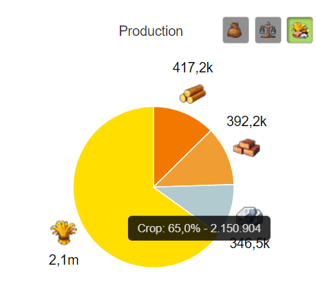
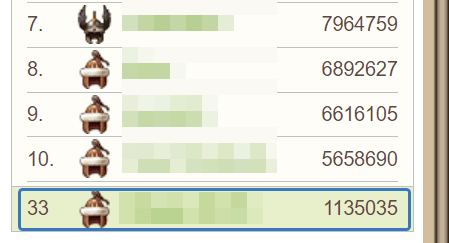

# Game secrets: The Path of the Warrior ~ When do I start training a hammer?

> Source: Unofficial Travian  
> URL: https://unofficialtravian.com/2025/01/11/game-secrets-the-path-of-the-warrior-when-do-i-start-training-a-hammer/  
> Written on April 24, 2024

---

In the previous 2 posts we talked about [Operational hammer,](https://blog.travian.com/2024/04/game-secrets-the-path-of-the-warrior-what-is-the-best-hammer-for-my-tribe/) the definition, the average costs and what it can be used for. Let’s now look at how to calculate the moment when we should start working on that.

In short – [**operational hammer**](https://blog.travian.com/2024/04/game-secrets-the-path-of-the-warrior-an-operational-hammer/) makes sense to get trained when keeping it and queueing this hammer is not a burden and losing it won’t drop account below recover level. Since it’s a hammer that is used for regular account activities: chiefing, farming, fighting surrounding, participation in the alliance operations etc, recovering hammer fully or partially is a regular task as well.

**And account income needs to be sufficient to support it. We recommend to start training operational hammer not before when your account regularly gains at least twice as many resources as operational hammer training costs per hour.**

We used verb “gains” because your account income is a combination of 2 main sources: own hour production and farm income. The third possible source is trade income, but if we do not count here alliance push, the impact of this third source is minimal.

##### **How to calculate own resource production (one of the options)**

- Open**General statistics** , find the circle with the percentage of your production per day.
- Hover over the yellow part (crop) and find out the numbers and percentage.
- **Use this formula:*****Total amount of crop x100 ÷ percent of crop ÷ 24 hours.***
- The number you receive will be your total hour production.

###### **Example****:**

Crop production here is 2 150 904 and it’s 65% from the total resource production.

2 150 904 x 100 ÷ 65 ÷ 24 = 137 878

One hour production of the player in the example is 137 878 resources per hour.

##### **How to calculate farm income**

Just divide your total number from midnight to the current hour. Let’s say at Wednesday 14:00 server time you checked and found that you farmed 1 135 000 resources.

######

Time from Sunday midnight to Wednesday 14:00 = 24+24+14 = 62

1 135 000 ÷ 62 = 18 300 resources per hour.

##### **To sum up:**

So, in total, this player gets 156 178 resources per hour. On x1 gameworld player with that income can train operational hammer already given that the player doesn’t play other roles (as defender for example, which will also take part of the income). However, it’s recommended to increase farm with it and make sure that newborn operational hammer brings at least enough resources for their crop consumption.

**Read more about military development and strategic choices in other related blog posts:**

- [An operational hammer – Introduction](https://blog.travian.com/2024/04/game-secrets-the-path-of-the-warrior-an-operational-hammer/)
- [An operational hammer – what is the best hammer for my tribe?](https://blog.travian.com/2024/04/game-secrets-the-path-of-the-warrior-what-is-the-best-hammer-for-my-tribe/)
- [What hero equipment do I need?](https://blog.travian.com/2024/02/game-secrets-hero-inventory-packages/)
- [How to develop successful account?](https://blog.travian.com/2023/04/developing-your-first-villages/)
- [Oasis farming tips and tricks](https://blog.travian.com/2023/05/oasis-farming-tips-and-tricks/)
- [How to send real attacks and fakes](https://blog.travian.com/2023/11/game-secrets-real-attacks-and-fakes/)
- [What is “Return on Investment”](https://blog.travian.com/2023/04/early-development-return-on-investment/)