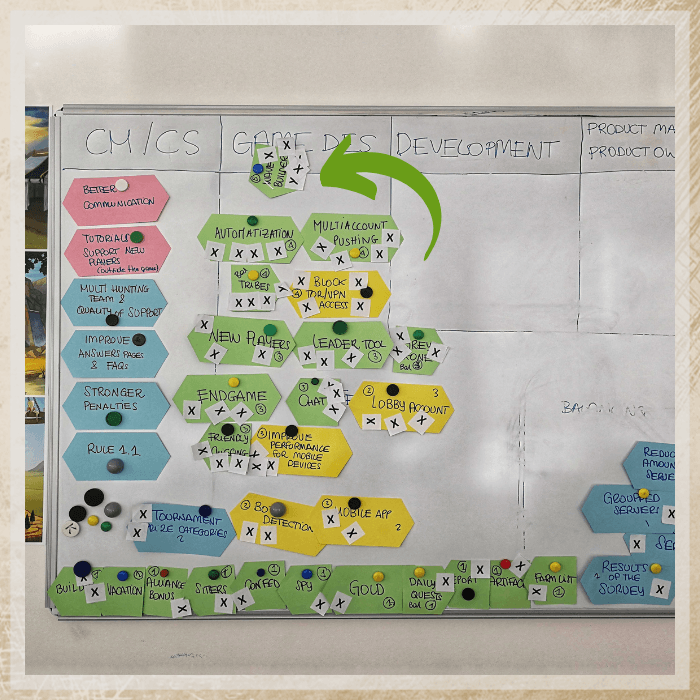
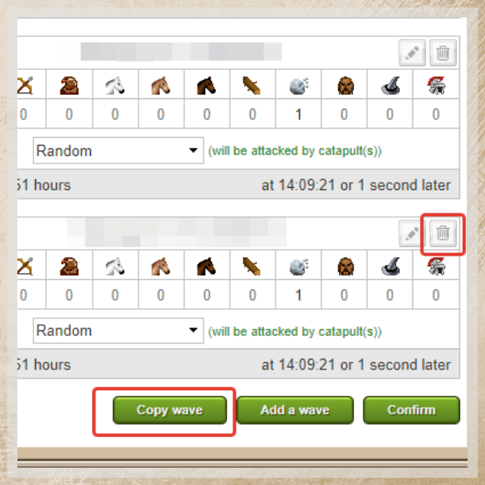
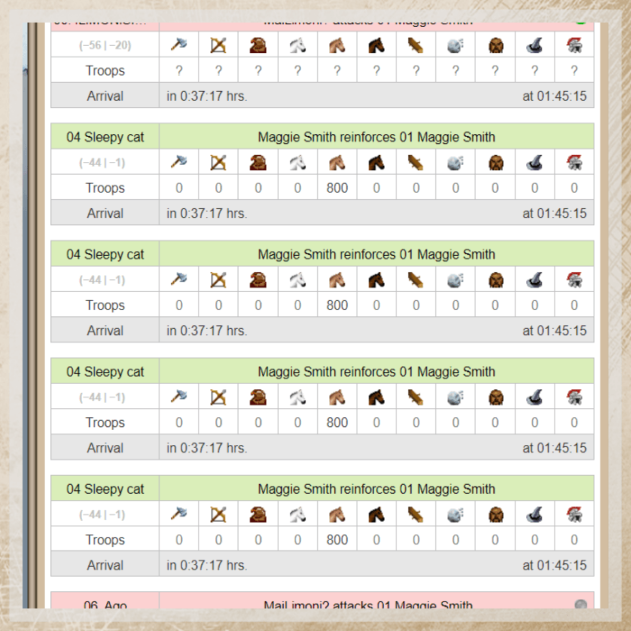

# Game Secrets ~ the Power of the Wave Builder

> Source: Unofficial Travian  
> URL: https://unofficialtravian.com/2025/01/12/game-secrets-the-power-of-the-wave-builder/  
> Written on February 14, 2024

---

*Welcome to the [**Game Secrets**](https://blog.travian.com/tag/thursday-guides/) series!  In the realm of Travian: Legends, mastering the art of warfare requires not only cunning strategy but also efficient execution. This is where the **[Wave Builder](https://support.travian.com/en/support/solutions/articles/7000068598-wave-builder)** emerges as a useful tool for all types of commanders.*

##### **A Brief History**

The Wave Builder was born from the **[collaborative efforts of the Travian: Legends community and developers](https://blog.travian.com/2019/05/legends-on-tour-2019-day-1/)**. In 2019, Community Ambassadors convened in Munich to discuss key features with the developers, and the implementation of the Wave Builder was their primary request.  Since its inception, this feature has transformed the way commanders wage war, providing unparalleled efficiency and precision in orchestrating attacks and defensive maneuvers.

##### **What it does?**

The wave builder helps to **automatize** one of the key actions in the game **– sending waves of armies within the shortest timeframe (maximum 1-2 seconds for 4 waves and 2-3 seconds for 8 waves)**.

We are not saying specifically “attacks”, even though the feature is used 98% for waves of catapult attacks. And still, the wave builder can also be used for defensive actions and even scouting operations.

The tool is developed with around 80% chance for sending 4 waves in the same second. This is the hard limit in the game, not just in the wave builder. It’s not possible to send more than 4 attacks in the same second (though there is no limit on how many attacks land on the same second, as they could travel from different places or have different travelling time).

##### **Why is it not perfect?**

That was a request from the community and developers’ desire. Making too perfect attacking tool could have a negative impact on the defenders. **[Sniping waves](https://blog.travian.com/2023/09/game-secrets-sniping-waves/)** is still a valid tactics and both players and the developers didn’t want to deny players that option. You can find the probability of possible combinations for the wave builder in our **[Travian Knowledgebase](https://support.travian.com/en/support/solutions/articles/7000068598-wave-builder)**.

##### **Important Facts and Tips**

**More than 8 waves? You can do that!**

You can send as many waves of catapults as you like, but only maximum 8 waves per tab. To send let’s say 16 waves, or 8x waves on 2 different targets within a short time just add the wave builder in 2 tabs and send them one by one.

**Keep an eye on timing!**

Players do not recommend preparing the waves too early, because the timer might get asynchronized with the server time or the wave builder might not work at all if the tab has been prepared more than 5 min before sending waves. **To fix both issues the easiest way would be to do some action on the page that will trigger recalculation.** This might be adding and removing an extra wave for example less than one minute before sending.

**Note:** Do not use the refreshing page option, since it might also reset prepared targets and/or even waves.

######

**Do not lose a wave builder!**

If your village with activated wave builder has been chiefed by another player, the wave builder gets deactivated. It won’t turn on even if you chiefed this village back. However, if you conquered village on your own, it would stay available.

**Wave builder for defence? Why not?**

The wave builder is a good way to cut waves. Sometimes it’s hard to send the cutting army at exact second, and this is where wave-builder might come in handy. **If you have enough defensive troops, you can set up to 8 waves of reinforcements and then cancel those that have been sent in the wrong second.** Given that with 8 waves they go at min in 2 seconds and at max within 4, you have way better chances to send snipe within correct second. And it might save your buildings and even a village.

######

**The wave builder works with the ships**

In gameworlds with the harbors you can use ships in a wave builder. **It’s important to set ships for each wave** or the travel time will differ.

**Help your alliance to achieve the goals**

Last, but not least. Multiple waves and participation in alliance operations have been the skills that required long training and a PC. In-game wave builders opened the gates to even less experienced players into the world of alliance operations. Even if you’re defensive player, you will greatly help your alliance to achieve your goals by participating in alliance operations. You don’t even need a big army for that. Small support (10000 – 15000 units + 1000 catapults and you can play a role of the “following catapults” in alliance operations, which will be a great help. Just learn the **[fakes and reals basics](https://blog.travian.com/2023/11/game-secrets-real-attacks-and-fakes/)**, make sure your **[hero wears the right equipment](https://blog.travian.com/2024/02/game-secrets-hero-inventory-packages/)** and send waves in exact second! This is a way to help your alliance win.

*To sum up. We can’t say wave builder is a game-changer in Travian: Legends, but it’s a powerful tool that gives you the edge you need to outsmart your opponents and help your alliance on the way to victory and achieving the goals.*

1

1