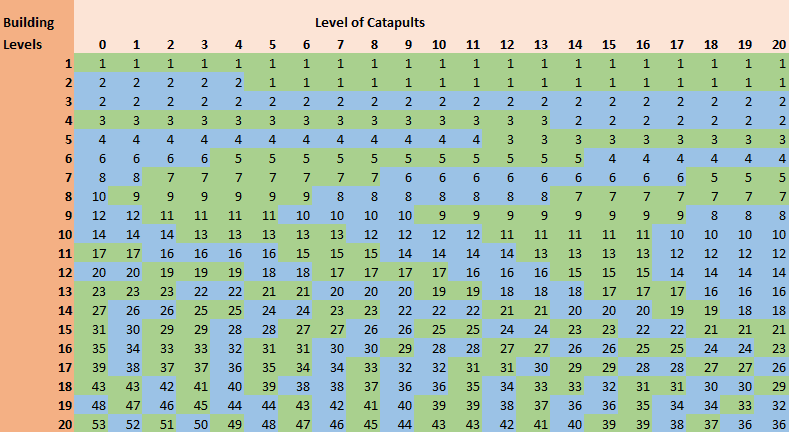

# Game secrets ~ The use of catapults

> Source: Unofficial Travian  
> URL: https://unofficialtravian.com/2025/01/12/game-secrets-the-use-of-catapults/

---

Catapults are definitely one of the units that deserve a separate article and today we will talk about them.

Catapults are a long-range weapon; they are used to destroy the resource fields and buildings of enemy villages. Catapults need time to shoot, and they can only do this in a normal attack, not raid.

Sending catapults into normal attack is not the only limitation. Catapults’ “efficiency” depends on many factors like Rally Point level, upgrade level, and various artefacts and building effects.

#### **Rally point**

| **Rally Point Level** | **Specifics** |
| --- | --- |
| **RP level 1** | Only random target available. |
| **RP level 3** | Only Warehouse and Granary can be targeted. |
| **RP level 5** | Additionally, resource production buildings can be targeted: resource fields, brickyard, iron foundry, sawmill, grain mill and a bakery. |
| **RP level 10** | Everything can be targeted except cranny, stonemason’s lodge and a trapper. |
| **RP level 20** | It is possible to target 2 buildings in one attack. This requires at least 20 catapults in the attacking army. Catapults strength is divided equally between the targets. |

**Important note!** If you have Rally point level 20, but want to hit just one target, keep second spot empty in the rally point. Hitting the same building twice will reduce effect from the catapults. This is extremely important when you send your army against World Wonder.

#### **What might affect the catapult battle result?**

| Ingame features | Effect on catapults attacks |
| --- | --- |
| Attacked village is a capital and has a stonemason’s lodge | The stonemason’s lodge increases durability of buildings (both resource fields and inside buildings) by 10% per level up to 300% of durability in total (100% own building durability and +200% from stonemason’s) |
| Alliance metallurgy bonus | Alliance metallurgy bonus doesn’t have effect on catapults ability to destroy buildings. It only increases attack. |
| Defender has an active Architect’s secret artefact | You simply need more catapults to be able to destroy a certain target. Small architect increases the durability of the buildings by x4, great artefact by x3 (but affects the whole account), and unique artefact makes buildings stronger x5 times. |
| Defender has an active Big cranny and Random targets artefact. | In case a defender has an active random target artefact (also called confusion) the catapults can hit only semi-random buildings. If an attacker sets internal building as a target, the internal building will be hit. If an attacker sets resource field as a target, resource field will be hit. Only after there are no buildings left of a certain type, the catapults start hitting “other” buildings. Stonemason’s lodge is always hit last.Small confusion – Treasury can be targetedGreat confusion – Treasury and World Wonder can be targetedUnique confusion – only World Wonder can be targeted |
| Attacker has an active brewery celebration (and a brewery building) | Catapults hit only random targets (there is no separation for “internal” and “resource” buildings anymore). Brewery effect prevails on a defender artefact effect. That means, that even if the attacker with an active brewery celebration and brewery at least level 1 selected internal buildings, the catapult will anyway hit randomly both internal and resource.  More information about Brewery and its destruction can be read here: **[Knowledge base Brewery](https://support.travian.com/en/support/solutions/articles/7000065345-brewery)** |
| Attacker selected “random” targets or selected a target that does not exist in the village. | Normally, if attacker selects a certain building, the highest level of this building will be hit (in case the defender has multiple buildings of same type, i.e. warehouses, granaries, resource fields etc.) If the attacker selected targets randomly or if there is no such building in the village, the catapults can hit any level of any building/resource field, not necessarily the highest one. |
| Stonemason’s lodge | Stonemason’s lodge is always hit last. That’s why in order to save your capital from full destruction and if you have enough time gap before last hits, just build a few buildings and resource fields of level one. The capital won’t get destroyed till all targets are hit. |
| Wonder of the World | Wonder of the World can always be targeted if you have a Rally point at least level one. Also, it’s not affected by any artefact effects (architect and random targets). |

#### **Smithy upgrades**

- Below you can find how many catapults of each level you need to destroy fully a building of a certain level.
- Please, note. For double target wave you need to sum up the number of catapults.
- For stonemason’s level 20 you need to multiply the needed number by x3.
- For Architect you need to multiply the needed number according to artefact effect.

##### **Example:**

- A capital village has Stonemason’s lodge level 20 + Small Architect’s secret artefact x4.
- Your catapults are fully upgraded to level 20. You want to destroy a level 20 building.
- 36*3*4=432 catapults needed to destroy fully one building of lvl 20.

15

3

12