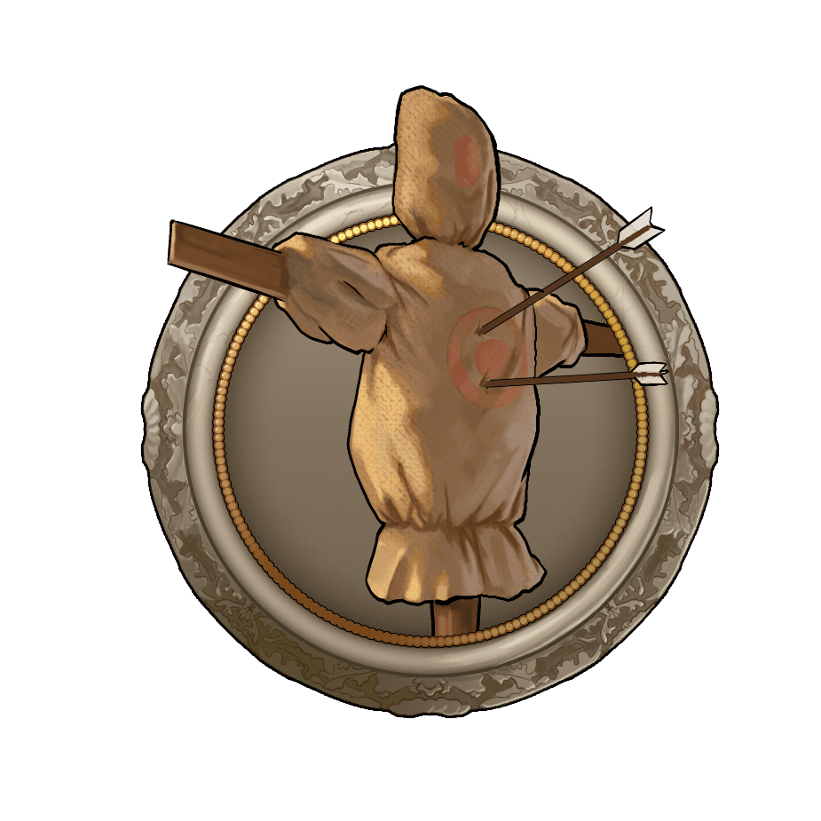
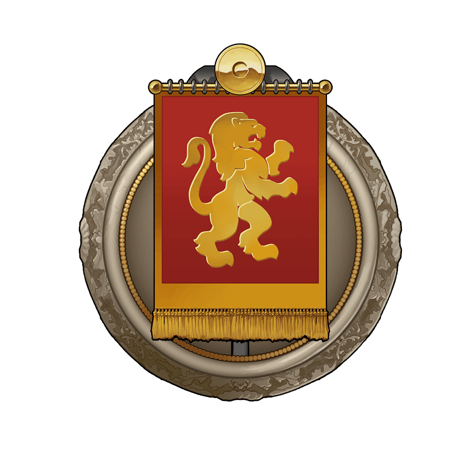

# Game secrets ~ Travian etiquette

> Source: Unofficial Travian  
> URL: https://unofficialtravian.com/2025/01/12/game-secrets-travian-etiquette/

---

Welcome to the [**Thursday guides**](https://blog.travian.com/tag/thursday-guides/) series.

It’s not a secret that our game is quite old – next year we’ll celebrate its [**20th anniversary**](https://blog.travian.com/2023/05/travian-legends-5-years-changes-at-one-glance/)! And over the years players developed an unofficial set of rules of a game courtesy – Travian etiquette.

##### **Why it’s important?**

Of course, none of what we would talk about further is forbidden by the game rules. Yet, in most cases obeying those rules will grant you respect and will help you build good relations with the gameworld community. Which, in return, will allow you to get into better alliance, build bonds and find the team of your life!

**So, what community rules exist in the game?**

##### **Do not defend raids after chiefing inactive village/unoccupied oasis**

After chiefing an inactive village, Natars or conquering unoccupied oasis, it’s a matter of general politeness to i not defend against attacks that are already on the way to the village. **It doesn’t matter whether the raid comes from a friendly player or a rival.** Such places are not considered to be a decent battlefield.

##### **Feed your reinforcements**

Unless it’s specified in the message/request, whenever you send reinforcement make sure to supply with crop the defended village for the whole time your reinforcement will be staying in that village. If you play on a gameworld with a forwarding feature and need your troops being forwarded (and not just sent back) please, it’s worth supplying defending village with crop to the whole time it would be travelling back.

##### **Do not overbid co-allies and confederacy members on auctions**

In most alliances there is a rule not to overbid items on auctions from your alliance or confederacy members. If you urgently need some item (for example, a bucket), just approach a person who already placed a bid and agree with him.

##### **Inform leadership about leaving the game**

It might happen that you decided to leave the game before gameworld ends due to various reasons. Inform your leadership and align with them your exit plan so that your leaving will not become a total surprise. On Annual special gameworlds it’s especially important, since your villages might hold the region or contain quite a big number of Victory points in it.

24

8