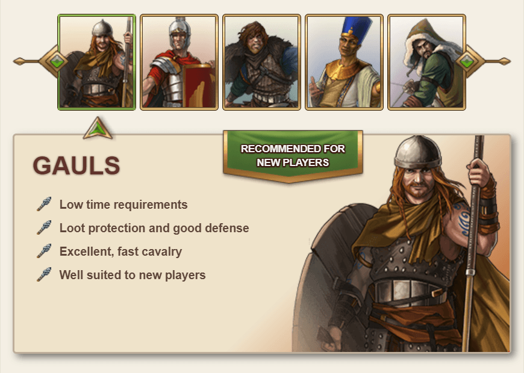
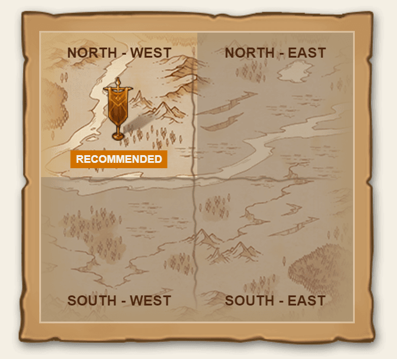

# Game Secrets ~ Your very first steps in the game

> Source: Unofficial Travian  
> URL: https://unofficialtravian.com/2025/01/09/game-secrets-your-very-first-steps-in-the-game/  
> Written on January 17, 2024

---

Welcome to the **Game Secrets** series.

Today we will talk about first steps in the game after a long break or if you never played before.

##### **Before registration**

- **Pick the most recent gameworld**.
	- You can find the newest gameworlds at [www.travian.com](https://www.travian.com/international/calendar)
- Ideally if you join the game round shortly (within 1 hour or so) after it starts. This way you will have early game advantages, same as other players.
- **Pick the tribe.**
	- If you had a long break, or fully new to the game and not sure whether you have enough time for the active play, **[Gauls](https://unofficialtravian.com/2025/01/5-things-to-consider-about-gauls/)** might be a good option for you with their early game cheap defense.
	- Other good options are **[Egyptians](https://unofficialtravian.com/2025/01/5-things-to-consider-about-egyptians/)** (good resource production)
	- or [**Romans**](https://unofficialtravian.com/2025/01/5-things-to-consider-about-romans/)(fastest and gold-saving development due to parallel queues).
	- Remember, this is not set in stone. Pick any tribe you like and explore their unique abilities and advantages!
- **Pick the quadrant of settling.** “Recommended” quadrant means that it has the lowest number of players at the time of your registration. It doesn’t matter much which quadrant you pick, though. This only affects the density of your neighborhood.
- **Find and pin/open the [fastest settling guide](https://unofficialtravian.com/2025/01/guides-fast-second-village/)** that you will need from the very start. Select one that is written for the speed of the gameworld you’ve selected. The guide for different speed won’t work.
- **Optional: Read “[What is Travian: Legends](https://unofficialtravian.com/2025/01/what-is-travian-legends/)”** if you never played the game **or [“5 years changes at one glance”](https://unofficialtravian.com/2025/01/travian-legends-6-years-of-changes-at-a-glance/)** if you had a long break to be up to date with the recent changes.

##### **After registration**

Your spawn (start) village will appear in the game. You will have a village with some resources in there, a hero and 130 initial gold. If you want to go into the game actively, you need to activate all 25% resource bonuses (20 gold, 5 per each resource) to maximize your early game production.

First steps are same on all gameworlds:

– **Activate resource production bonuses**. (Gold button -> Advantages->Resource bonuses)

– **Send your hero to the very first adventure** to get a horse and increase hero travel speed. **Pick adventure with the lowest travel time** out of 3 initial that are given to you at the start. Once your hero gets back from your first adventure on horse, the time to other adventures will be recalculated.

– Open the **[fastest settling guide and follow it step by step](https://unofficialtravian.com/2025/01/guides-fast-second-village/)**. Please, note – building levels and their order matters! The guides are written to minimize time needed for settling your second village.

– While you are waiting for your buildings to get completed, look around the map and **decide on your next village coordinates**. Since your second village is most likely your future capital, consider 15-cropper, 9-cropper or 7-cropper with good oases.

– **In order not to lose your village coordinates, put a flag there**. It’s better if you select not one, but a few options for your future village, so you will have some backup plans if some of those won’t work.

– **Settling second village takes time.**Early game is when you establish the foundation of your future game actions. Use this time to get to know the game better and **craft your future strategy**. The **“Game secrets”** series and [Game Knowledgebase](https://support.travian.com/en/support/solutions) contain a lot of information about various aspects on development.

– **Pay attention to exclamation marks and signs** and explore the interface. In most cases those mean that some things require your action or the game has reward for you. Note: If you don’t want to receive contextual help (appearing pop-ups on a dark layout), you can disable them in the settings menu.

– **You will get resources into your hero inventory for completing the quests.** Collect them and use them to add lacking resources that are needed for building upgrades, celebrations or settlers. Don’t transfer them all at once and at the same time do not hold them for long in your hero inventory – early game it’s one of your main sources of development.

There is a fast way to see which and how many resources you’re missing. Click on NPC-merchant in the building menu and enable resource distribution page.

Here you will see how many and which resources you are currently missing.

Transfer only that many resources that you are missing for the next building level:

|  |  |
| --- | --- |

– Early game use **[NPC-merchant](https://support.travian.com/en/support/solutions/articles/7000062807-npc-merchant)** only if you can’t add enough resources from your hero inventory. Calculate everything!

– **Do not forget to take daily quests rewards** before reset time or they will be lost.

– When you settle your second village, **develop both villages simultaneously** using **[early development guide](https://unofficialtravian.com/2025/01/early-development-return-on-investment/)**.

– **Start training troops not before there are few hours of beginner protection left**. Early development is important for your future **account sustainability**.

– **Join an alliance**. Pick the one that has most village presence at first in your surrounding (you can check it up in the embassy) and write to their leader/recruiter or a top-player. Do not organize your own alliance yet – a solo-player alliance won’t give you much benefit. Focus on joining one of already existing.