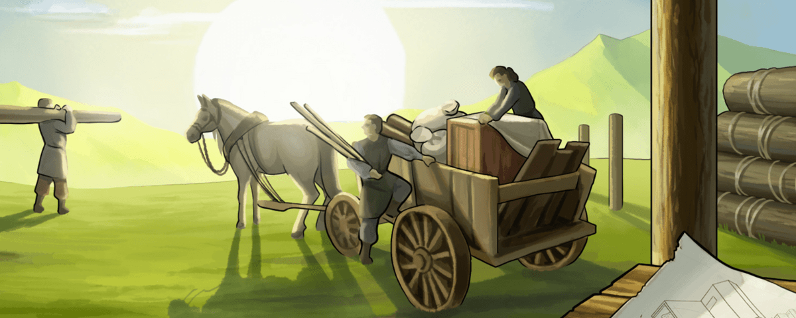

# Hero and adventures in the early game

> Source: Unofficial Travian  
> URL: https://unofficialtravian.com/2025/01/09/hero-and-adventures-in-the-early-game/  
> Written on September 20, 2023

---

The early game second village rush race is one of the most thrilling and nervous parts of the game. Experienced players are making very detailed calculations about how to do best in order to settle desired cropper before others would take it. Today we will share with you some observations players made about the game and some hidden information you might have not known about this game.

Hero and their wellbeing is one of the most important cornerstones of an early game economy. Losing a hero in adventure or in a risky oasis farming operation might throw you back in development for hours and cost you a good future capital. It’s even more complicated because in most cases early game players distribute all points into hero resources.

The best way to secure you a good cropper for your future capital is to follow one of the guides. You can find some of the guides here: [**Fast Second village guides**](https://blog.travian.com/2022/12/guides-fast-2nd-second-village/). Pick the one for your speed and follow it step by step.

Tables below will help you on your way to the best development and answer some questions that are not covered by various guides.

| **Hero production per point** | | | | |
| --- | --- | --- | --- | --- |
| Tribe | Production (1x, multiplied by speed) | | | |
| All tribes heroes except Egyptian | 9 resources each per point or 30 if you select one of them. | | | |
| Egyptian Hero | 12 resources each per point or 40 if you select one of them. | | | |
| **Note:** The 25% resource bonus applies also to the hero production. | | | | |
| **Hero health loss in first adventures****(with 0 points into fighting strength)*** | | | **Rewards and next adventure** | |
| № | “Normal” adventure | “Hard” adventure | **Reward** | **Appears****(hours after start)**** |
| 1 | 1 – 3 | 3 – 4 | Horse | Available from start |
| 2 | 2 – 4 | 4 – 8 | Resources | Available from start |
| 3 | 2 – 7 | 7 – 12 | Troops | Available from start |
| 4 | 3 – 9 | 9 – 16 | Silver | 0 – 8 |
| 5 | 3 – 11 | 11 – 20 | Ointment | 8 – 16 |
| 6 | 4 – 14 | 14 – 24 | Book of Wisdom | 16 – 24 |
| 7 | 4 – 16 | 16 – 28 | Resources | 24 – 32 |
| 8 | 4 – 18 | 18 – 32 | Silver | 32 – 40 |
| 9 | 5 – 21 | 21 – 36 |  | 40 – 48 |
| 10 | 5 – 23 | 23 – 39 | Nothing | 48 – 56 |
| 11 | 6 – 26 | 26 – 43 | Reward unknown | 56 – 64 |
| 12 | 7 – 28 | 28 – 46 | Reward unknown | 64 – 72 |
| 13 | 7 – 30 | 30 – 48 | Reward unknown | 72 – 80 |
| 14 | 8 – 32 | 32 – 51 | Reward unknown | 80-88 |
| 15 | 8 – 34 | 34 – 54 | Reward unknown | 88+ |
| What items can be found in adventures | | | | |
| Adventures | Item limitations | | | |
| Adventure 1 to 31 | No scrolls, no small bandages***, no large bandages, no artworks | | | |
| Adventure 32 to 61 | No large bandages | | | |
| Adventure 62+ | Can find everything | | | |

******Information is based on players tests and observations*

*******Information is based on players tests and observations. For speed gameworlds the times should be divided by the speed of the world (i.e. /2 for x2, /3 for x3 etc.)
***On Annual Special worlds small bandages in rare cases can appear before adventure 31. They appear when Hero should have found Natar Horn, but last moment changed their mind and took small bandages instead.*

#### **Starting Culture points**

| **Speed:** | **X1** | **X2** | **X3** | **X5** | **X10** |
| --- | --- | --- | --- | --- | --- |
| Starting Culture Points: | 500 | 250 | 167 | 100 | 50 |
| Townhall level 1 celebration time: | 24h | 24h | 12h | 12h | 6h |

And that’s a wrap! Share with us in Discord what you think about this article, get ready for the [**Thursday Tactician**](https://blog.travian.com/2023/09/thursday-tactician-contest-galore/) and come back next Wednesday for the next guide in the [**Game Secrets**](https://blog.travian.com/tag/thursday-guides/) series!