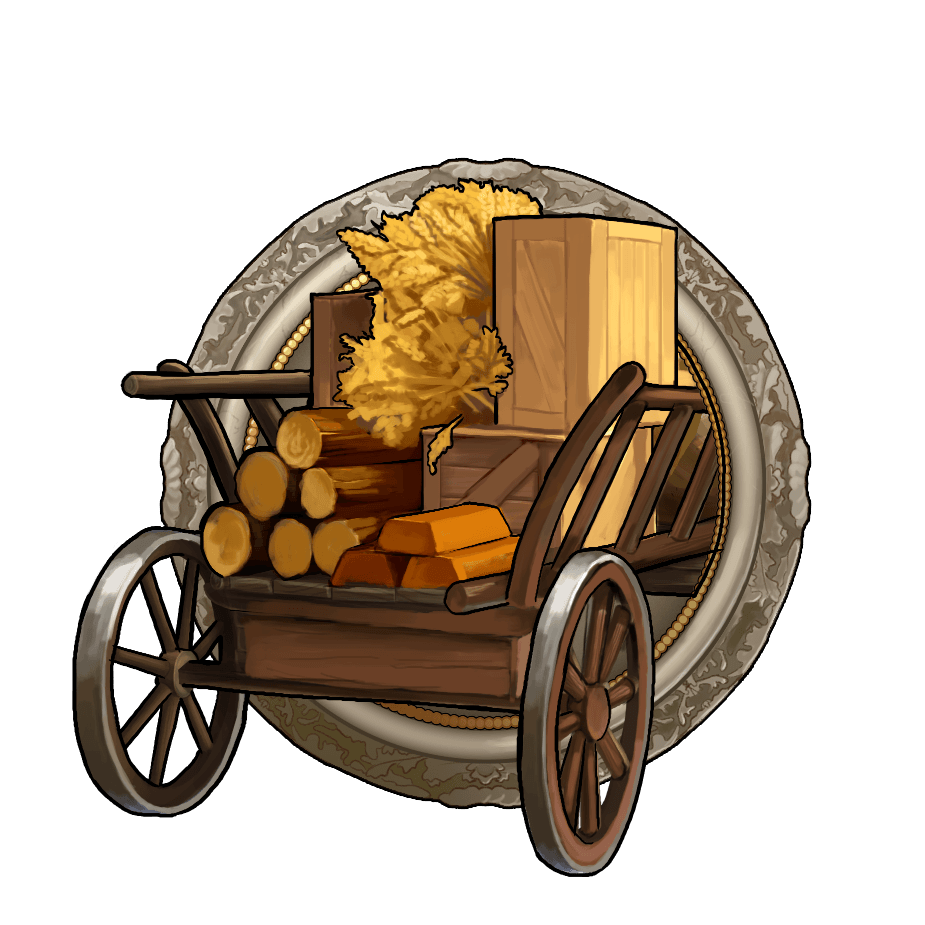
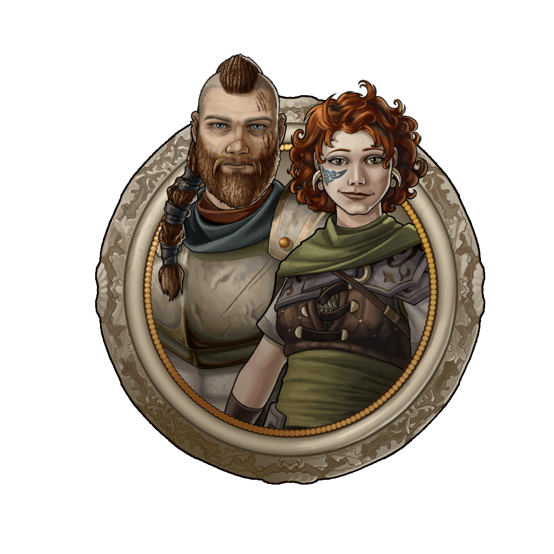
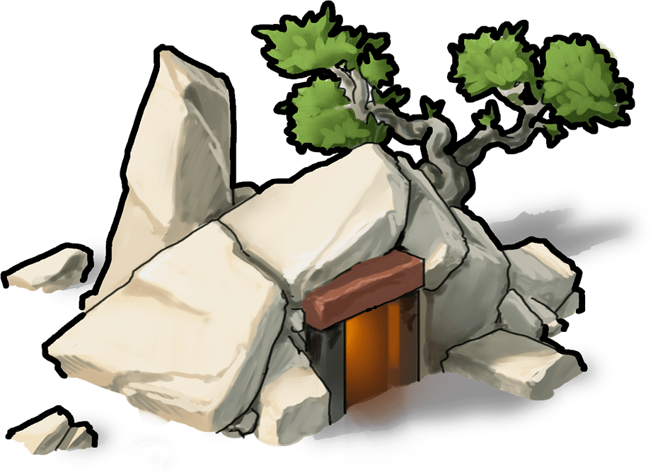

# How to avoid getting farmed?

> Source: Unofficial Travian  
> URL: https://unofficialtravian.com/2025/01/09/how-to-avoid-getting-farmed/  
> Written on May 25, 2023

---

Welcome to the [Thursday guides](https://blog.travian.com/tag/thursday-guides/) series!

One of the first tough tasks for newcomers is avoiding losing precious resources needed for development because of other players their aggressive actions.

Let’s look into what one can do to avoid getting farmed?

#### **Top-6 tricks to avoid being farmed:**

**Be active**. Most farmers (this is a name for players who are hunting for resources) are using the so called “inactive search” sites or tools where they monitor your development or, if you are close to them, can just watch you directly on the map. So, make sure to increase your population regularly and throughout the whole day. That will give farmers a sign that you are often online and can resist a farm attack at any time.

####

**Keep your development in line with the others**, somewhere around the top-200 top-300 population of your gameworld. Not only would it help you avoid farmers’ attention, but it will also increase your chances of being accepted into a good alliance.

####

**Train some troops and upgrade a wall**min. to lvl 10-15 to make possible losses of the farming player higher than the resources they might get from you. Make sure during the early game that you have 5, later not less than **20-30 scouts** in each village, even the one you just settled!

####

**Do not keep lots of resources in your resource villages** when you are offline. It’s easier than it sounds. Just make sure to clear up your resources before going offline. Order expensive buildings, send away resources to your capital or defended village. If you still have too many resources after that, invest into alliance bonus.

####

**Use trade routes during your offline periods** that would send away all resources from your resource villages to the defended ones. Less than 20 000 resources in total, 30 scouts + 800 defensive units, combined with a wall level 15 will make farming you unprofitable. If you need to build more expensive buildings, save resources for them when you regularly check your account, or send them from your defended village and use immediately upon arrival.

####

**Join an alliance.** A good alliance name in most cases serves a good protection from farming attempts. If you follow the pieces of advice 1-5, following this one would not be a hard task: alliances recruit such active members.

####

**Note:** you do not need to keep lots of anti-farm troops in your every village. If you follow all of the advice above, meaning that you do not have lots of resources in your resource villages, rival scouts do not come unnoticed for you and you have a considerable number of defense in other villages (or your co-ally villages) nearby – in most cases that would stop farmers from attacking you.

#### What about crannies?

**Some experienced players might ask: How about the usual advice of building up crannies?** Unfortunately, practice says that in most cases “cranny-up” tactics do not work the best. Players who build more than one cranny in their village waste a useful space needed for regular development and in this case they are in an inferior position to those who use this space for normal buildings. Also, high building levels require lots of resources that none of the crannies can save.

####

For the early optimal development please read one of our previous articles: [Developing your first villages](https://blog.travian.com/2023/04/developing-your-first-villages/).

#### **To Sum up:**

Be active, watch closely, develop and be a helpful part of an active alliance – those are defensive tactics that have been proven their effectiveness.

And this is a wrap! Have a nice game and see you next Thursday for another [Thursday guide](https://blog.travian.com/tag/thursday-guides/)!