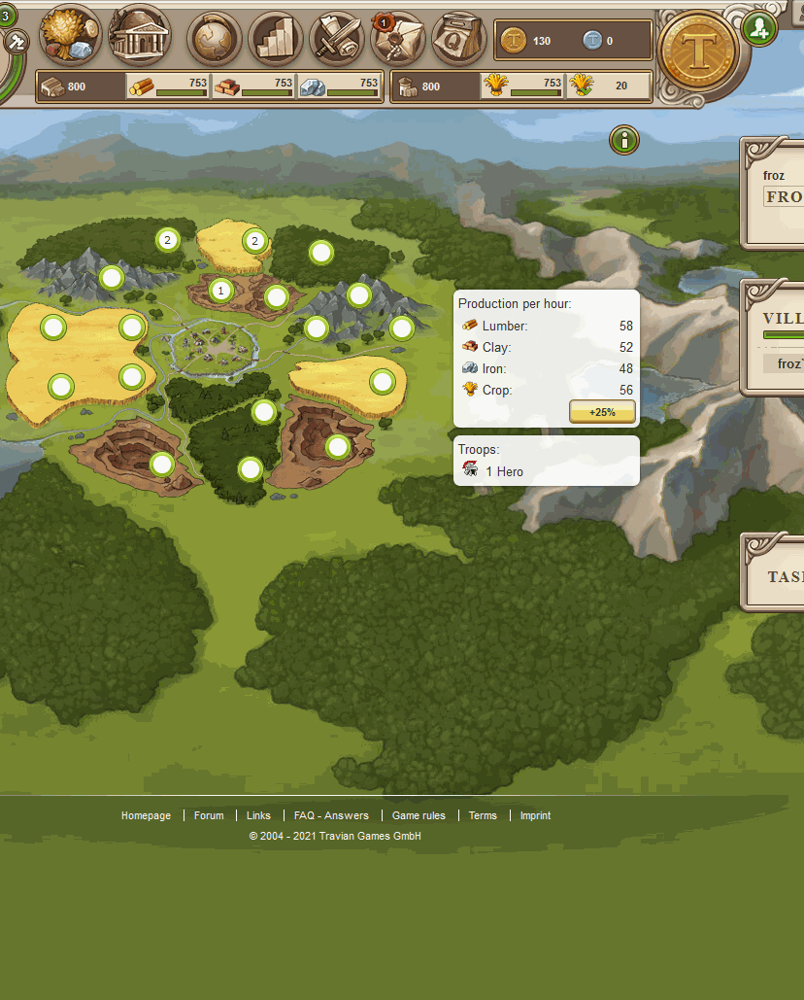
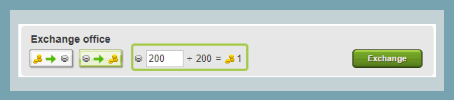
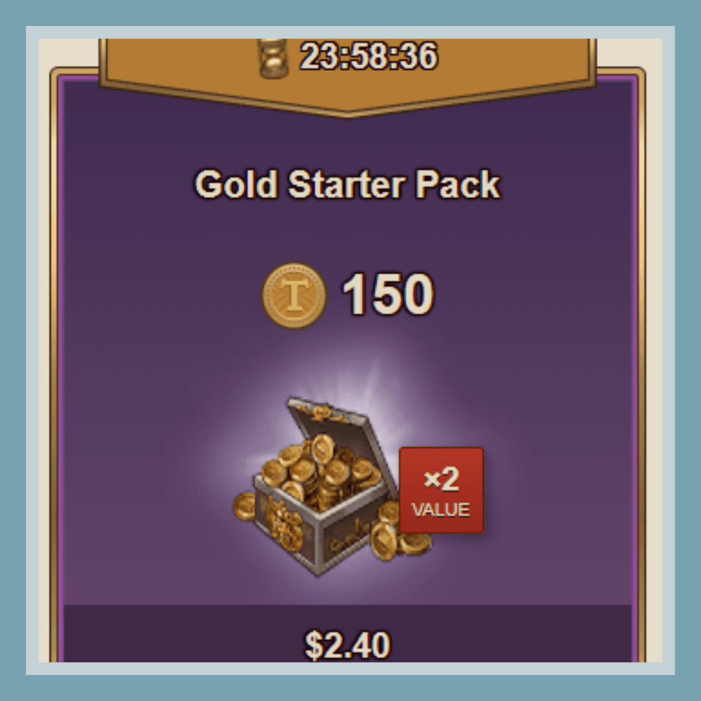
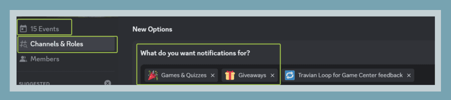

# How to earn gold

> Source: Unofficial Travian  
> URL: https://unofficialtravian.com/2025/01/12/how-to-earn-gold/  
> Written on July 20, 2023

---

Welcome to [**Thursday guides**](https://blog.travian.com/tag/thursday-guides/) series. In this guide we’ll cover some methods how to earn gold in the game to make your game more comfortable and enjoyable even if you do not plan to spend money at all.

#### **Refer a friend feature**

The inviting player gets a reward when the invited player increases the number of his villages. Each new village starting with the 2nd up until 9th gives 20 gold. 10th village gives 40 gold.**So in total you can receive 20*8+40=200 Gold for inviting a new player to the game.**

Note that if the friend losses their village, you do not lose your reward, but you don’t get reward again for that village number.

You can get rewards for up to 10 invited friends. Specifically, you can get each reward type (for 2nd village, 3rd village, 4th village etc.) up to 10 times, if 10 players invited by you managed to get the specified number of villages.

In total you can get up to 2000 gold.

#### **Auction**

Be wise in getting the best out of the auction system. The exchange rate silver to gold is 200:1, that means you will get 1 gold for each 200 silver coins you earn.

- Sell consumables, especially cages and ointment early game. If you are not farming a lot, and therefore your hero is not losing lots of health, selling ointments and cages will bring you some starter gold for auctions.
- If your hero was lucky enough to bring some valuable item from the auction, early game you can also sell it. In most cases during the game the items price will go lower, and after tier 2 and tier 3 items appear in the game, most of what you sold for bigger money can be bought back for the less price. Wise use of gold in most cases gives a better advantage than a solo hero item.

#### **One-time-offer**

One time offer is not exactly about pure earning, yet, it’s one of the best offers in the game that allows players to get certain benefits early and for extremely low price. The one-time-offer is a cheap Gold package that normally appears after few hours and up to one day of active playing depending on speed. If you intend to play in this gameworld for a long time, one-time offer is a good option to start the game with certain benefits. Please, be aware that one-time-offer gold is non-transferrable though and therefore can be used only on the gameworld it’s been bought. The one-time-offer lasts for 24 hours.

#### **Discord activities**

This is where your activity really pays off. Various game-and-non-game events, such as giveaways (where everything depends only on pure luck), Monday-mysteries (a random event that is run every Monday evening) and various quizzes can bring you gold vouchers as a prize. Do not forget to sign up for every activity and participate in those! There are multiple activities run every week with multiple winners. Join the official discord channel, sign up for getting notifications for events and giveaways and overcome your opponents.

[**T0 DISCORD**](https://discord.gg/cMjFxxqA5h)