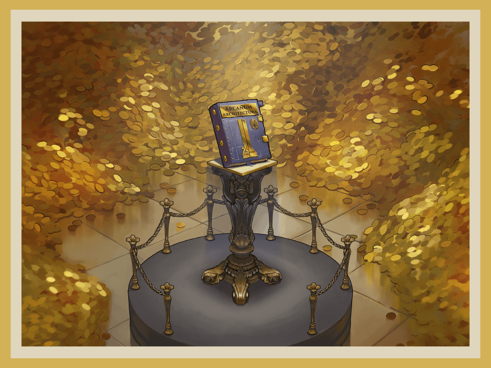
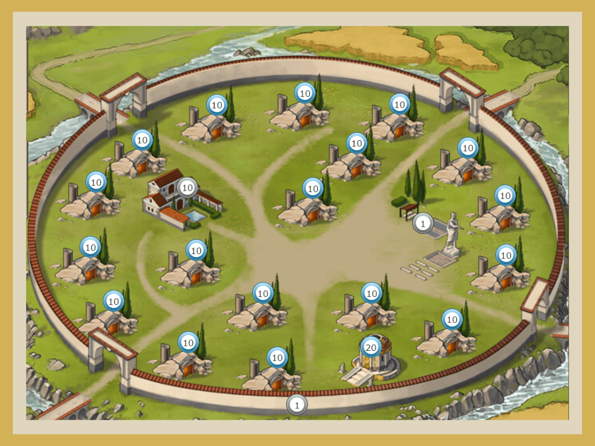
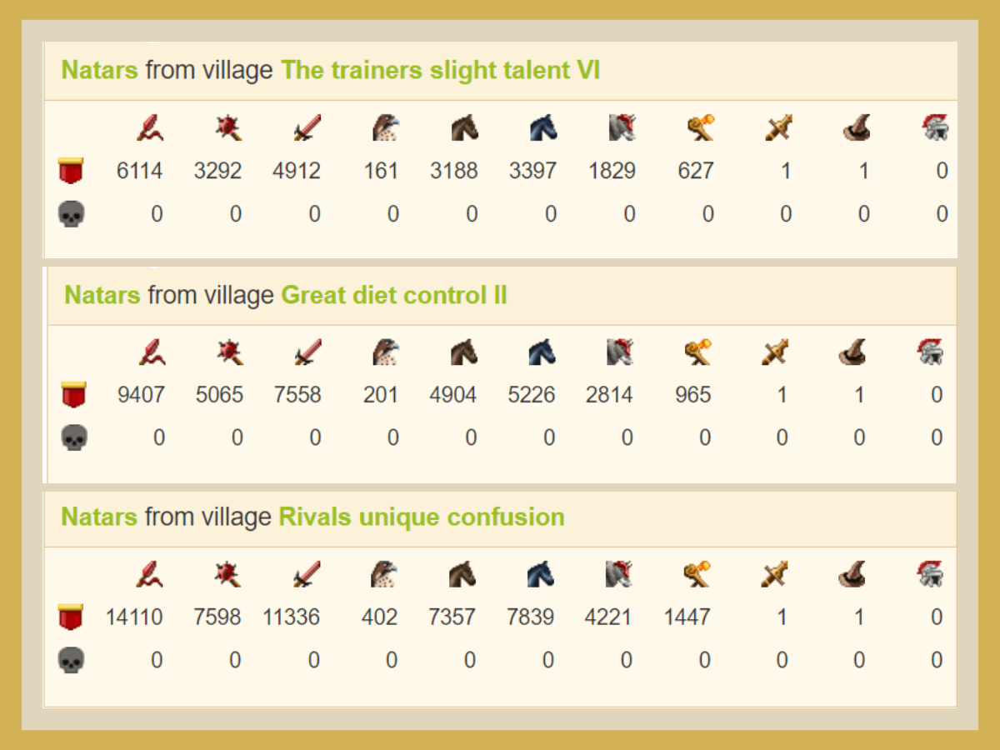

# How to get ready for the Artefact release

> Source: Unofficial Travian  
> URL: https://unofficialtravian.com/2025/01/12/how-to-get-ready-for-the-artefact-release/  
> Written on June 15, 2023

---

One of the most important events on Wonder of the World game worlds is the artefact release. The artefacts lay a foundation for future battles for victory and give lots of benefits to their owners.

- A detailed description of artefact effects can be found in our Travian Knowledge Base:[**Artefact effects**](https://support.travian.com/en/support/solutions/articles/7000060572).
- Find step-by-step instructions on how to capture an artefact here: [**Capturing artefacts**](https://support.travian.com/en/support/solutions/articles/7000060572).

Capturing artefacts is typically an action organized by an alliance. This doesn’t mean you can’t capture an artefact as a solo player. However, if you play in an alliance, it would be wise to follow the leaders’ instructions on this matter. Alliance leaders might ask you to build a level 20 treasury, for example, or train 55 catapults in a certain village, where they expect artefacts to be nearby, to ensure that the alliance will have catapults as close as possible.

If you take part in an artefact battle, make sure to be online when the artefacts appear – the most valuable artefacts are captured within minutes!

#### **Capturing an artefact**

It’s not unusual for up to three players to take part in capturing artefacts, and it might be carried out in three waves:**The cleaner:** A player attacks Natars with a sufficient army accompanied by the hero, equipped with the Natar Horn (left-hand hero item that adds 20-30% attack strength against Natars depending on its tier). Since Natars do not have walls when they appear, and they can build a wall only up to level 1 in an artifact village, the cleaner doesn’t need rams and can travel quite fast.

**The catapults:** A player with catapults close to a particular artefact sends catapults to destroy the treasury. **Natars have a level 20 treasury in all artefact villages**, including those that contain small artefacts! This means you need to make sure that you send enough catapults to destroy the level 20 building. 55 non-upgraded catapults sent with one target – the treasury – will do the trick.

**The hero:**The hero attacks from the village that has an empty treasury of a sufficient level: level 10 for small artefacts, or level 20 for large and unique artefacts.

Of course, the same action can be performed by one player and even in one wave. The above scenario is one of multiple options for how to optimize travel times and make sure you capture as many valuable artefacts as possible with your alliance.

#### **Where should I expect artefacts to appear?**

On most gameworlds, unique artefacts appear within or close to the gray area (coordinates 0-25). Large artefacts and some of the small ones will appear somewhere distributed over a big spiral after the unique artefacts (coordinates 20-60), and small ones will appear somewhere at 40 to 110 coordinates. Those are approximate numbers. The higher and more stretched out the general population of a certain gameworld is, the more stretched the “artefact spirals” will be.

#### **What defenses should I expect in the artefact villages?**

**The base defense formula for artefact villages is:***Base Natar defense * speed of the gameworld * a random multiplier different for each gameworld.*Unlike independent Natar villages, artefact villages contain scouts. So, make sure you send at least 200-400 if you want to scout Natar artefacts. The defenses for all artefacts of the same tier (small, large, or unique) are the same, and they also have an identical ratio between each other, so you don’t need to scout them all.

**Just scout the closest and then you can figure out the defenses on all three tiers using the formulas below:**

- Small to large: small defense * 1.5384
- Large to unique: large defense * 1.5

And it’s the same the other way:

- Unique to Large: unique defense / 1.5
- Large to small: large defense / 1.5384

**Here’s an example of an artifact defense for one of the recent x1 gameworlds:**

**Other examples of Natar defenses can be found here:**[**Artefact defense records**](https://blog.travian.com/2021/06/strongest-natars-defenses-artefacts/)**.**

**If you want to make sure in advance that your army is strong enough to clear the defenses on a certain artefact, please use the in-game combat simulator.**

Hopefully, this article answers some of the questions you might have about artefacts and helps you to prepare for this great battle.

See you next Thursday when we talk about preparing for construction plans!