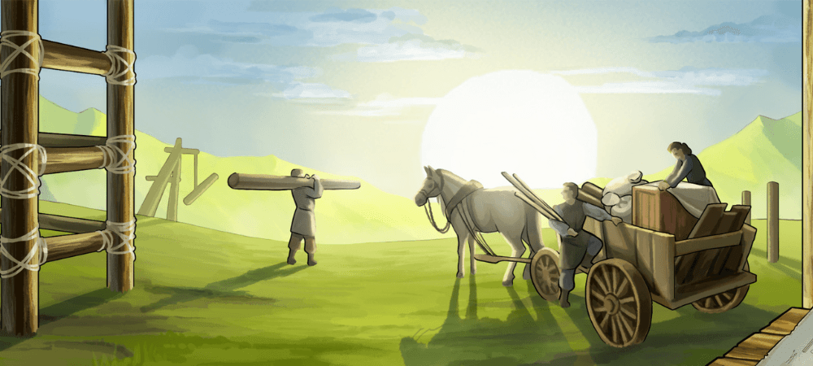
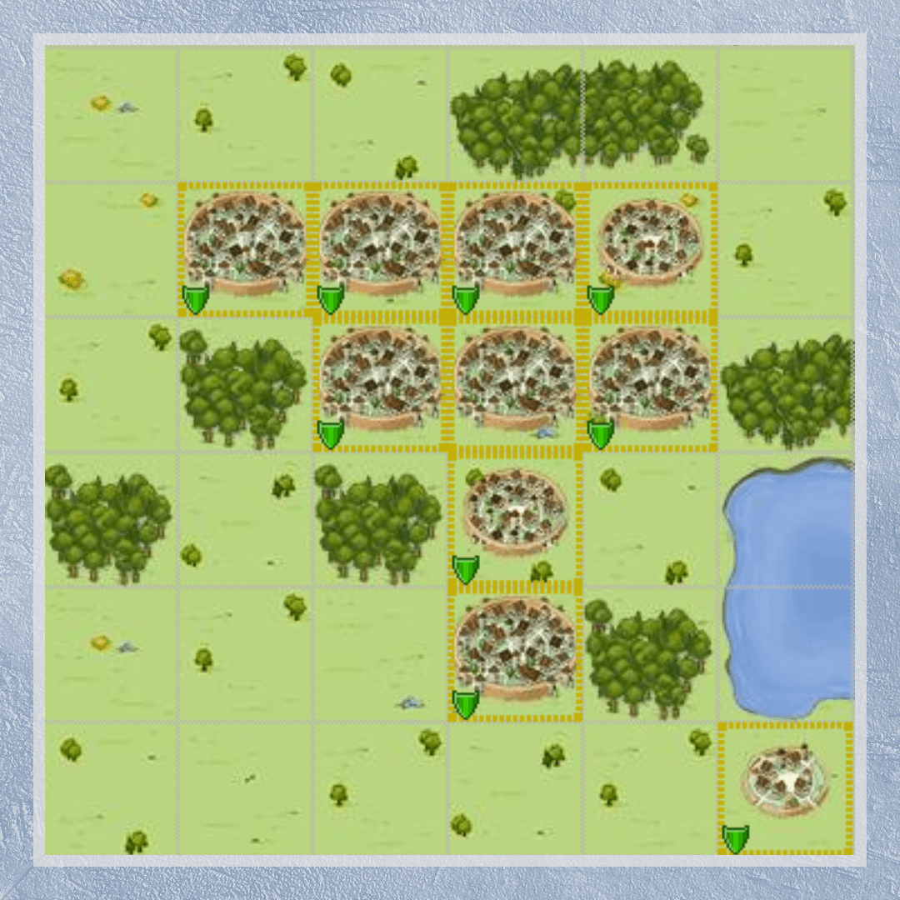
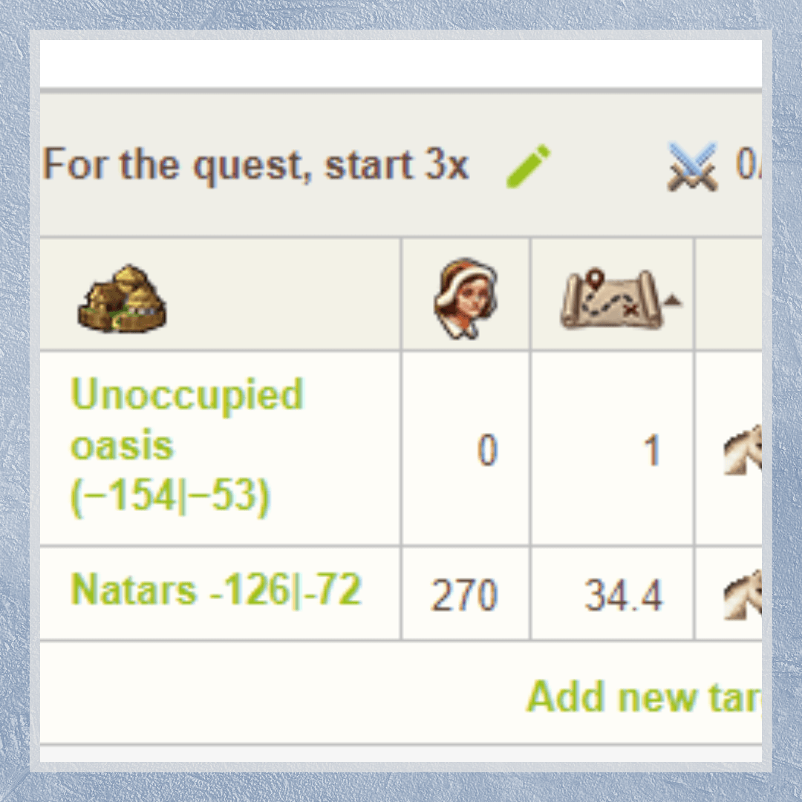
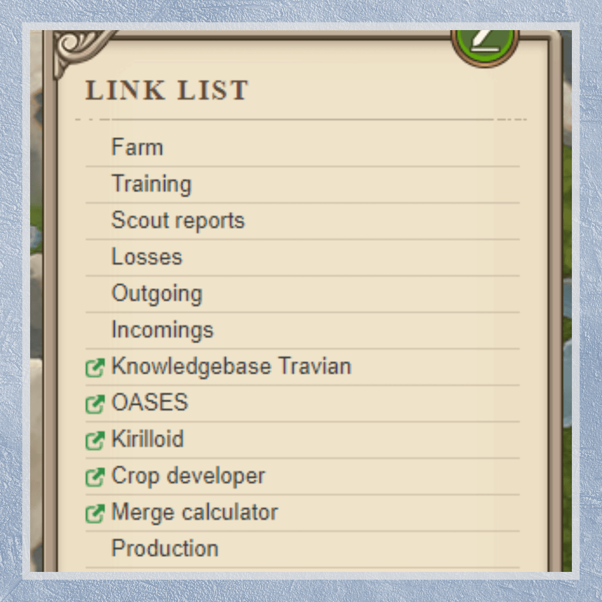

# How to make self-supporting account

> Source: Unofficial Travian  
> URL: https://unofficialtravian.com/2025/01/09/how-to-make-self-supporting-account/

---

Welcome to the [Thursday guides](https://blog.travian.com/tag/thursday-guides/) series!

It’s not a secret that our beloved game might be quite time-consuming and require quite a lot of actions to be done as a usual daily routine.

Today we’ll talk about how to make our own life easier, the account in general less gold-consuming and make sure that your account empire requires minimal attention while still giving good results.

#### How to make self-supporting account – pro-tips

**Pick [the right capital](https://blog.travian.com/2023/04/types-of-capitals-and-their-development/) that best suits your planned gold investments**. As simple as it might sound, this rule would save you a lot of trouble. 15-croppers with high crop oases will require quite some gold to NPC excessive crop to other resources. If you are not ready to use NPC every few hours once your granaries get full, select one of less-demanding, but well-balanced croppers: 9с +100-150, 7c+150

**Settle tight!** The less time your merchants have to travel from one village to another, the less time your account will require attention.

Later in the game, when you have 5-7 villages, **turn your capital (or some village next to it if capital for some reason is out of options) into “Resource distribution centre”**: 3-4 fully upgraded warehouses, 3-4 fully upgraded granaries and a high-level (minimum 10) Trade Office. Transfer there all “excessive” resources that you might have in your village, and then exchange them in the needed proportions.

**When using NPC merchant, plan which resources you might need most and distribute resources based on this parameter.** Different buildings require certain resources more than others. For example, barracks and stable require almost double amounts of lumber and iron than clay and crop. Croplands, on the opposite, require almost 1.5x more clay than lumber and iron.

**Settle your army villages as close to your capital (and/or resource distribution centre) as possible**. That will save you time for delivery.

In order to save resources for upgrading military buildings ( for defence villages it’s for example barracks, stables, smithy, hospital, Tournament square) and army upgrade, keep a good balance between “army villages” and “regular villages”. For offensive type of playing – 1 offensive village for 10 “regular” at most. For defensive type of playing – 1 defensive village for 3 “regular”.

#### **Manage your Routine**

**Set Trade routes:** Once the regular resource village is fully developed, set trade route out of there to transport 2/3 of its production to one of the “army villages” or to your capital. You will need 1/3 of production for Townhall celebrations. Also, in ideal self-supporting account you should make sure that your army receives enough crop supply via trade routes without your direct involvement and that you will not have to wait resources to come when you decide to add units to the training queues. That also prevents your resource villages from overflow.

**Note:** If you actively trade on a marketplace, or, later in the game, when you need to supply World Wonders of Artifact villages, do not send your merchants away on long distances from your capital or resource distribution centre. Set “chains” of trade routes: Resource centre -> regular village -> trade route to World Wonder. Make sure that you always have 1/4th of your Merchants home available at any time in case you need to adjust something in your development.

####

**Use Farm lists:** Even if you’re not too much into farming, it’s still worth adding some unoccupied oases around your village with farming troops to increase your hero bag. We explained how to farm unoccupied oases in one of our previous articles. You can read it here: [**Oasis farming tips and tricks.**](https://blog.travian.com/2023/05/oasis-farming-tips-and-tricks/)

Farm list is also a good option to save you time for making daily quests (Raid against Natars, Raid unoccupied oasis). Just add one oasis and one Natar village next to you, set 1 scout as troops – click 3x on “Start” and quest is completed!

####

**Set link list.** Add most used links into the link list so that you could access needed information or a building with one click. One of the useful recent changes that worth being added into the link list is **the Training tab**, where you can monitor your queues and go directly to the village and training building that needs attention.

####

And this is a wrap! Of course, [**developing your first villages**](https://blog.travian.com/2023/04/developing-your-first-villages/), setting proper trade routes to feed your armies and to transfer resources for development might require some time and calculations. However, once the order is set and the initial job is done, account requires way less attention, gold and performing routine actions. This, in turns, helps you develop faster and saves you time for more interesting stuff in the game!

See you next Thursday!