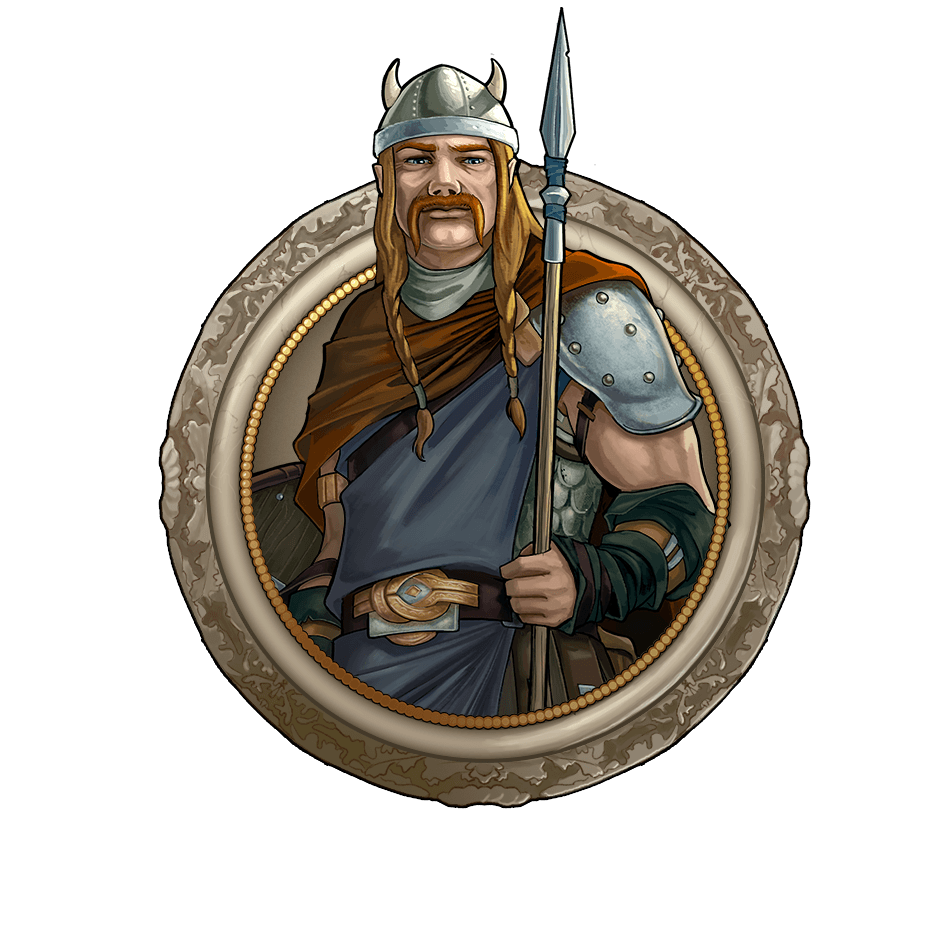
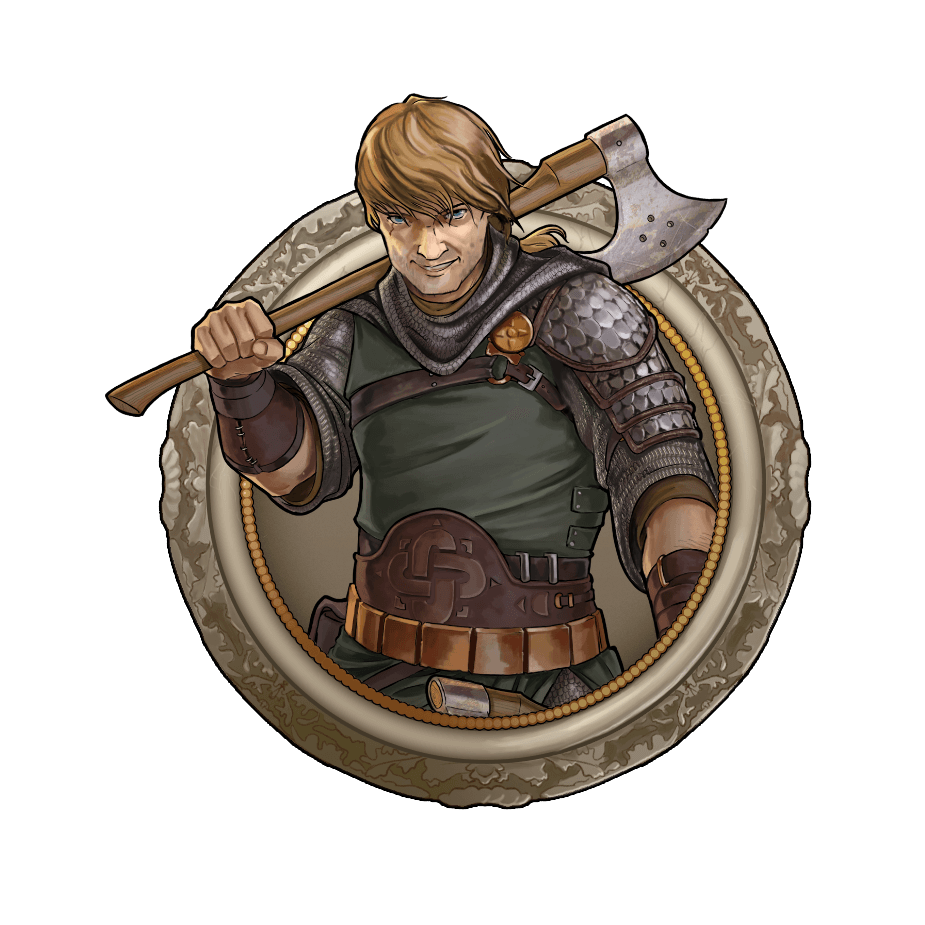
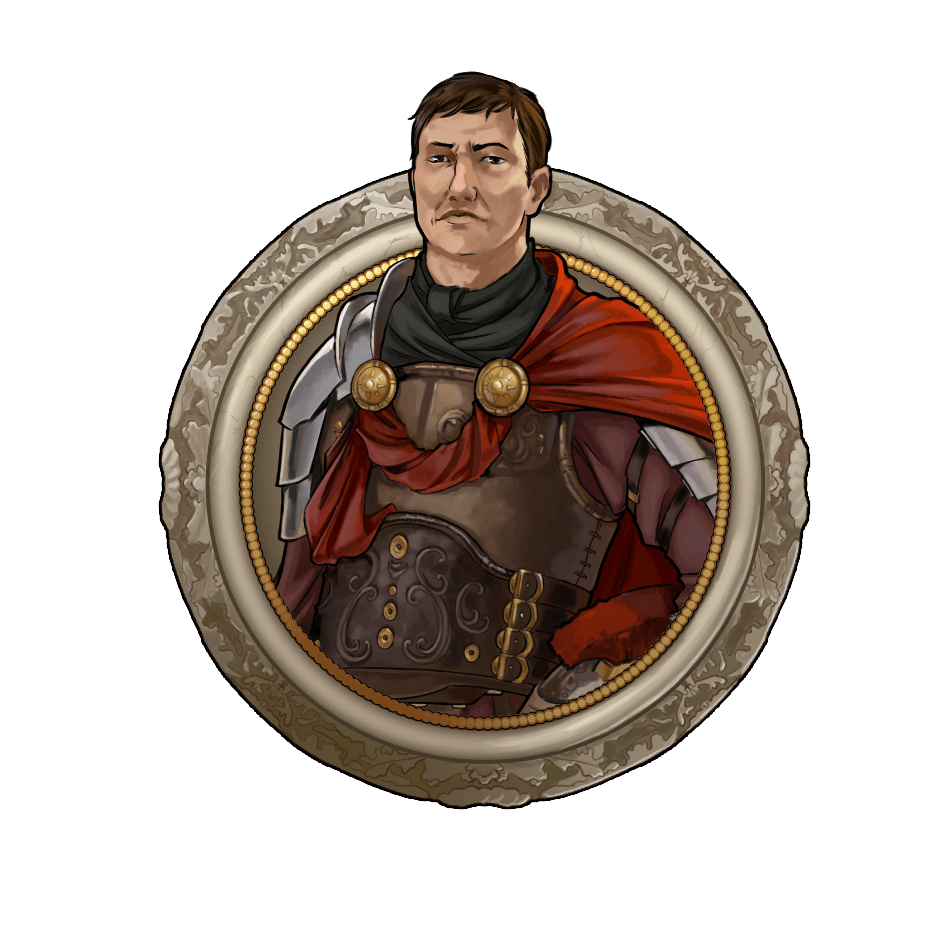
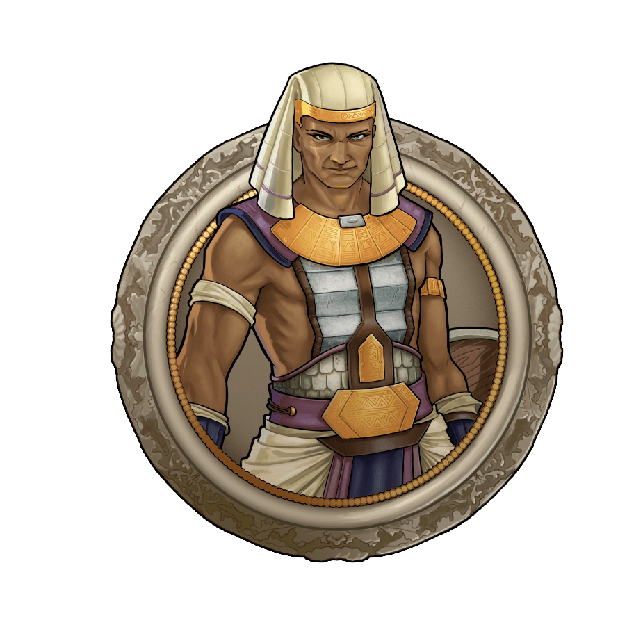
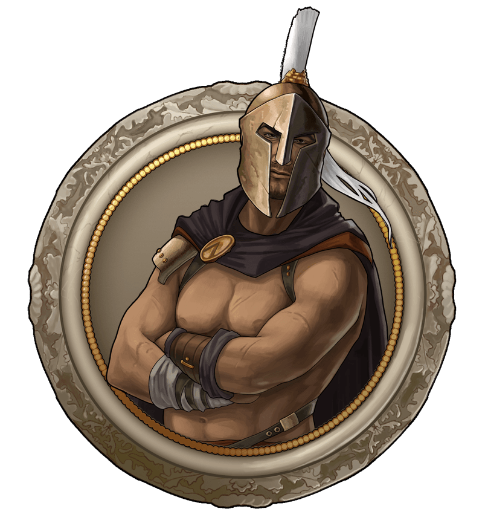
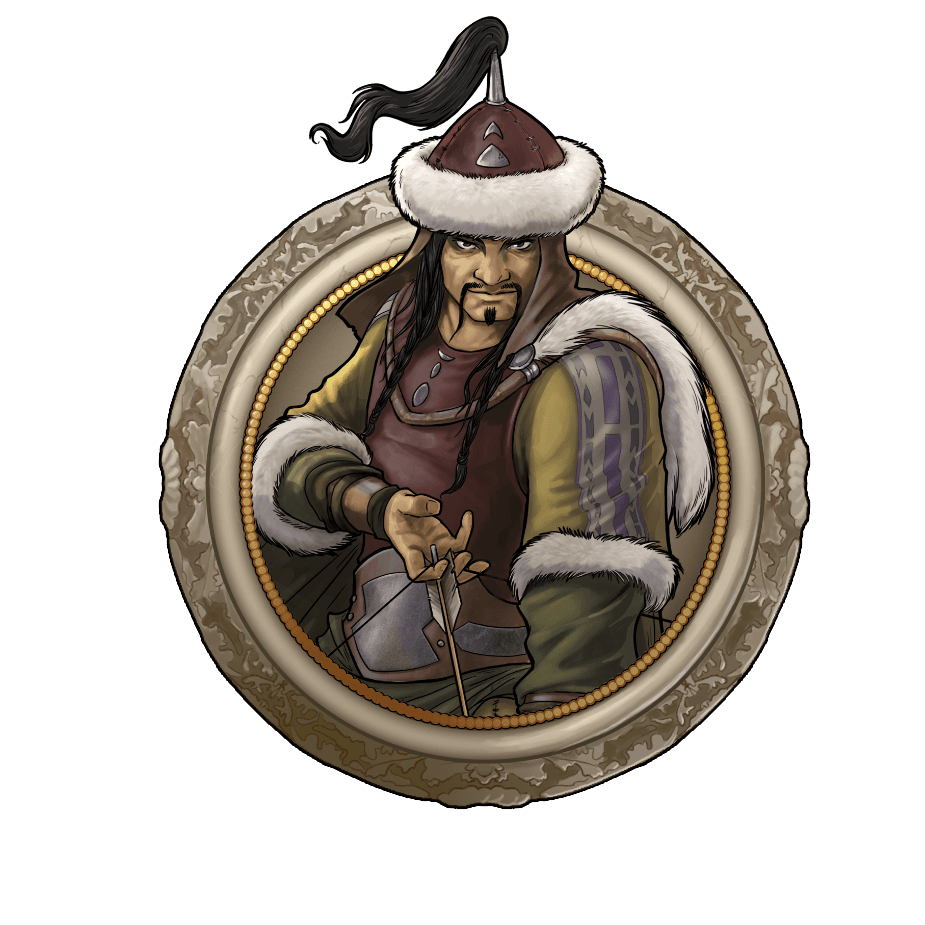
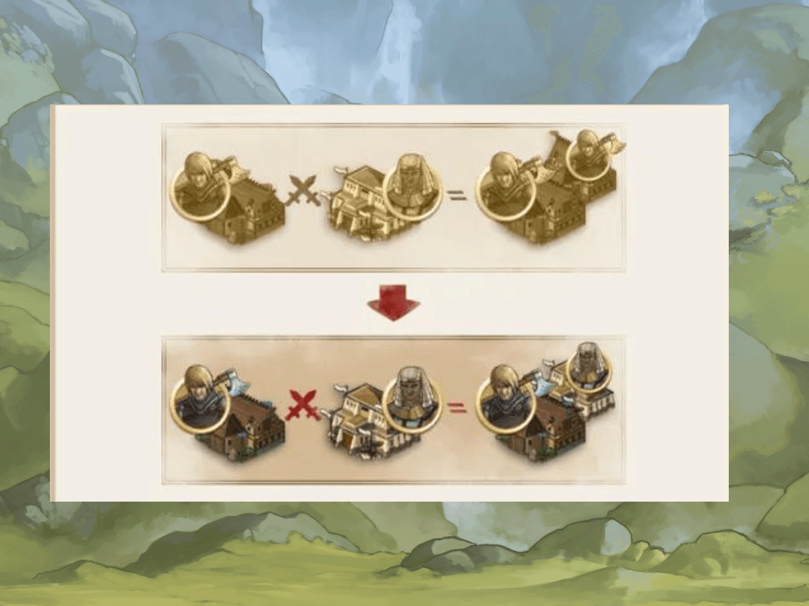
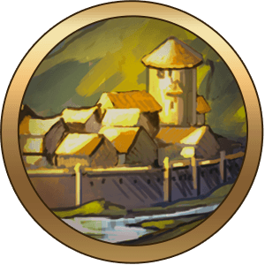
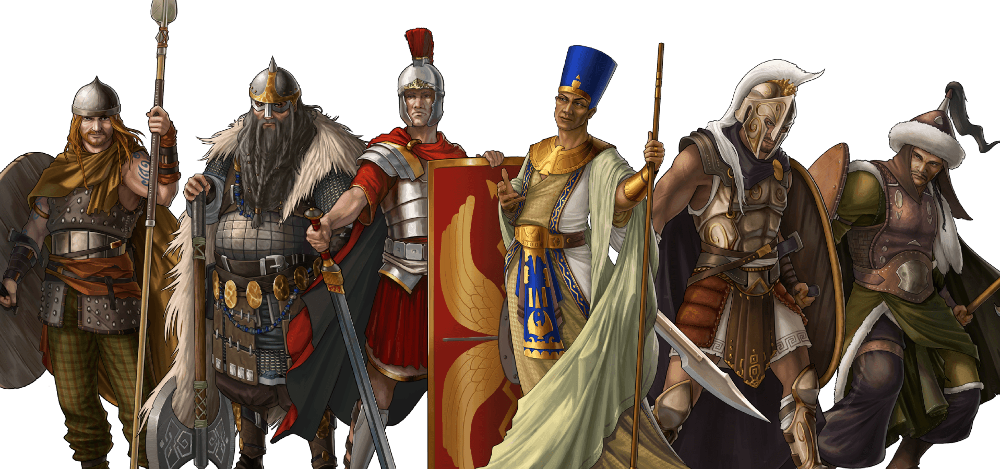

# Keep tribe on conquer feature Tips and Tricks

> Source: Unofficial Travian  
> URL: https://unofficialtravian.com/2025/01/12/keep-tribe-on-conquer-feature-tips-and-tricks/  
> Written on April 6, 2023

---

Welcome to the [Thursday guides series](https://blog.travian.com/tag/thursday-guides/)!

Currently we have more and more gameworlds with a new “Keep tribe on Conquer” feature, today we will talk about specifics of multitribe gameworlds.

**The keep tribe on conquer feature allows us to use the benefits of each tribe without suffering too much from their downsides.** If you are unaware how exactly the feature works, you can **????️ click on the header below ????️** to read its description.

**Keep Tribe on Conquer Feature in detail**

|  | |
| --- | --- |
|  |  |
|  |  |
|  |  |
|  | |
|  |  |
|  |  |
|  |  |
|  |  |
|  | |
|  | |

#### What do you need to consider when you play on a gameworld with a **Keep tribe on Conquer** feature?

First of all, if you are attached to a certain tribe or do not like conquering, you can just easily ignore all the tips and play happily with just one tribe!

But if you want to explore the feature in its full scope, read the following tips.

##### **I.  The Hero ability doesn’t change.**

#####

The first choice on a gameworld with the ‘keep tribe on conquer feature’ enabled already appears during registration. Remember, basically the only thing that can’t be changed is your [**hero ability**](https://support.travian.com/en/support/solutions/articles/7000061665-hero-overview) that will stay to you till the end.

**And here we have 2 tribes whose hero ability is useful during the whole game round:**

**Huns tribe**: +3 fields/hour speed for a mounted army with a mounted hero. The army must not include any infantry units. That is applicable to any tribe cavalry, not just Hun one! Imagine Resheph chariots travelling with speed 13 instead of usual 10, or Druid riders on speed 19! So, if cavalry speed is important to you, Huns are the nice choice to start a gameworld.

**Spartan tribe**: +50% strength from Spartan weapons and increased bonus to Spartan troops from appropriate weapons. If you are fascinated by a Spartan tribe just like we are, and planning to train Spartan defense or use it as an attacking army it’s worth considering starting as a Spartan due to the increased bonus a spartan hero gives to Spartan troops. You can find the full description of this hero ability and comparison to the other tribes in this [dedicated blog post](https://blog.travian.com/2022/07/spartan-hero/).

##### **II. Future capital and an early game development.**

**Another aspect** that might define your choice of tribe upon registration is early game development. And here the **Egyptians** still hold the first place due to their focus on economy and increased hero resource bonus, which allows them to settle the second village faster. Also, settling your second village (that most likely will be your capital) as an Egyptian will provide you a nice start without the necessity to rush with conquering too early which might not be the easiest task.

**Yet, it’s important to highlight once again:**It’s fully up to you with which tribe to start, since at a later stage you will be able to benefit from other tribe villages and make them work for your best.

*If you are still unsure, the best tip would be to register with a tribe you are most used to and have the most experience with.*

##### **III.****Late stage tips and tricks, and villages specialization**

Experienced players that play with this feature often, tend to use the benefits of each tribe by **giving villages different specializations based on their strong sides**. Let’s look at the most prominent ones.

| Tribes | | Benefits (Village Specialization) | Read more… |
| --- | --- | --- | --- |
| Gauls |  | One of the best defensive villages due to phalanx and druidriders, Trapper gives cheap population on gameworlds where it’s important (i.e. Annual Special). | **[5 things to consider about Gauls](https://blog.travian.com/2023/03/5-things-to-consider-about-gauls/)** |
| Teutons |  | Second best option for the capital for very aggressive players due to Brewery, that affects the whole account (imagine a Roman or a Spartan attacking army with a 20% additional bonus from Brewery)! | **[5 things to consider about Teutons](https://blog.travian.com/2023/03/5-things-to-consider-about-teutons/)** |
| Romans |  | Better development due to double queue for resource villages, best spying villages when it comes to active spying (sending on spy operations) and strong and crop-efficient attacking army. | **[5 things to consider about Romans](https://blog.travian.com/2023/03/5-things-to-consider-about-romans/)** |
| Egyptians |  | Best capital in terms of resource base due to waterworks, good defence. | **[5 things to consider about Egyptians](https://blog.travian.com/2023/03/5-things-to-consider-about-egyptians/)** |
| Spartans |  | Elpida Riders as one of the best universal cavalry units, shieldsmen are one of the strongest infantry defence, sentinels as the best stationary anti-scout defence, very crop-efficient spartan attacking army (though quite low in training). | **[5 things to consider about Spartans](https://blog.travian.com/2022/07/5-things-to-consider-about-spartans/)** |
| Huns |  | Best conquering villages due to Command Centre, very good cavalry for farming, one of the best attacking tribes in general. | **[5 things to consider about Huns](https://blog.travian.com/2023/03/5-things-to-consider-about-huns/)** |

More detailed explanation about each tribe benefits you can find in our earlier Thursday guides (see the links above).

And that is a wrap! All in all, keep tribe on conquer is a great feature that makes the game more diverse and allows you to use different specializations and it’s definitely worth trying!

See you next Thursday!

8