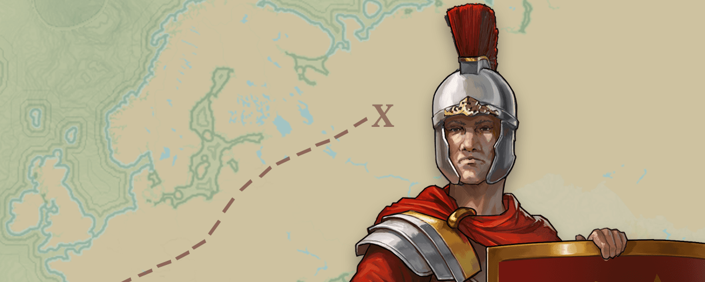
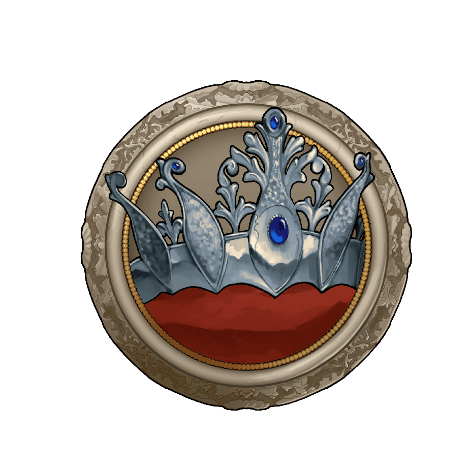
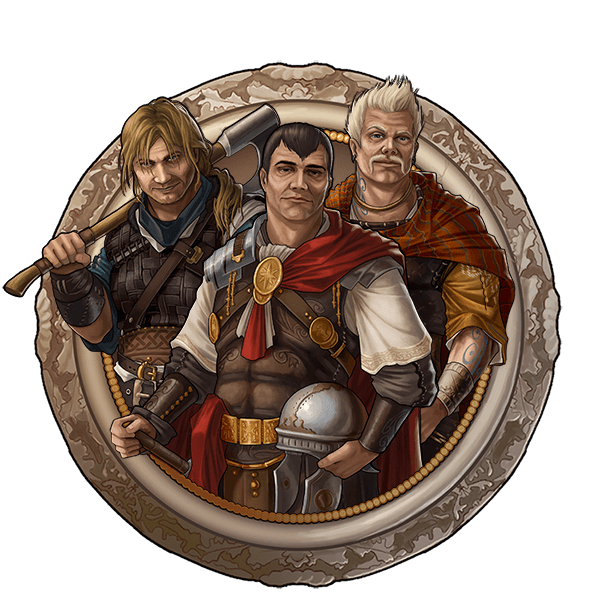
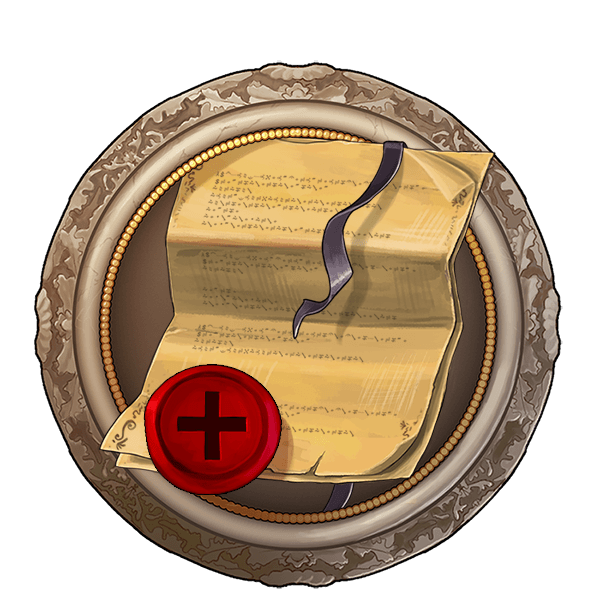
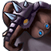
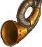
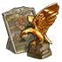
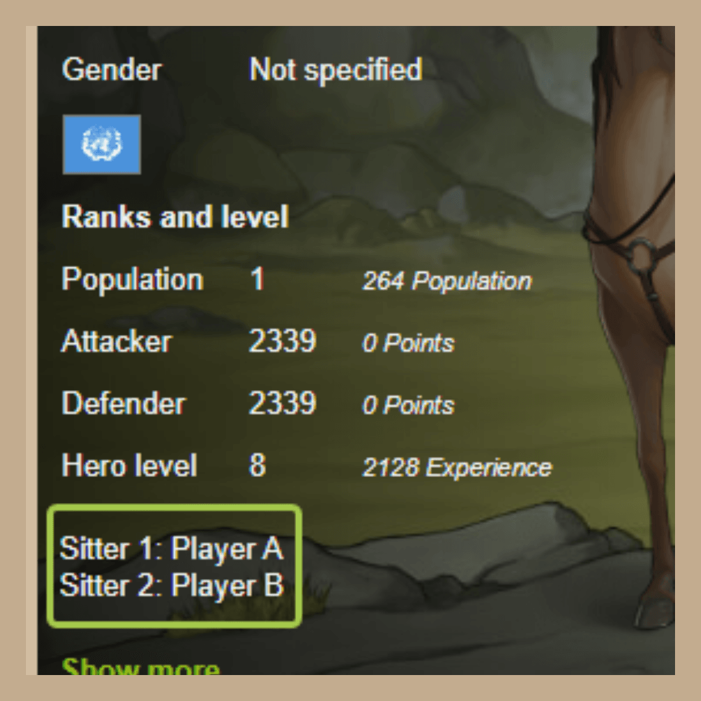
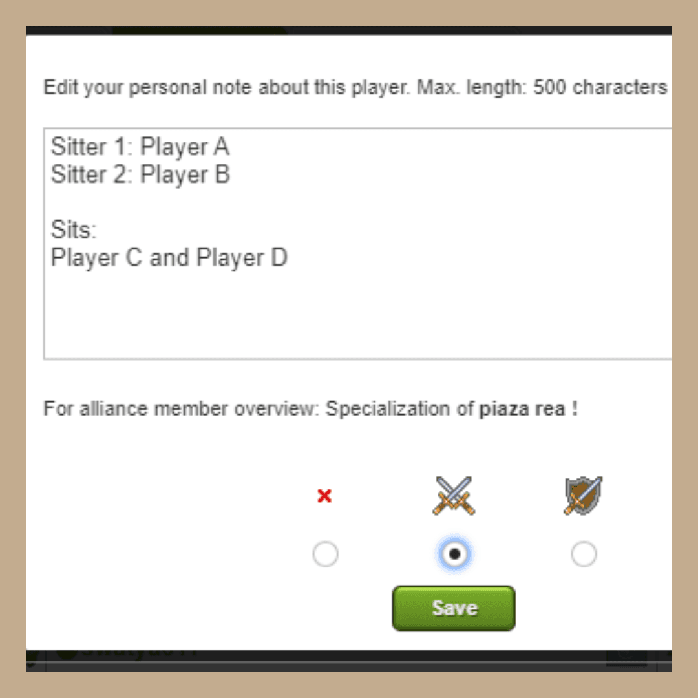

# Leading an alliance – Introduction

> Source: Unofficial Travian  
> URL: https://unofficialtravian.com/2025/01/12/leading-an-alliance-introduction/

---

**Welcome to [Thursday guides](https://blog.travian.com/tag/thursday-guides/) series!**

*Disclaimer: This guide won’t teach you how to win the game. Yet, it aims to help new and less experienced alliance leaders setting up a good foundation for an organized alliance. We will keep publishing alliance tips in Tricks in further guides series!*

It’s not a secret that leading an alliance in-game might at times feel like a second job, and occupy every possible free time. Yet, the feeling of achievement when your team starts making progress is hard to compare. Today we will have a look into the world of alliance leaders. Tips and tricks how not to get burnt leading an alliance. Let’s start with basics.

**What differs organized group from a random alliance that most likely won’t last long after the server start? Or, to phrase differently, what all organized alliances in Travian: Legends have in common?**

##### **Clear common goal**

It doesn’t matter whether you create a group on the map around you or you gather the team to a certain gameworld, one of the ultimately important things is setting a clear goal.

**Your goal doesn’t necessarily need to be major. The most important thing is that it should be challenging and achievable and fit your members’ alliance size and ambitions/capabilities.**

A good goal for an entire pre-made alliance would be to play for the victory. You can increase your challenge by agreeing on playing without signing any non-aggression pacts or confederacies.

If you only start your road to victory and your alliance was only newly created, a good goal would be to build up the core of players for further rounds, to conquer and keep certain number of artefacts, get a top-1 position in attack/defense or any other achievable goal that would bring sense to your actions and define your future strategy.

##### **Permanent and active channel of communication**

**Currently most organized alliances have discord channel where they can coordinate their efforts.**If you’re new to Discord, [use this guide](https://blog.travian.com/2022/06/create-your-own-discord-chat-server/) to set up initial one. You can always adjust it to your needs. Make sure your members joined this channel and added their in-game names to their nicknames. This should be one of the first coordinated actions – in case of attacks there you won’t have much time to figure out which one exactly out of joined members plays under a certain name.

##### Defined alliance rules

Game rounds are long and you as a leader will have to sort out lots of tricky situations all the time. What do you do if a player becomes yellow? What if a certain account has too low activity? Who defines alliance diplomacy? All this should be clearly written in a short but a nice manner in the one of the introduction channels.

##### More than one leader / player in charge

It’s important for you to find people who would help you with your leading duties. Even if your alliance is rather small, you always need to have people who can make decisions in your absence. This is highly important to delegate some of your tasks (for example, monitoring players activity and recruiting, offense-coordination, defence coordination etc) to others. Don’t get burnt by a burden of doing everything yourself! Players tend to ping leader for any question they have. Redirect them to general channels so that other members could answer their questions and make sure you have other active people in the leadership who can be there for you.

##### **Information is a key**

Always make sure to be up-to-dated about your alliance powers. As a leader, you will need to have information about each player sitters, army sizes, specialization.

In general, treat alliance leadership just as any other fun project you might have. In a nutshell, it’s not much more different than participating in any other hobby.

#### **Tools that can help in your leader duties**

[**Gettertools**](https://www.gettertools.com/en/)

Still one of the most used tools for alliance management.

What you get as a leader if you create there your alliance group

- Sitter information (needs to be filled and updated by the players)
- Troops information
- Possibility to plan, create and participate in alliance off-operations
- Map overview of your alliance settling

[**Travco**](https://www.travcotools.com/en/)

Relatively new tool for alliance management

- Troops information
- Report attack function with some possibility to analyze incoming attacks
- Defense planning function (allows to set a defence call, that is automatically closed when the needed number of defence have been reported)
- Resource push planning function (allows to set a resource push call, that is automatically closed when the needed number of resources have been reported)

[**Various spreadsheets and google forms**](https://docs.google.com/)

Some alliances still prefer using google forms and google sheets for creating plans and reporting attacks. Here only sky is the limit. Most often this is used for recruitment, gathering information on specific questions etc.

**In-game tools**

Even though the game itself doesn’t provide with lots of tools, it’s still worth mentioning alliance profile notes and specialization.

Notes is a good space where you can add information about sitters for example (please, remember, that notes in the game are visible only for your account, they are not public).

#####

Specialization allows to have an overview of what players are more focused on. Unlike notes, this information is visible for other alliance members (but not outside of the alliance) and it also gives option to send mass message to selected group only.

More information about bb-codes you can find here: [BB-codes.](https://blog.travian.com/2023/07/game-secrets-bb-codes/)

And this is a wrap! We will certainly return to this interesting and complex topic – how to lead an alliance – in the upcoming posts. Come back next Thursday for more tips and tricks on how to play the game!