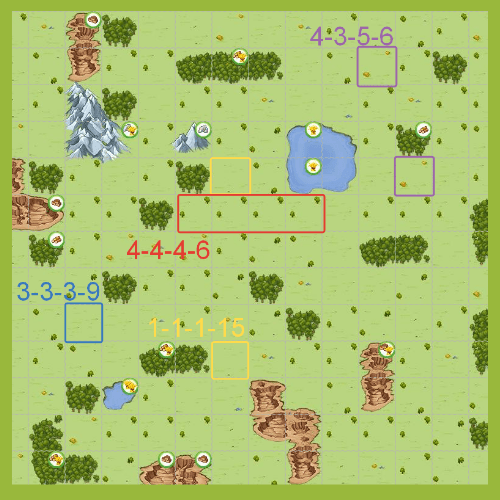
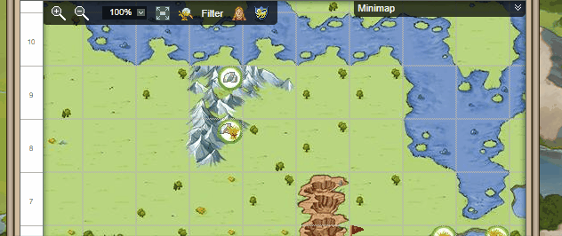
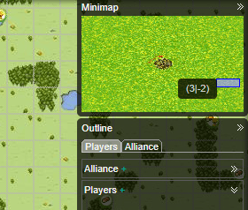
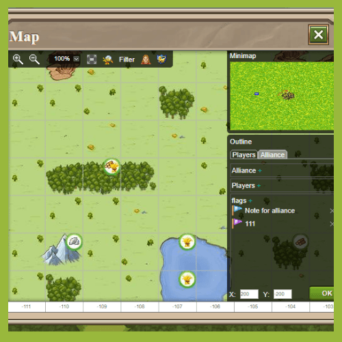
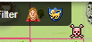
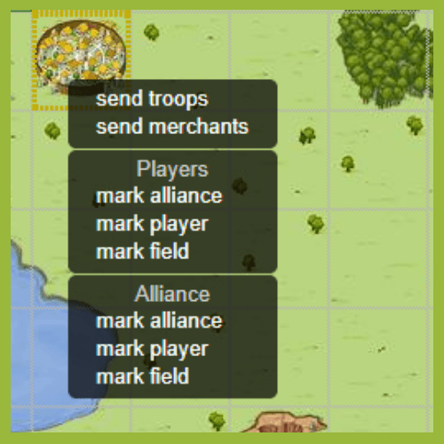
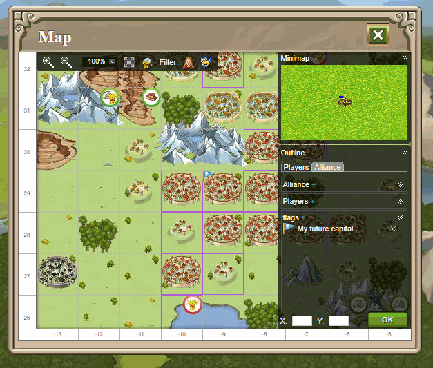
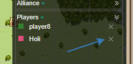
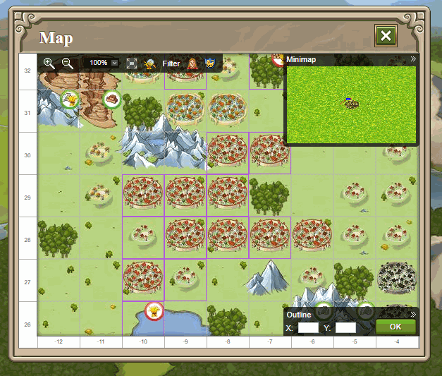

# Map Secrets in Travian: Legends

> Source: Unofficial Travian  
> URL: https://unofficialtravian.com/2025/01/12/map-secrets-in-travian-legends/  
> Written on March 6, 2024

---

Unlocking the full potential of the map in Travian: Legends can significantly enhance your gameplay experience. In this guide, we’ll delve into some hidden features and tips to help you navigate and strategize more effectively.

##### **Understanding Tile Details**

Have you ever noticed that specific map tiles have different landscape items depending on their type? For instance, two trees in opposite corners signify a 4-4-4-6 map tile, while two stacks indicate a 4-3-5-6 tile. Additionally, 9 and 15 croppers may appear almost empty with tiny-sized yet recognizable markings. Understanding these tile details can provide valuable insights into resource distribution and strategic positioning.

##### **Coordinate Input Simplified**

Inputting coordinates into Travian: Legends is a breeze. Simply paste the coordinates into either the X or Y entry field, and the game will automatically set the other one for you. This streamlined process saves time and ensures accuracy when pinpointing specific locations on the map.

##### **Navigation Shortcuts**

Efficient navigation is key to conquering the game world. Utilize these shortcuts to traverse the map seamlessly:

- **Press G to Toggle Grid:** Hide or display the grid overlay by pressing G on your keyboard.
- **WASD or Arrow Keys:** Move around the map using WASD or arrow keys for quick exploration.
- **M key to open/close Minimap**
- **O key to open/close Outline menu**

##### **Minimap**

The minimap serves as a valuable tool, offering an overview of village density and aiding navigation. Simply press the M button to open or close it. Hovering over coordinates allows players to select specific map areas for more detailed exploration.

##### Outline Menu

The outline menu is a powerful tool for managing markers and enhancing collaboration within your alliance. Just click on a certain tile with the right mouse button and pick which marker you want to add.

Which features are worth mentioning for the outline?

**Players and Alliance Markers:** These markers serve similar purposes, allowing players to mark specific locations on the map. However, the key difference lies in their visibility scope:

- **Players Markers:** Visible only to the player who sets them, providing personal reference points.
- **Alliance Markers:** Visible to the entire alliance, facilitating coordinated strategies and communication.
- Please, note, that priority is the following: Alliance (own player marking) -> Player (own player marking) -> Alliance (alliance marking -> Player (player marking).

#####

**Toggle Visibility:** You can easily manage visibility of player and alliance markers for yourself by clicking on the upper menu buttons. Greyed out buttons indicate disabled marker display.

#####

- **Mark Alliance:** Adds an outline border around all villages and oases associated with a particular alliance. Useful for highlighting alliances with varying relationships to your own, such as allies or rivals.
- **Mark Player:** Adds an outline border around villages and oases belonging to a specific player. Ideal for keeping track of notable players or monitoring potential threats.
- **Mark Field** This feature allows players to strategically mark map tiles with flags, providing essential notes and information for planning and coordination:

#####

**Rectangular Flags:** Visible only to the player who sets them, offering personalized markers for individual reference.

**Triangle Flags:** Visible to the entire alliance, enabling collaborative planning and communication.

**How to edit text on the flags:**

**How to delete markers:**

Don’t forget though about **Marker Etiquette.**Maintaining a clutter-free map environment is essential for effective gameplay and communication:

- **Regular Cleanup:** Encourage players to regularly review and remove outdated markers to ensure a clear and accurate map view. You can do that by going into outline menu and removing the outdated markers by clicking on the cross.
- **Balanced Information:** Avoid overloading the map with excessive markers, prioritizing relevant and up-to-date information to streamline navigation and decision-making.

#####

12

3

1