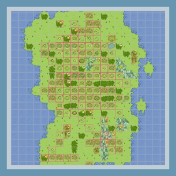

# Map Strategies for Newer Alliances in Travian: Northern Legends

> Source: Unofficial Travian  
> URL: https://unofficialtravian.com/2025/01/12/map-strategies-for-newer-alliances-in-travian-northern-legends/  
> Written on August 28, 2024

---

Surviving and thriving as a newer alliance in [**Travian: Northern Legends**](https://blog.travian.com/travian-northern-legends/) can be challenging, but with smart strategies and realistic goals, even less experienced groups can carve out a place for themselves. Here’s a guide to help newer alliances navigate this treacherous scenario, focusing on building strength, securing essential regions, and enjoying the game.

#### Avoid High-Conflict Regions Early

Small boots regions that are close to initial spawn areas like Vandali, Eburacum, Segovia, Halicarnassus etc. often become hotly contested early-game battle arenas for experienced alliances. As a newer alliance, it’s crucial to estimate your powers realistically and avoid engaging in battles you can’t sustain. Instead, focus on securing less contested regions that still offer valuable bonuses or wait for regions that unlock with delay like Carthago and Ravenna for small boots, for example.

#### Oversettling as a Territory-Securing Tactic

One effective tactic is to “oversettle” in a recently unlocked region that offers the powers your alliance needs. By flooding the region with multiple settlements, you can make it more time-consuming and resource-intensive for stronger alliances to take over. This approach can secure your position in a region and deter more experienced alliances from trying to conquer it.

#### Small or Great Powers?

Fighting for highly sought-after powers like Small Boots or Small Trainer can be tough for newer alliances, as these regions will likely attract pre-made, advanced alliances. If fighting for these small powers isn’t an option, consider targeting less contested regions with similar but Great Powers, which provide a lesser effect but apply to the entire avatar. While Great Boots or Trainer only offer a 1.5x boost, it’s still a significant advantage and easier to secure than the smaller, more coveted powers.

#### Focus on Defensive Powers

Newer alliances should prioritize securing defensive powers like Small and Large Confusion, Architect, and Eagle Eyes. These powers can make your villages more resilient and harder to conquer:

- **Small and Large Confusion**: Increases the difficulty of conquering your villages due to the random catapult effect.
- **Architect**: Makes your villages more durable, requiring more catapults for destruction.
- **Eagle Eyes**: Helps analyze incoming attacks, detect chiefs or heroes, and allows you to prepare your defenses.

Combining powers like Great Architect with Small Confusion can significantly fortify your villages against close-range attacks, making them tough targets. The attacker will need to train a bigger army nearby and produce many catapults that cannot be merged.

#### Create Defense Hubs and Develop a Strong Scouting Network

Establishing defense hubs — strategically located villages with concentrated defensive troops — can help your alliance hold key regions. These hubs act as deterrents, cooling down even the most aggressive attackers by extending battles and making conquests more costly and time-consuming.

Encourage alliance members to maintain at least 50 scouts in every village, with more scouts in capitals and crucial defense or offense villages. Designate a “scouter” within your alliance to coordinate scouting efforts, sending infantry scouts as reinforcements to all newly settled or conquered villages. This proactive approach can help detect enemy scout operations early and prepare your defenses accordingly.

#### Choose Your Battles Wisely

Once you’ve secured your core regions, you can begin to consider engaging in battles for other regions. However, always assess the risk and potential reward before committing your resources. Picking fights you can win, rather than chasing after every valuable region, will keep your alliance strong and sustainable.

#### Use Diplomacy to Your Advantage

Form non-aggression pacts with some stronger alliances. Diplomatic relations can provide you with breathing room to grow and secure your territories without constant threats of attack. Over time, these relationships can evolve into strategic partnerships, allowing you to take on more significant challenges together.

#### Capitalize on Timing and Prepare for the Long Game

Timing is crucial in Annual Special. Aim to expand and settle in regions that have just unlocked, as they are less likely to be heavily contested. This approach allows you to establish a presence before stronger alliances move in, giving you time to fortify your position.

Newer alliances should focus on sustainability rather than quick victories. Invest in building strong infrastructure in nearby regions. Don’t spread too thin over the map—your main strength should be well-defended villages and efficient resource management. By focusing on the long-term, your alliance will be better positioned to withstand late-game pressures and potentially even emerge as a formidable force.

#### Enjoy the Process, Celebrate Small Wins, Learn and Adapt

Remember, the journey is just as important as the destination. Celebrate small victories, such as securing a new region or successfully defending your territory. Encouraging a positive atmosphere within your alliance will keep morale high and make the game more enjoyable for everyone.

Each round of the **Annual Special** offers new challenges and learning opportunities. Take note of what strategies worked well and where you could improve. Over time, your alliance will become more experienced and capable of taking on more significant challenges, gradually moving from survival to dominance.

With careful planning, realistic goals, and a focus on defense and strategic expansion, your alliance can enjoy the game and become a force to be reckoned with, even if the ultimate victory isn’t within immediate reach.

