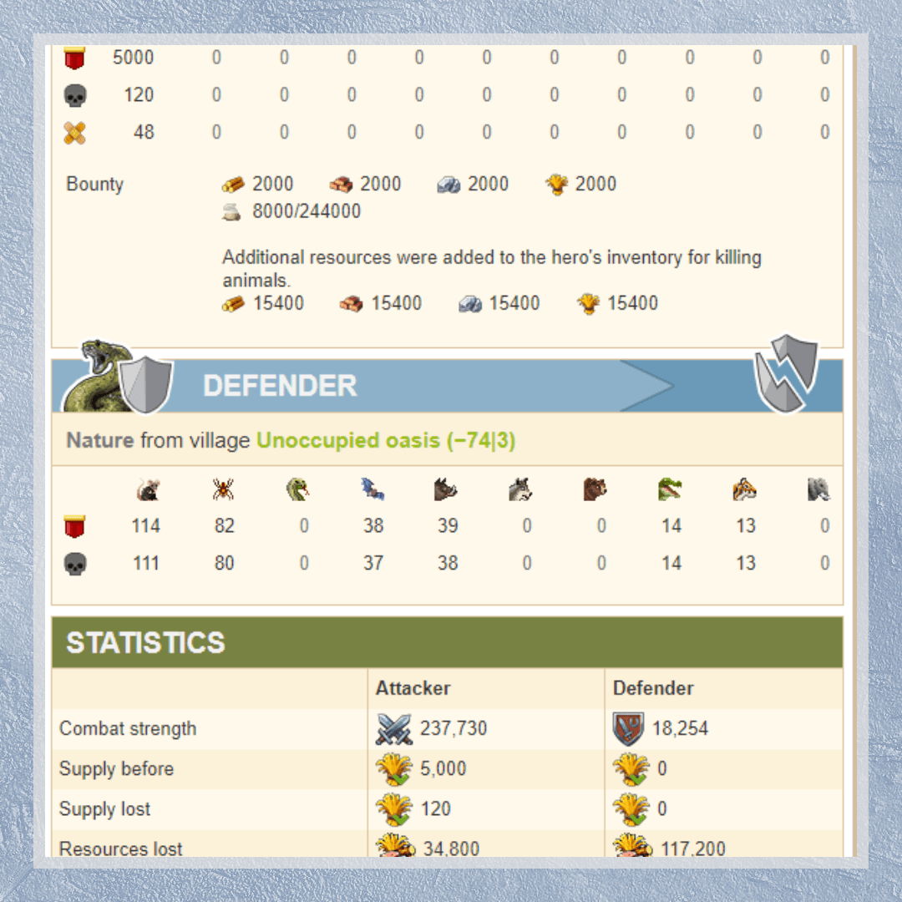
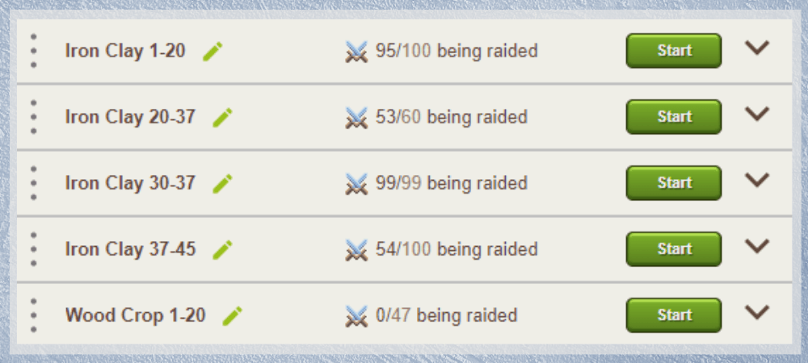
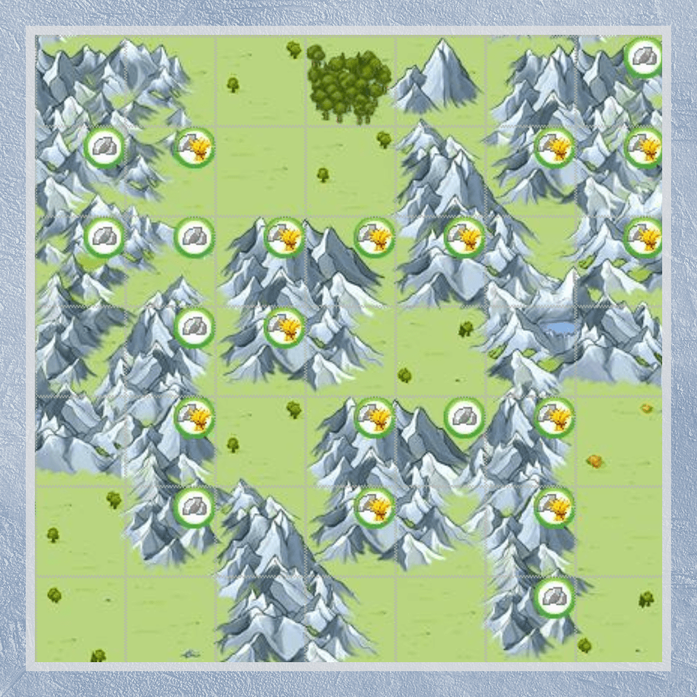

# Oasis farming Tips and tricks

> Source: Unofficial Travian  
> URL: https://unofficialtravian.com/2025/01/12/oasis-farming-tips-and-tricks/  
> Written on May 11 2023

---

*Disclaimer: This article contains tips for the oasis farming AFTER initial beginner protection of a gameworld when animals start to respawn. For the beginner protection stage please read our **[previous article](https://unofficialtravian.com/2025/10/beginners-protection/)**.*

There is no universal method of farming oases. However, in most cases farming oases and fighting nature troops will give you extra resources for development and save you some gold – it’s really nice to have resources in the hero inventory that you can add any time to any village and start a certain building or order a celebration in the Townhall without the long waiting times of a marketplace delivery.

## **Basic oasis farming (manual search and sending)**

Open the map around your spawn or farming village and hover over the mouse on oases around it. Open the one that has animals in there.

Calculate the army you need to defeat those nature units with minimal or no losses in a combat simulator.

Good result of a fight would be if your losses in resources needed for training army are minimum 2x less than the resources you get from the oasis to your hero inventory.

Send the needed army.

## **Hero farming**

- Use your hero to kill the animals without losses.
- Add points to fighting strength rather than to hero resource production if you use hero for oasis farming.
- The rule of thumb is that your hero should bring more resources with that farming than what you would have received if you instead had focused on a hero resource production. So, if you only farm from time to time and not doing it your permanent source of income, avoid hero farming early game till your hero becomes lvl 30 or higher and you can distribute points into hero strength without sacrificing resource production.
- Use tasks from your villages to upgrade your hero when their health is too low to get back to full health with the level up.
- If the oasis has not been farmed for a while and you send your hero there, consider adding a small squad right after the hero to collect resources that were produced by the oasis.
- The optimal hero equipment for hero farming (early game) is: Horse and Small Spurs (increase mounted hero speed), Small Map (for faster return), any right-hand hero Weapon (adds strength), Helmet of Awareness (increases gained hero experience and lets hero level up faster), Light Scale armour (reduces damage and helps health regeneration). Of course, if you do not have exactly those items, any items would fit.
- Do not forget to have a stock of ointment to heal your hero in case they are left with too low health after some unfortunate attack and you do not have enough saved tasks in your villages to level up hero safely. It would be good if you also have a water bucket at any time in your hero inventory for the cases when the attack ended up with the hero’s death.

## **Oases Farmlists**

Most players who heavily rely on oasis farming are doing that via farmlists. We already mentioned that not all oases are similar in terms of which units are more likely to appear there. That’s why to start your first ever farmlist you can follow this path:

Open the map around your spawn or a farming village and create a farmlist that contains all oases around it **separating them by oasis type and the distance**.

##### **Separating by oasis type:**

- Separate farmlist for the **“Easy cavalry” oases**: Iron, Iron-Crop, Clay, Clay-Crop
- Separate farmlist for **“Medium”** oases: Wood and Wood-Crop
- Separate farmlist for the **“Hard”** oases: Crop and Double Crop (this one can be combined with “Medium”)

##### **Separating by distance:**

**Make separate lists for oases within 1-20 fields, 20-30 fields, 30-40 fields from your farming village.** Do not add more distant oases early game though since you most likely won’t have enough troops to cover bigger distances and will have to wait your troops back home for too long. In the midgame most active oases farmers have the whole map covered by their farmlists though.

**As a result you will get something like that:**

## **Which units to add?**

##### **Iron and Clay oases**

|  | For Iron, Clay, Iron-Crop and Clay-Crop oases The best units would be attacking cavalry (or a combination of attacking + defensive cavalry). At later stage, when there are many farmers and oases are cleared regularly, farming with just one offensive cavalry unit is also an option.      **Teutons:**1 Paladin + 1 Teutonic knight     **Gauls:** 1 Theutates Thunder + 1 Haeduean      **Egyptians:** 1 Anhur Guard + 1 Resheph Chariot      **Romans:** 1 Equites Imperatoris + 1 Equites Caesaris      **Spartants:** 1 Elpida Rider + 1 Corinthian Crushers      **Huns:** 1 Steppe Rider + 1 Marksman + 1 Marauder |
| --- | --- |
|  |

##### **Wood and Crop oases**

|  | If you have a lot of troops, adding 100 units per each target would give good results. If your troops’ counts are still too low, use those farmlists for manual farming  in order not to search them each time on the map and keep them deactivated. Some players add 1 scout to see how many resources gathered there and send separate small troop squads to get those resources and defeat some small animals numbers.Top Hun oases farmers use combination of 6-6-6 or 6-6-3 cavalry attack (6 steppe riders, 6 marksmen, 6 maraudeurs and 6 steppe riders, 6 marksmen, 3 maraudeurs).  You need to have a good number of those units though. |
| --- | --- |
|  |

## **Annual Special oasis farming tactics**

One of the main features of the Annual Special is [the European map](https://blog.travian.com/wp-content/uploads/2021/07/CommunityMap_AS2021.jpg). Therefore, unlike the classic map, this one contains vast water masses of the Mediterranean and Atlantic and **vast mountain chains filled with iron and iron-crop oases**.

That’s why if you consider getting additional income, it would be good to settle a farming village in the middle of those mountains. You can easily find a good spot if you just follow real-world mountain chains: The Alps, Carpathian Mountains, or the Pyrenees.

The best farming tribe for Annual Special is the **Huns**. Since Annual Specials are **“keep tribe on conquer”-**types of gameworlds, even if you started with the other tribe, focus on getting a Hun village for farming. You can do that by conquering inactive or asking your alliance Hun member to settle one for you.

## **Conclusion**

We would like to remind once again – this guide does not give a universal way of farming oases. It’s mainly just a general direction on how to develop your farm.

Gameworlds are different and farming tactics may vary based on the activity of you and other players. Adjust, test, calculate losses and income, select your preferable tactics and unit numbers per farmlist entry that fit you best. For example, it might happen that there are a lot of farmers around your farming village and 2+2 cavalry squad is too big for oases where nature troops are often killed by other farmers and 1 attacking cavalry unit or 1+1 would be enough to defeat 1 stray rat or a lonely spider. Or, on the opposite, the animals appear too often and with too big packs and in this case it’s just better to farm with 20-30 units of one type for Iron-Clay, and 50-100 units for Wood-Crop to reduce losses.