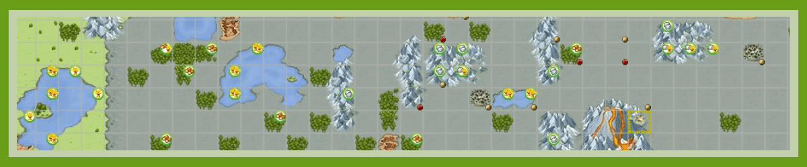

# Settling and Securing village in a Grey Area

> Source: Unofficial Travian  
> URL: https://unofficialtravian.com/2025/01/12/settling-and-securing-village-in-a-grey-area/  
> Written on December 13, 2023

---

#####

##### **What is Grey Area?**

The Grey area is a zone in the centre of the map (around Volcano) on a World Wonder worlds.

##### **Advantages to Settling in the Grey Area**

- All Oases have a +50% bonus, including wood, iron and clay.
- There is a high percentage of croppers in this area. Additionally, due to the fact above, the probability of getting a good cropper with decent oases increased.
- If your alliance is planning to build one of the World Wonders located in grey area, you’ll be able to help more, if your capital and villages are close to it.
- Being close to the center will give active attackers a good opportunity to fight in all directions.
- Unique artifacts have tendency to appear not far from the grey area.

##### **Disadvantages to Settling in the Grey Area**

- It produces no Culture Points (their theoretical culture point production is still taken into consideration when throwing parties or using artworks)
- After you settle the Natars will hit you with 14 waves of attacks. When it happens exactly will depend on the speed of your gameworld.

| **Speed:** | **X1** | **X2** | **X3** | **X5** | **X10** |
| --- | --- | --- | --- | --- | --- |
| Delay of Natar attacks in grey area: | 24 hours | 12 hours | 8 hours | 4:48 | 2:24 |

- Being in the center means you’ll attract a lot of players so be prepared to take quite a lot of action. A high amount of online time is required if you want to succeed.
- A good option (if there is no other choice but settle in grey area) is settle a cropper there and then resource villages right outside. This way you will only lose capital passive culture (which is still quite a lot) and not the whole account production.

##### **How to survive attacks**

- Before you send your settlers, make sure you will be online right after settling and when the Natars are expected to hit your village (see delay times in the table above).
- Save resources in your hero inventory to develop your village. Farm oases or use quests, it’s up to you.
- Not necessarily but if you have this option, be prepared to spend some gold on instant building.
- Do not defend. This is not worth the troop cost.

**The newly settled village has two major threats regarding the Natarian attacks:**

–  If all its buildings and resource fields get destroyed, the village will vanish from the map

–  Even if some buildings resist that do not give population, but the village’s population drops down to zero, it will also vanish from the map.

The Natar 14 attacks have each two random targets, thus they can destroy at most 28 targets. Filling all the slots in village center (21 slot) + all 18 targets outside will give you in total 39 targets. In order to survive with 100% certainty, **you need to have total of 29 buildings and resource fields which all grant population**.

##### **Inside buildings: (In total 21 target with population)**

- Main building level 5
- Granary level 3
- Warehouse level 5
- Hero Mansion level 1
- Marketplace level 1
- Embassy level 1
- Rally Point level 1
- Residence level 1
- Barracks level 3
- Academy level 5
- Smithy level 3
- Stable level 1
- 1x Cranny level10
- 8x Crannies level 6

##### **Resource fields:**

**For 9c:** Upgrade all resource fields to level 1, including croplands. This will give additional 9 “population” targets and some non-population.

**For 15c:** Upgrade woodcutter, clay pit, iron mine to level 1 + 5x croplands lvl 6 (rest level 1). With all inside buildings above it will give you 29 “population” targets in total.

This is 100%, yet quite expensive way of securing cropper which is not the capital.

Since Natar catapults are hitting quite often also 0 population targets, you might replace some of those “population” targets with those that don’t give population. (Upgrade all croplands to level 1, extra crannies keep on level 1 instead of 6 etc). Yet, there is a slight chance that the village might be lost. The more zero population targets your village will have, the higher probability that it will be destroyed completely.

##### **If you change a village to the capital**

There is a cheaper way to secure cropper if you switch it to the capital. It goes from how Stonemason’s Lodge works. Since Stonemason’s is always the last building to get demolished in the village, all you need to do is

- Upgrade all resource fields to lvl 1 (18 targets)
- Main building level 5
- Rally Point Level 1
- Warehouse level 1
- Granary level 1
- Hero Mansion level 1
- Marketplace level 1
- Barracks level 1
- Cranny level 1
- Embassy level 1
- Palace level 1 (and make this village your capital)
- Stonemason’s lodge level 1
TOTAL: 29 targets where last one – Stonemason’s gives population.

P.S. For the video guide from Martina check up this[**video**](https://blog.travian.com/2021/11/tips-tricks-to-settle-in-the-grey-zone/)!