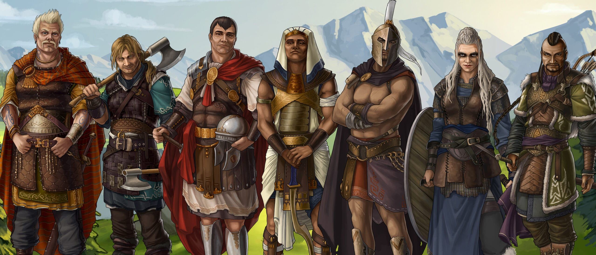
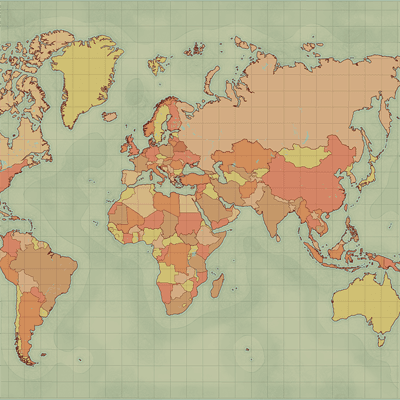
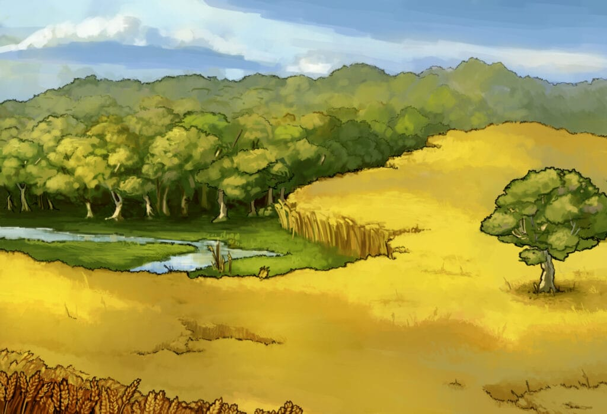
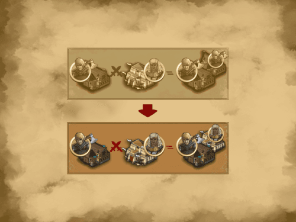
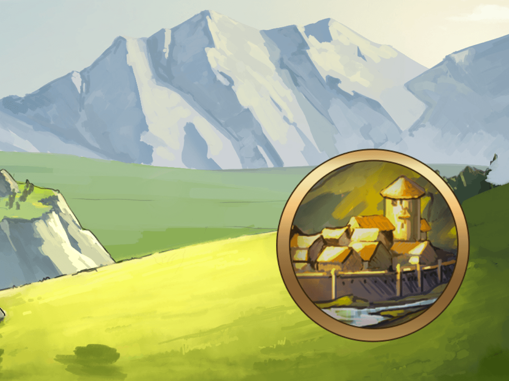
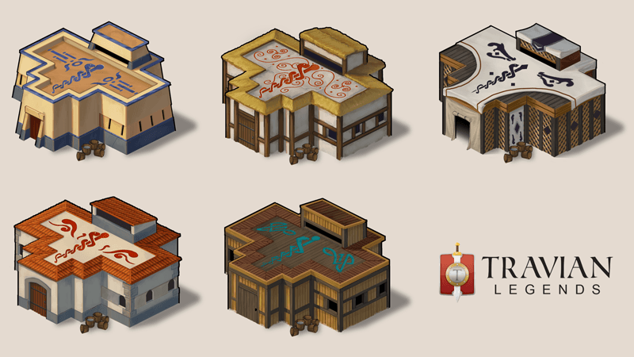
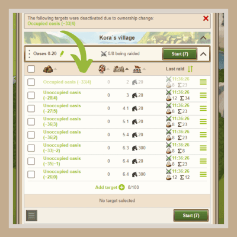

# Travian: Legends ~ 6 years of changes at a glance!

> Source: Unofficial Travian  
> URL: https://unofficialtravian.com/2025/01/08/travian-legends-6-years-of-changes-at-a-glance/  
> Written on May 18, 2023

---

Greetings, Warriors!

It’s not unusual that our players come back to the game after a three or four-year gap and enjoy playing this captivating game, which will soon celebrate its 20th birthday! And we are very happy to see you here.

Specially for those returning players, we collected information about the most important changes from the past years to help you dive straight into the action!

**So, what are the most interesting and exciting new features that have been introduced in the game?**

## **General changes**

#### **Seven tribes**

In 2017 the **Huns** and **Egyptians**, and in 2022 the **Spartans** joined the fight for the Travian legacy! Finally, in 2024 the **Vikings** also decided not to stay aside and invaded the lands of Travian on their mighty dragon ships!

The 3 “original” tribes – the **Gauls, Romans**, and **Teutons** – are still present in the game, of course.

You can refresh your memory and find out new information about those tribes in this dedicated [**Knowledgebase article**](https://support.travian.com/en/support/solutions/articles/7000061162-the-tribes-and-their-advantages) and in our previous guides:

| Tribes | | Read more… |
| --- | --- | --- |
| Gauls |  | [5 things to consider about Gauls](https://unofficialtravian.com/2025/01/09/5-things-to-consider-about-gauls/) |
| Teutons |  | [5 things to consider about Teutons](https://unofficialtravian.com/2025/01/09/5-things-to-consider-about-teutons/) |
| Romans |  | [5 things to consider about Romans](https://unofficialtravian.com/2025/01/08/5-things-to-consider-about-romans/) |
| Egyptians |  | [5 things to consider about Egyptians](https://unofficialtravian.com/2025/01/08/5-things-to-consider-about-egyptians/) |
| Spartans |  | [5 things to consider about Spartans](https://unofficialtravian.com/2025/01/08/5-things-to-consider-about-spartans/) |
| Huns |  | [5 things to consider about Huns](https://unofficialtravian.com/2025/01/08/5-things-to-consider-about-huns/) |
| Vikings |  | [5 things to consider about Vikings](https://unofficialtravian.com/2025/01/09/5-things-to-consider-about-vikings/) |

#### **Regions**

Most game worlds are now organized into five regions: **America, Asia, Arabics**, and **Europe** with three tribes (Romans, Teutons, and Gauls) and the **international** region with five tribes (Romans, Teutons, Gauls, Huns, and Egyptians) as default settings.

There is also a variety of special game worlds (New Year’s Special, Annual Special, Community Week etc.) where the usual features are combined with some unique extras (e.g. the Spartans tribe).

All regions have all interface languages enabled, so you can play in your local language anywhere you wish.

#### **Local game worlds**

If you don’t feel comfortable in the international setting and prefer to get in touch with your local community, there are various**local game worlds launched throughout the year**. What makes them special is that at the end of each local game world players receive a unique participation medal.

#### **Rounds became shorter**

In 2021, there was another important change that made the game more dynamic: Game rounds became shorter! The maximum length of the round even for x1 speed is rarely longer than 200 days and can’t exceed 250 (compared to 350 before). More information about current timelines based on speed can be found in our [**Knowledgebase**](https://support.travian.com/en/support/solutions/articles/7000068688-game-versions-and-speed).

## **Gameplay changes**

#### **Fixed rewards in the first ten adventures, daily quests, and a new task system**

The element of randomness was lowered to make the early game fairer. Every player will always get a horse in the first adventure, and all players will have the same daily reward rotation. You can read more information about this here:

- [**Adventures**](https://support.travian.com/en/support/solutions/articles/7000060172-adventures)
- [**Daily quests**](https://support.travian.com/en/support/solutions/articles/7000061163-daily-quests)
- [**Task system**](https://support.travian.com/en/support/solutions/articles/7000060702-task-system)

#### **Oasis farming**

One of the most important changes in the game that happened within the last two years and which has affected the gameplay a lot is the introduction of oasis farming and granting rewards for killing nature units.

Please read the [Early game oasis farming ~ Feature description](https://unofficialtravian.com/2025/01/12/early-game-oasis-farming-feature-description/) and these [Oasis farming Tips and tricks](https://unofficialtravian.com/2025/01/12/oasis-farming-tips-and-tricks/)

#### **Separation of PvP vs PvE**

The top ten attacker ranking is now split into two rankings:

- PvE (player versus environment) of the week: earned during offensive battles against unoccupied oases and Natars.
- PvP (player versus player) of the week: everything else

#### **“Keep tribe on conquest” feature (only on special game worlds)**

The “keep tribe on conquest” feature allows you to play with all of the tribes within one account and use the benefits of each tribe without suffering too much from their downsides.

A detailed description of how it works can be found here: [Keep tribe on conquer feature Tips and Tricks](https://unofficialtravian.com/2025/01/12/keep-tribe-on-conquer-feature-tips-and-tricks/)

In 2023, it also became possible to **select a second village tribe** when you send your settlers. This is a separate, yet linked feature that currently is available only on special game worlds.

#### **Other special features (only on special game worlds)**

The game provides more variety in terms of strategies and tactics. The most prominent special features that sometimes appear on special game worlds are [Game Secrets ~ Advanced Start](https://unofficialtravian.com/2025/01/12/game-secrets-advanced-start/)– possibility to start a game world with already three half-developed villages.

[Game Secrets – Harbors and Ships](https://unofficialtravian.com/2025/01/12/game-secrets-harbors-and-ships/) on an **ancient Europe** map – your chance to go on maritime adventures in the familiar setting of Travian: Legends. In 2024, the first World Wonders were added to the European map. Building a World Wonder in Hibernia while fighting for artifacts in Massalia? With the new setting, everything is possible.

#### **New tribe balancing****(only on special game worlds)**

In 2023, new special game world series – **Community Week** game worlds – were added in addition to [**Annual Spec**](https://blog.travian.com/category/annual-special/)**i**[**al**](https://blog.travian.com/category/annual-special/) and **New Year’s Special** versions. Only on these game worlds do players have the option to play with rebalanced tribes. **The Romans, Gauls, and Teutons received new unit parameters**, which were based on community suggestions and voting. Paladins as a farming unit? A Legionnaire-Caesaris hammer? On Community Week game worlds, these make total sense!

#### **Settling the second village the fastest and developing strategies**

Due to the changes in the task system and the introduction of oasis farming, players adjusted strategies regarding how to settle a second village fast and develop in the early game.

- [[GUIDES] Fast second village](https://unofficialtravian.com/2025/01/13/guides-fast-second-village/)
- [Developing your first villages](https://unofficialtravian.com/2025/01/09/developing-your-first-villages/)

## **New in-game tools and buildings**

The last five years brought us new in-game features and buildings that became part of regular gameplay on all game worlds. Let’s mention the most prominent changes:

#### **The Hospital**

The **Hospital** (for Spartans: the Asclepeion) allows you to treat wounded troops so they can once again become part of your army. This results in the quicker recovery of losses after significant battles. Read here to find out how the “wounded” mechanic works: [**Hospital and Asclepeion.**](https://support.travian.com/en/support/solutions/articles/7000065344-hospital-and-asclepeion)

#### **Wave builder**

A new in-game option allows you to send waves of attacks with the in-built [**wave builder**](https://support.travian.com/en/support/solutions/articles/7000068598-wave-builder). The feature costs 50 Gold per village and allows you to set up to eight waves and send them with one click!

#### **Training queue**

The new “Training” tab in the village overview shows queue lengths for all buildings, including the Hospital, Great Barracks, and Great Stables. This tab is next to the “Hospital” tab in the “Troops” category.

#### **Overhauled farm lists**

Farm lists have been completely overhauled and now provide more information about your farming. Average farm income, total farm per day, possibility to copy target to multiple farm lists, automatic deactivation of the targets that changed owner, and much more. You can see a full description here: overhauled farm lists.

#### **Abandoned farm lists**

If your village has been destroyed, you will still have the option to reactivate farm lists from this village in another one.

#### **Scout farm lists**

It’s now possible to make scout farm lists that send scouts on spy operations.

#### **“Start all” button for farm lists**

Possibility to launch all farm lists using just one button!

**In-game travel time simulator**A new tool has been added to the Rally Point. A **travel time simulator** that helps to calculate travel time between villages without the need to use external tools.

#### **Visibility of village list attacks (Travian Plus feature)**

Attacks marked with a green dot ???? in the Rally Point are no longer shown as red swords in the village list.

#### **Reworked trade routes**

**Trade routes** received a **full rework** and are now more convenient.

#### **New refer-a-friend system**

The maximum reward for inviting players is increased and now amounts to up to 2,000 Gold! You receive Gold for the in-game progress that your invited players make. More information about the new refer-a-friend system is here: **refer-a-friend system.**

**Lobby account**

**The lobby account is your central hub for everything you do in Travian: Legends.**Now you can rule all your avatars from one place. More explanation how it works here:**[Lobby account in Travian: Legends](https://support.travian.com/en/support/solutions/articles/7000087903-lobby-account-and-avatar).**

**New respawn system**

When you start a new round, you may find your initial spot is not as great as you expected. Or maybe you made a mistake when selecting the tribe or the quarter of the map. You want to restart the game. You can abandon that avatar and create a new one in another place easily, automatically, within the same lobby account, using the respawn avatar feature. More information is here: **[Respawn feature – how it works](https://support.travian.com/en/support/solutions/articles/7000061167-abandoning-your-avatar-and-respawning)**.

