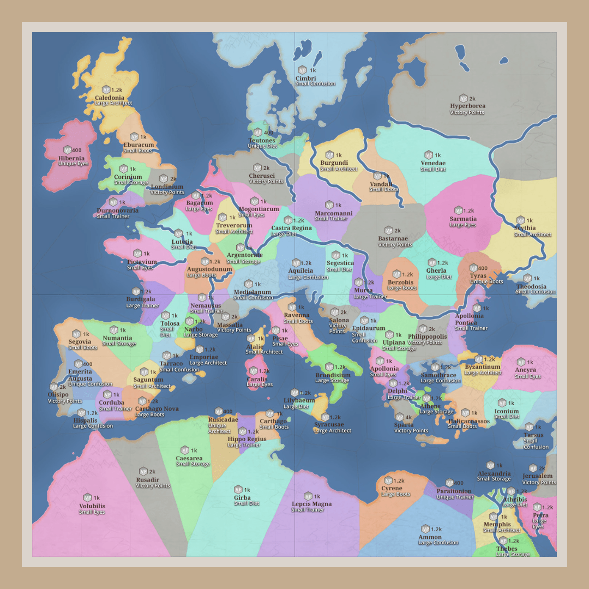
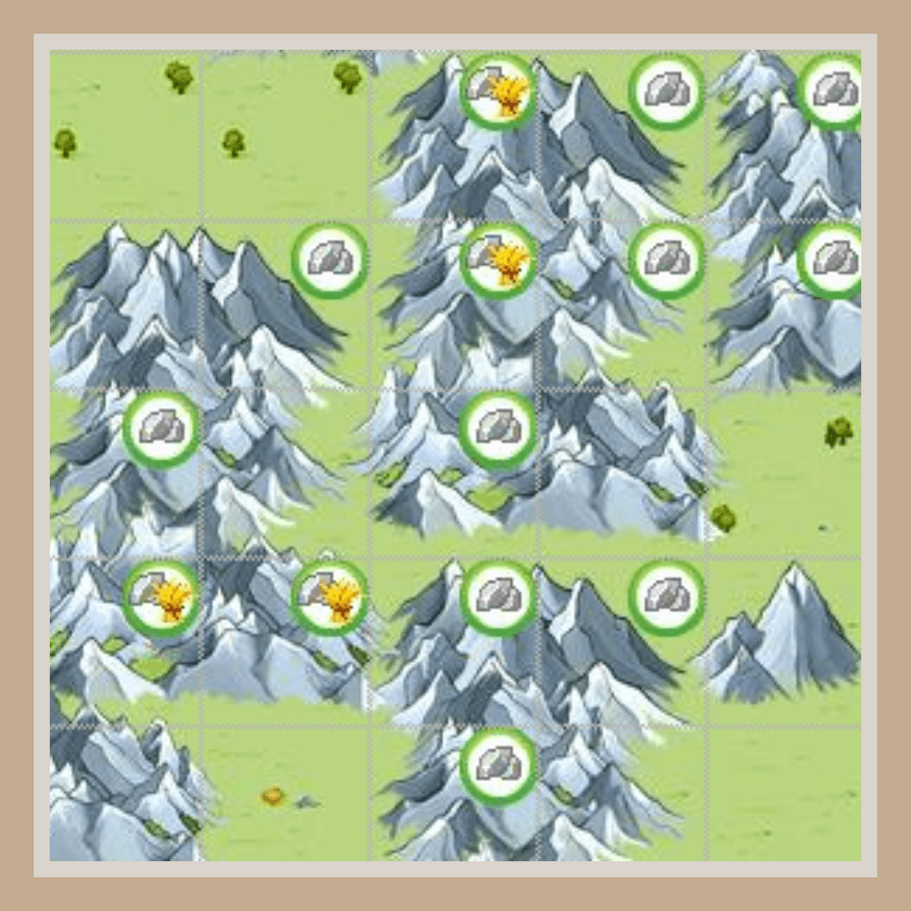
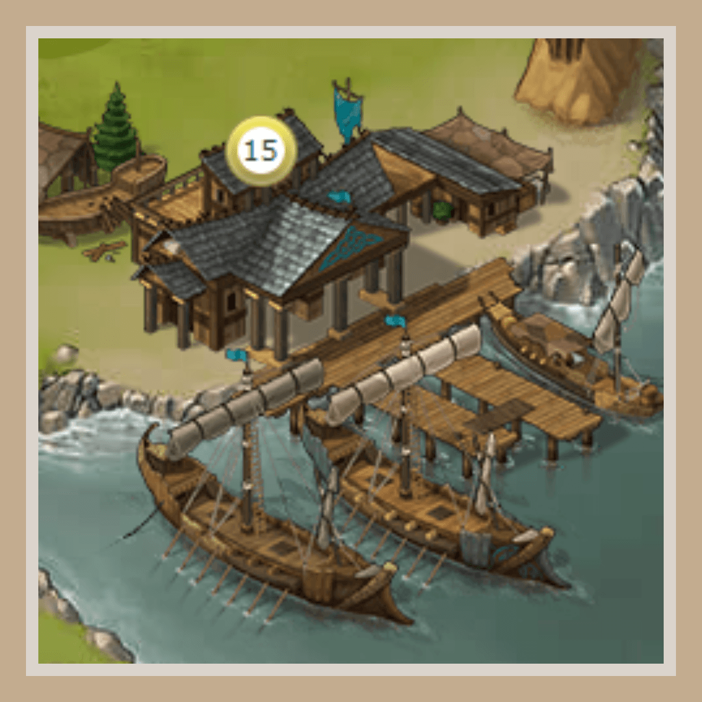
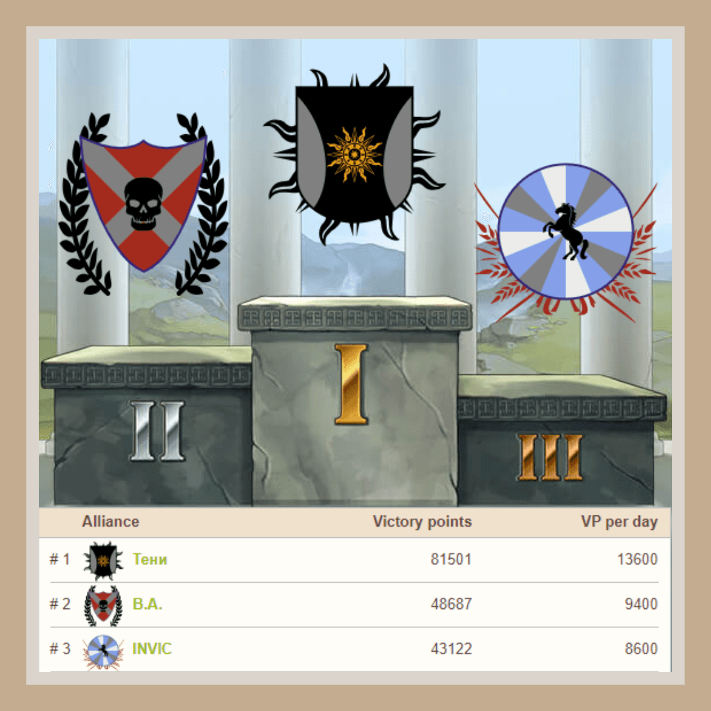
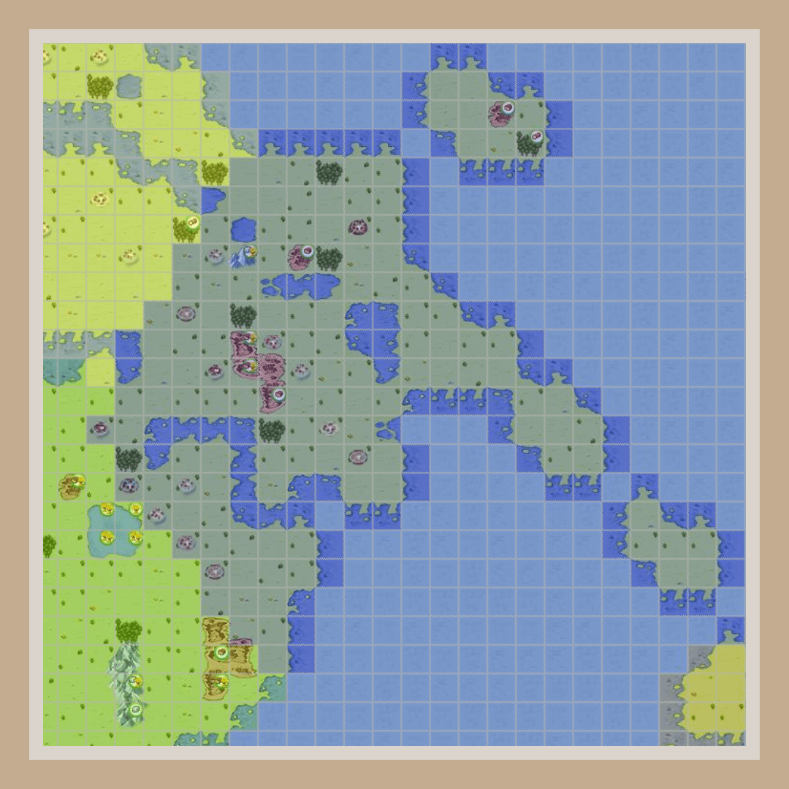
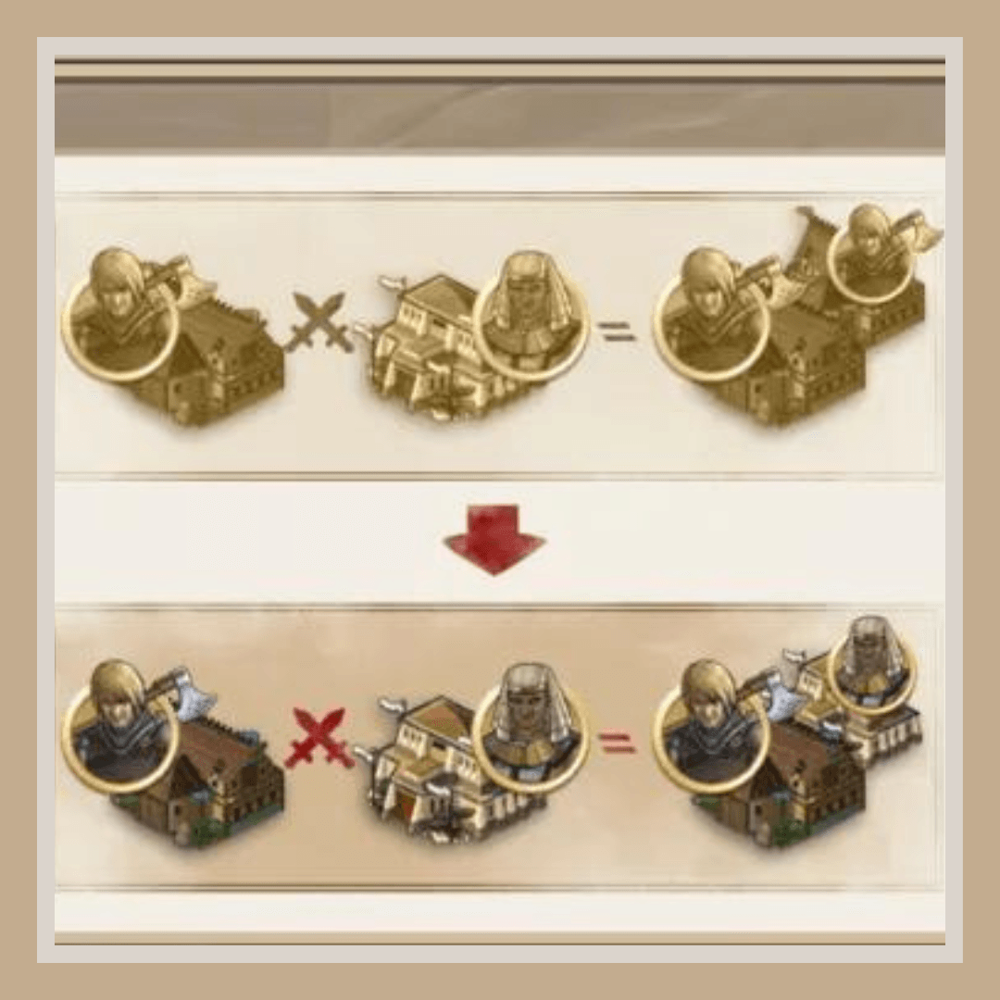
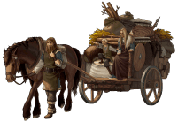
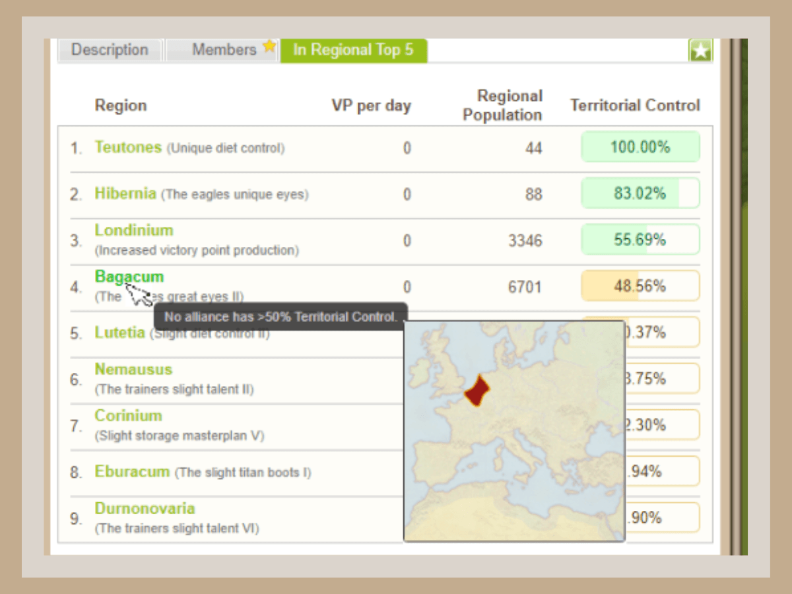

# Travian: Shores of War ~ Guide on your marine adventure!

> Source: Unofficial Travian  
> URL: https://unofficialtravian.com/2025/01/12/travian-shores-of-war-guide-on-your-marine-adventure/  
> Written on August 24, 2023

---

*This guide is an updated one from the previous years and aims to help solo players and alliance leaders new to the Annual Special setup enjoy the **Travian: Shores of War** scenario and get a better vision of the gameplay**.*

##### What are the main focus points players need to know about **⚓**Travian: Shores of War**⚓**?

#### **MAP**

One of the main features of the Annual Special is****the European map****. The map follows the actual shape of the ancient world, centered on the Roman Empire, and goes further to distant provinces stretching between Hibernia to the North and Africa continent to the South.

Therefore, unlike the classic map, this one contains huge water masses of the Mediterranean and Atlantic and vast mountain chains filled with iron and iron-crop oases. All in all, this setup brings new challenges and opportunities to the gameplay.

There is another big difference that is present only in the Shores of War. The map here is flat. That means, you cannot travel over the edge, and coordinates like (200|1) is no longer next door to (-200|1) like it is in classic scenario. In fact, they are on the opposite sides of the map!

*Pro-tip: If your strategy highly depends on an **early oasis farm**, follow real-world mountain chains: The Alps, Carpathian Mountains, or the Pyrenees to find a good spot for your early villages. If you mainly**focus on your production**, the plain areas will attract fewer farmers, and therefore the early game pressure might not be that intense.*

*Useful tips and tricks on oasis farm you can find in*[Oasis farming Tips and tricks](https://unofficialtravian.com/2025/01/12/oasis-farming-tips-and-tricks/)

#### **HARBORS**

Another new feature players need to pay attention to are **harbors**. Harbors, especially strategically located, make a huge difference in the pace of actions and in general bring more activity to the gameworld. While the flat map makes general distances a big higher, ships and harbors shorten the travel times. In our **previous guide**we already gave recommendations to the harbors specialization that we believe would be most useful in the game.  Please, remember, the game specialization is not set in stone, though. You can always rework it at a later stage.

*Pro-tip: Early game it makes sense to build “universal” harbor, building all 3 types of ships. 2-3 warships for fast forwarding reinforcements, 10-20 decoy ships for some tasty oasis farming with your hero, and 10-20 trade ships to increase your transporting capacity. Make sure to send your ships on the way when there is the risk the building might get destroyed – losing a harbor building will result in losing your ships also. But! Only those that are home, not on the way. Make sure to rebuild harbor at least to level 1 before they return and you can use them again! More information about ships you can find*[Game Secrets – Harbors and Ships](https://unofficialtravian.com/2025/01/12/game-secrets-harbors-and-ships/)*.*

#### **WINNING STRATEGY**

From the **Shores of War feature set** you will know that this version of the game doesn’t have World Wonders. Also, the**Artefacts (called Ancient Powers) are available from the start** and attached to the regions. Every member who has a Treasury of sufficient level (10 for village scope and 20 for account-scope effect) can activate the power under their alliance control in any of their villages.

**To win the game with your alliance, you need to gather as many victory points as possible.** You can do this in two ways:

- Get control over multiple regions by settling, conquering, and developing your settlements there until your alliance gets over 50% of the total regional population among the top-5 alliances of that region. This would provide all your alliance members with Ancient Powers and generate Victory Points in their settlements (villages and cities).
- Conquer and destroy rival settlements, bringing points to your alliance and subtracting them from your foes.

*Pro-tip: There is no need to choose between those two paths. Any successful alliance will have to explore and use both options and watch any opponents’ movements closely to act quickly.*

#### **GAME START**

Unlike the classic scenario, [**only a few regions in each quadrant**](https://blog.travian.com/2023/07/travian-shores-of-war-map-and-spawn-order/) are unlocked for settling and spawning at the beginning. The regions are settled one by one, meaning that first every spawning slot of previous needs to get filled before settling goes further.

Based on your alliance strategy, you can start as soon as the gameworld opens or wait for a few hours until other regions (closer to the ones you want to get control of first) become available. Organized alliances usually send so-called “scouts” (players that spawn early to monitor spawning situations) and give a go for the others when the spawn area reaches the regions they chose.

Both early and late starts have their pros and cons. If you start early, you will get the needed culture points and infrastructure half a day before those who spawned 12 hours later. However, those who begin later directly in the focused regions can use spawn village population to help get regions for their alliance and might be closer to the good croppers due to shorter walking distance for their settlers.

Since the whole map is not available for settling at once and might take days until the last region is unlocked, getting culture points early is not as crucial for that scenario as it is in classic gameworlds. It’s also not unusual to prioritize alliance settling in the needed region over settling a cropper. So you might as well settle your future capital as a third or fourth village.

*Pro-tip: If you haven’t found an alliance before the game round and want to increase your chances to get accepted into a good one, consider spawning and settling your other villages in one of the valuable early game regions with village-scope powers: small boots, eyes, storage. The recruiters of big alliances might notice you and invite you to the alliance to get control over the region.*

#### **DIVERSITY**

Another thing worth mentioning is that the Annual Special gameworlds are all about diversity. So even though huge hammers are still valuable to pull the rival defense out of possible targets or breakthrough good stationary, a range of mid-sized armies spread over different regions might give a more significant advantage.

In the Annual Special, you [**keep tribe on conquering**](https://blog.travian.com/2023/04/keep-tribe-on-conquer-feature-tips-and-tricks/), and therefore you may have troops of different tribes on one account. Huns and Roman hammer, both supported by the Teuton brewery? *Easy.* Are druid-riders and Reshape Chariots getting a speed bonus from the Hun hero? Not unusual. The so-called hybrid account that trains one mid-sized hammer and the rest of the villages focus on massive defense production? Highly recommended for any defense account.

*Pro-tip: In Travian: Shores of War you can pick the tribe of your second village for your very first settlement and enjoy having 2 different tribes right after the start.*

- *This only works for the first successful settlement from your spawn village.*
- *If the settling fails (due to other settlers being faster), you can still select the tribe.*
- *If the settlement was successful, but later the settled village got destroyed, the feature is not re-enabled.*

#### **GOAL**

Ok, the chaos of the first days is gone, the alliance has spawned, and the first croppers are secured. So, what’s next? **Time to look around, define possible allies and threats, and adjust/set your alliance goals**.

Of course, we all play Travian: Legends to have fun. However, practice says that a clear and definite in-game goal is essential for an organized group. Only with a clear vision of what you as a group want to achieve by the end of game round can you be sure that most of your players will have fun from the first day to the last day of the gameworld. Some alliance members might stick to your group, and some may even become your loyal core members for multiple further rounds in the future.

**Your goal doesn’t necessarily need to be major.** The most important thing is that it should be challenging and achievable and fit your members’ alliance size and ambitions/capabilities.

- A good goal for an entire pre-made alliance would be to play for the victory. You can increase your challenge by agreeing on playing without signing any non-aggression pacts or confederacies.
- If you only start your road to victory and your alliance was only newly created, a good goal would be to build up the core of players for further rounds, to conquer and keep certain number of regions, secure full set of powers, get a top-1 position in attack/defense or any other achievable goal that would bring sense to your actions and define your future strategy..

*Pro-tip: Overall, small boots regions (Eburacum, Segovia, Ravenna, Halicarnassos, Carthago, Vandali) are a good start region to fight for. If you are one of the newer alliances, avoid early game clashes for boots regions with high-ranked pre-made alliances and pick one with a minor presence. Other valuable artefacts worth fighting for are small eagles’ eyes to spot conquering and confusion and architect to prevent it**.*

#### **USEFUL LINKS**

- For further information about **Travian: Shores of War scenario** take a look**[here](https://blog.travian.com/2021/09/tides-of-conquest-useful-links/).**
- **Ancient Europe map** and region spawn order can be found **[here](https://blog.travian.com/2023/07/travian-shores-of-war-map-and-spawn-order/).**
- Detailed explanation **how players can** **unlock regions and use their power** you can find in our [**Knowledgebase**](https://support.travian.com/en/support/solutions/articles/7000060360-special-servers-regions-and-population).
- Useful hints on**how to settle second village fast**  you can find [**here.**](https://blog.travian.com/2022/12/guides-fast-2nd-second-village/)
- **Early game developmen**t guide can be found in this **[blog post](https://blog.travian.com/2023/04/developing-your-first-villages/).**
- Share your opinions and let us know what you think in our**[Discord](https://discord.gg/travianlegends).**

It’s time to go on a lifetime marine adventure in the Travian: Shores of War!