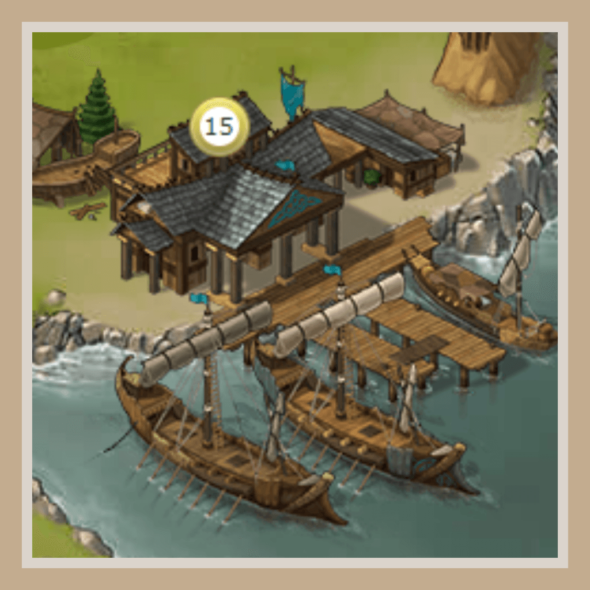
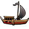

# Travian: Shores of War ~ Questions and Answers

> Source: Unofficial Travian  
> URL: https://unofficialtravian.com/2025/01/12/travian-shores-of-war-questions-and-answers/  
> Written on August 10, 2023

---

This guide will be a bit unusual and will answer some questions from the community about the Annual Special 2023 –**⚓Travian: Shores of war⚓**

During Ask-me-Anything session we answered to the questions from the community about Shores of War. Here are the answers sorted by categories.

| **????️****General questions????️** | |
| --- | --- |

**With ships coming into play, are there any plans to re-introduce bigger maps?** **We already have part of Africa, why not expand into America / Australia / Asia?**

Removing the big map was a conscious decision in order to force more conflict between alliances. There is less space to co-habitate on the small map. We have not yet considered adding other continents as the space, the regions currently available are enough. Adding more regions means adding more powers up for grabs and the community in general already thinks it’s easy to get all necessary powers.

**Will winners get medal on SoW like they did on GoS?**
YES! There will be a fancy new Shores of War medals for the winners

**What was your inspiration for the new Special? Why Ships?**
We want to shake up the game for annual special. Pathfinding and ships will challenge both on the offense and defence front.

**Is there a chance that deep water mechanics will be added to the classic servers with WW?**
We always look into how to adapt the current Annual Special features to the classic servers in our New Year Special. The current challenge is the lack of water on the classic map ????

**Can only port villages be transformed into a city?**
No, you don’t need a harbor to upgrade to a city. You need a townhall 20 ???? That’s much harder to get.

**Do you think that Harbor villages are must to have/overpowered for off** **(or any important) villages, as it gives one additional building to keep village not getting zeroed by enemy ops?**
They are strong, and they give a huge advantage, but I wouldn’t take it as a must have. They are a strong choice for def hubs or offense villages but other positions inland can also be strong, it all depends on your alliance’s strategy. Cities have 3 additional slots, and they happen to also get destroyed in ops

**Are there any features or mechanics that didn’t make it to the final version of SoW?**
We considered that for a huge hammer you’ll need a bunch of ships, but the picture of needing another ship, because you’ve added 1 club…

**Do you plan to continue the ship mechanics on future special servers?**
If the feedback is positive, we would of course keep the mechanics for future Annual Special. We only remove features that the community didn’t appreciate. We are rather confident that this Annual Special will be fun servers!

**How do you decide which suggestions from the players will be implemented after the first/beta round of SoW?**
We’ll probably run a feedback loop to gather feedback from all of you. This gives us some wide feedback, and we can see contradicting opinions very well. We can then address the problematic areas for the spring servers.

**What were the toughest and most important questions to answer when designing ships, so the game would feel balanced and still offer something new to the players?**

Will players adopt to the changes in terms of meta game, or will the pathfinding only enable very specialized OPs?

**How city with harbour will look like?**
Beautiful! Here is a picture ????

**Why only 900 keys were distributed for closed beta?**
We try to keep our closed beta focused on players, alliance leaders discovering the new features, asking questions and organizing themselves for September. But the big event for us is to see all of you joining the Annual Special in September!

**Will it be possible to have a 1-time selection of the hero tribe, considering we can choose the tribe when settling the 2nd village?**
Your hero is attached to your first tribe choice. We don’t plan on changing this as it would make any advantages for tribes available to anyone. Imagine if you can pick your first village tribe, your capital tribe, and your hero bonus. That is a bit much and we risk falling into the trap of everyone picking the same thing like everyone wanting an egyptian capital.

**I’m interested if the new diplomacy system will be implemented on normal servers with the fact that there would have to be a restriction for transfers between alliances**, **so that after leaving an alliance for example a 72h “cooldown” before a player can join another alliance to prevent abuse. Balance changes, if there are plans to change the current meta farming of the oases and if for example every tribe would be redesigned so the game wouldn’t be the same all the time and tribes would get a new “feel” so for example Roman would get some extra boost that would put it in the top ranks in terms of benefits to the tribe, hun extra nerf that would dethrone it again and so on.**

That’s a lot of questions! Changing the diplomacy server on classic servers is definitely a possibility. Having big confeds seems to be an overall issue on all types of servers. Regarding the tribes, we often have discussion based on player suggestions, feedback loops on what we should change. It’s difficult to consider big changes as it could really destabilize the game, however we are considering a few things and we are willing to have test rounds for those changes.

**Can you add more 150% 15c’s to the map?**
Balancing the croppers is a difficult thing to do. Adding more also means less fight worthy positions and making the game easier.

**Is a Roman rework still in consideration?** It was a requested suggestion from the community for this year’s annual special.
Yes, we are considering a few of the player suggestions for multiple tribes, not only Romans. However, those changes will not be the part of this Annual Special.

| **⛵Harbors and Ships⛵** | |
| --- | --- |

**Can you add an option for the hero taking a warship or a decoy warship for adventure when the hero is in harbor village?**

No, ships do not interact with hero adventures. Adventures are balanced for land travel, and we didn’t want to boost them.

**How do the ships get destroyed?**
If ALL your troops die, then the ship is destroyed. If there is anyone to bring home, then your ship will return.

**What will happen to the ships if the port is destroyed during the voyage (attack)?** Will the journey itself continue as planned (as with the destruction of the rally point), or will there be changes (as with the destruction of the brewery)?
While ships are traveling, they are not destroyed when the harbor is destroyed. If they return while the harbor is not yet rebuilt, they are destroyed then.

**What was the warship cost based on?** As we can’t use ships in farm lists, cost seems way too high
The use of ships should not be default – their speed power is very strong. So their costs are thought of as investment.

**The ship mechanics are available from level 10 of the Rally Point. Wouldn’t it be better to replace the Rally Point with a harbor?**
You will always require a Rally Point to send troops. Sending via ship is not the only option available to you in your village.

**Is the number of ships limited? Can we have an unlimited amount?**
There is a defined maximum number of ships in function of your harbor level. You can however chose how many merchant ships and warships you want to have in function of your needs.

**After reaching the max. number of ships can we dismiss trade ships to make more warships?**
Yes you can destroy ships if you change your mind on the ratio you currently have.

| **????****Pathfinding****????** | |
| --- | --- |

**Can you explain the new pathfinding system?**
First, for regular troop movements which are not supported by ships, nothing changes. When using ships, we’re using a A* pathfinding algorythm, which have some cost for water and other for land. The found path is a bit chunky, and we’ve added additional straightening to it and add some boarding time for the ship. This results in an alternate duration for the troop movement.

**Will there be more transparency regarding harbour distance calculations? With the current information it feels vague and arbitrary.**
We understand that there is no easy way for you to calculate the traveling time. Pathfinding tries to find the fastest travel for your troops to the destination of your choice. It will keep your troops on water as long as possible for you to benefit from the deep water travel speed. All deep water tiles are identfiable on the map. The algorithm is quite complex, and therefore it is hard for us to share but I can tell you that it’s a A* algorithm with additional smoothing of the path.

**We need better clarification regarding the pathfinding, movements don’t seem to match what has been explained in the blog articles on the beta.**
There is currently some issues in the pathfinding in the beta which we are working hard to fix.

**Does Tournament Square affect the speed of ship?**
No, the Tournament Square does not affect the speed of the ships.

**Third party tools have become redundant with ships. Do you have knowledge of tools that will be updated for SoW pathfinding and time calculations?**
No. To be transparent with you, we discussed it as we usually put effort in providing tools with information ahead of servers but the algorithm for pathfinding is complex to share. As we wrote before, it’s an A* algorithm with smoothing of the path and an additional onboarding time.
Right now, the feature is easier to use on solo action, or to cover for someone else who had issues sending their op, than actual op planning.

**Will rams and catapults travel at 30sq/hour if sent from an harbor attacking another harbor?**
If you send the catapults with a ship, then they will travel at sea travel speed as long as they are on the sea.

**Can any random events occur during the journey with ships and will we be at risk of losing units/resources?**
No, there will be no random events triggered during the sea travel. We rather put focus on less random mechanics to avoid disparities between players.

And that is a wrap! Sharpen your swords and string your bows, the fight is about to begin!
Your Travian: Legends Team