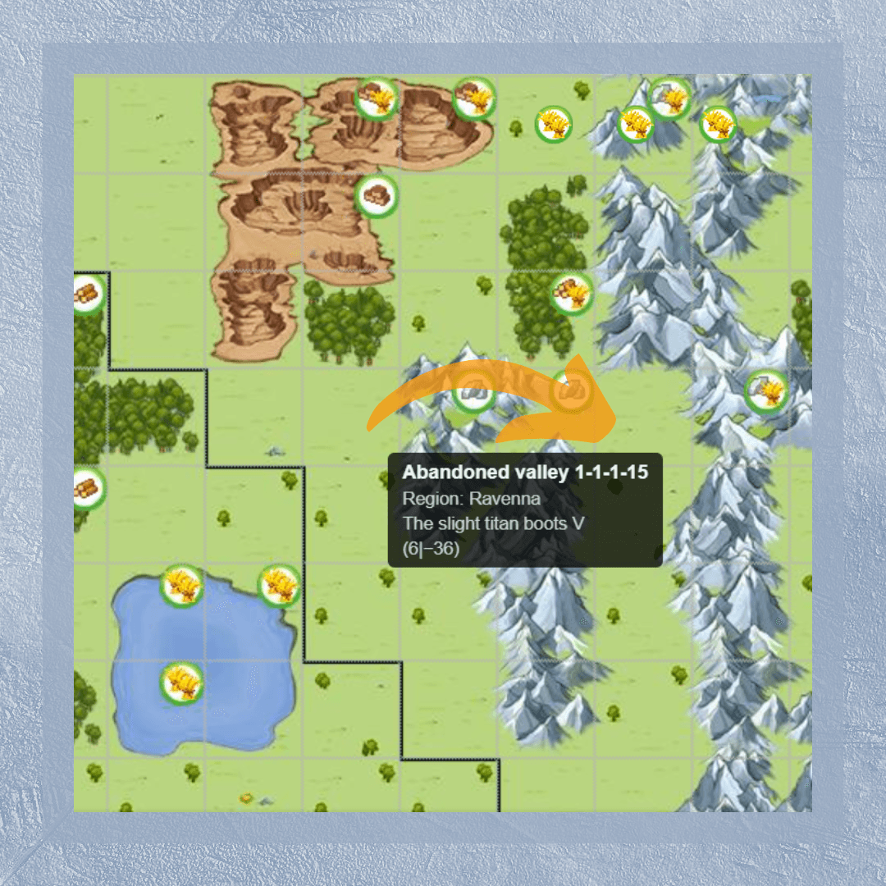

# Types of capitals and their development

> Source: Unofficial Travian  
> URL: https://unofficialtravian.com/2025/01/09/types-of-capitals-and-their-development/  
> Written on April 20, 2023

---

In the previous **[Thursday Guide](https://blog.travian.com/tag/thursday-guides/)** we talked about [**early game development**](https://blog.travian.com/2023/04/developing-your-first-villages/) and how to make things faster in an early game and have a flourishing account at a later time. Today we’ll talk about our capitals!

One of the main reasons of “Second village rush” stage is to settle your future capital before others take all valuable spots for themselves.  Players develop intricate strategies on how to gain needed resources to build Residence 10, train 3 settlers and gather enough culture points to be able to found second village as soon as possible. If you are new to the game or a returning player, visit our [**“Fast second village guides”**](https://blog.travian.com/2022/12/guides-fast-2nd-second-village/) section, pick the guide for your gameworld speed and follow it step by step. This in general will give better results than developing your first village without a clear plan.

##### **Settlers are ready, I have enough culture points and 750 of each resource! Where should I settle?**

In most cases a second village is meant to be your future capital, that’s why choosing the correct type is important.

If you are a member of an alliance, coordinate this with your alliance leaders who might have a settling strategy that you need to follow.

If you are playing alone, you can find a small overview of possible options in the table below:

**Note:** For cropper-search you can use a **[crop-finder](https://support.travian.com/en/support/solutions/articles/7000061582-crop-finder)** option which is a part of the gold club or just hover over the map and look at the field type in a tooltip.

##

| Future capital | Comments | |
| --- | --- | --- |
| **15-cropper with 125-150% oases** | Those type of croppers is quite rare in the game, that’s why there might be a big competition on them not only during settling, but also after.*For very active players willing to invest gold into faster development.* | |
| **15 croppers with 75%-100% oases** | There is a bigger variety of those croppers, that’s why less competition is expected in the early game. As any other 15-cropper, it requires quite some gold investment to NPC excessive crop into other resources. Croppers where at least 1 oasis is 50% are a bit more preferable since you would get boost to your crop production faster and won’t have to build expensive Hero mansion.*For active players, planning to train big armies at a later stage.* | |
| **15 croppers with 25-50% or no oases** | Not the best choice for the capital. If those are the only available 15-croppers that left, it’s better to look at other cropper types: 9-croppers and 7-croppers. | |
| **9 croppers 100-150%** | It’s a balanced option that might fit to various categories of users. It still produces other resources apart from crop and at the same time has option to give bigger crop numbers when armies become more demanding in terms of supplies.*For active players, that would still like to have good crop production, and at the same time not to use a lot of gold for exchanging crop to other resources via NPC-merchant.* | |
| **7-cropper 150%** | Those croppers cannot be found through crop finder, and still, it’s quite a common one and you can find some by just hovering over the map with needed oases.**Note:** 7-cropper +150 slightly better in production to 9-cropper +100 and 15-cropper +50 but it’s way more common, so you can find one nearby**Note:** Make sure those oases are not shared with other tiles that are bigger in cropfield numbers, or it might create a tension!*For all types of players.* | |

**Note:** You can always use resource development calculator from Kirilloid to calculate expected resource income and pick the best capital type that would fit you most: **[Resource calculator from Kirilloid](http://travian.kirilloid.ru/villages_res.php#s=1.46&pl=15&fl=10,10,10,10&fs=31).**

##### **So, how to develop my capital?**

In a nutshell, developing a capital is no different from developing any other village. **Economy comes first.**

Main building level 20 -> All resource fields to 8 -> 1 resource field of each type to lvl 10 -> build resource buildings (for 15-croppers only grain mill and a bakery, ignore sawmill, brickyard or iron mine) -> keep constructing fields above level 10 and adding needed Warehouses and Granaries. Do not forget to build Stonemason’s Lodge to increase durability of your buildings.

Use **cropper development calculator** created by our players-enthusiasts to see step by step instruction in which order you should upgrade your cropfields and resource buildings. Select your cropper-type, oases within reach and tribe (in case of Egyptian) then follow the order.

**You can find this tool here:** **[Cropper developer](https://blog.travian.com/wp-content/uploads/2024/10/Travian-Cropper-development-calculator.html).**

**If you plan to use your capital only as a resource base**, your buildings inside will mainly consist of Warehouses and Granaries for resource fields development (later can be replaced with Great Warehouses and Great Granaries if your alliance manages to conquer a special artefact, allowing its construction), Marketplace 20, Trade office 10-15, Academy 20 (it gives a lot of culture points, so it makes sense to have it in the village), Townhall min 10 for Great Celebrations.

**If you plan to use your capital also as a military base**, add there Barracks, Stables (Workshop – in case you develop attacking army), Smithy to upgrade your troops and make them stronger (you can demolish it once you upgrade all needed troops – the upgrades will stay), Hospital and a Tournament Square.

And this is a wrap by now. We will talk about how to develop **capitals with the game specialization** in one of the next articles in more detail.

Stay tuned! See you next Thursday!

10