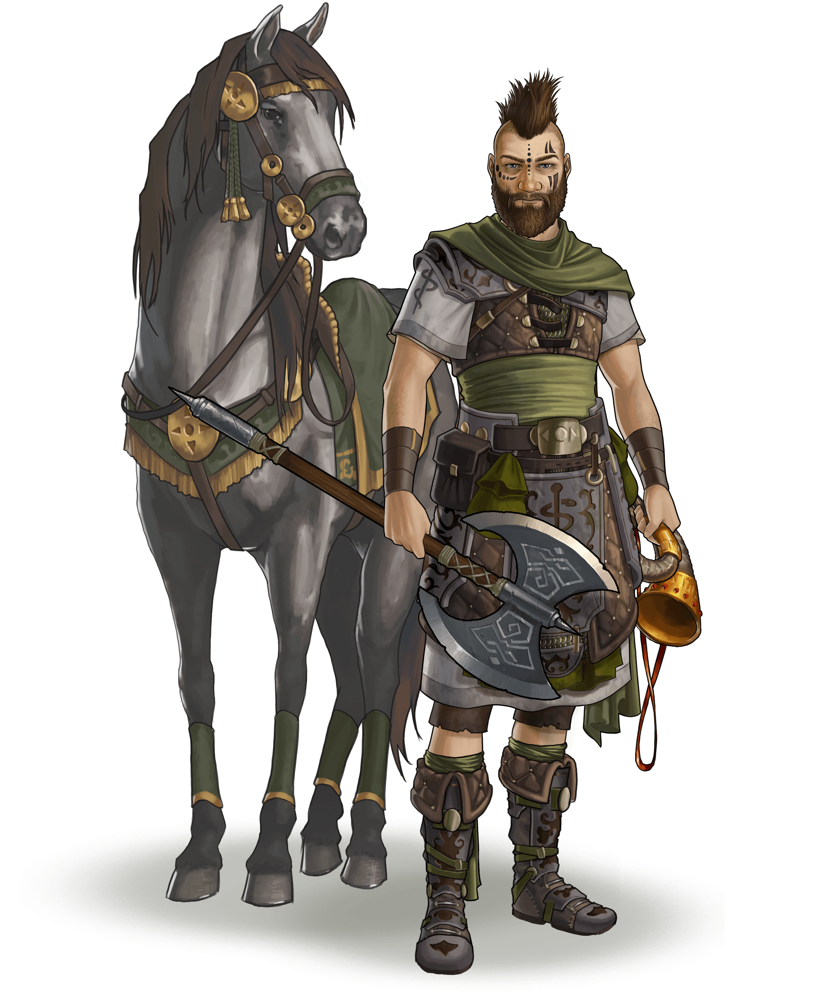

# Unleashing the Hero’s Potential (Beginner protection stage)

> Source: Unofficial Travian  
> URL: https://unofficialtravian.com/2025/01/09/unleashing-the-heros-potential-beginner-protection-stage/  
> Written on January 24, 2024

---

Welcome to the [**Game Secrets**](https://blog.travian.com/tag/thursday-guides/) series! Whether you’re a fresh face in the world of Travian: Legends, a returning player after a break, or a veteran player looking to refine your strategies, there’s one crucial aspect that can shape the destiny of your future Empire – the Hero.

You receive your hero right after registration. Hero becomes one of your main assistants from the very the first days of the game and till the end of the gameworld. In this guide we will focus on your very first steps in your hero.

***Hero development path is one of the first decisions you will have to make in the game. It’s also one of the key stones in the foundation of your future empire.***

##### **Hero points overview**

Each hero starts the game with 4 skill points, which are initially set to their resource production bonus. There are 4 special abilities that can be increased to level 100.

**Fighting strength (Early game skill):** Increases the attack and defense value of the hero.

**Resources (Early game skill):** Increases the production of resources by hero. The resources are added to the hero’s home village, regardless of where he currently is.

**Off bonus (Mid-late game skill):** Increases the attack value of the whole army by 0.2% per point (maximum of 20%). This bonus only applies if the hero is attacking with the army.

**Def bonus (Mid-late game skill):** Increases the defense value of your whole army (means all own troops defending – the village where they come from is unimportant) by 0.2% per point (maximum of 20%). This bonus only applies if the hero is defending with the army.

| Tribe | Hourly Resource Production (x1, multiplied by speed) | | | |
| --- | --- | --- | --- | --- |
| All tribes heroes except Egyptian | 9 resources each per point or 30 if you select one of them. | | | |
| Egyptian Hero | 12 resources each per point or 40 if you select one of them. | | | |
| **Note:** The 25% resource bonus applies also to the hero production. | | | | |

You gain 4 more skill points every time the hero XP increases the hero’s level. Early game, when beginner protection is still active, **village tasks and nature troops killings in unoccupied oases are the main sources of experience.**

##### **Resource Production vs. Oasis Raids**

**What skills to develop in the early game? That is the question a lot of new players still are looking for answer.**

**During the early game there are only 2 attributes that make sense to invest your first hero points: Resource production** or **Fighting Strength** of the hero. Offence and defense bonuses are more for the mid- and late- game since they require an army to really grant you considerable benefits.

In general, if you don’t have much experience in [**oases raids**](https://blog.travian.com/2023/05/oasis-farming-tips-and-tricks/), we recommend you use all your points at first for hero**resource production**. This path offers a more stable and reliable advantage, it doesn’t depend on oases location, nature troops in there, your online times and it doesn’t bring many risks.

Losing your hero early game is not the end of the world, but it’s a considerable setback to your strategy. So, always be careful to keep your hero alive during the whole beginner protection and [**second village race**](https://blog.travian.com/2023/04/developing-your-first-villages/).

Hero health losses in early adventures are quite predictable and risks are calculated easily. You will find the hero potential losses in first adventures in the table below. So, you only have to monitor that your hero has enough health to survive the next adventure and that’s it.

##### **Pro-tips:**

- When hero is on foot, it counts as infantry, mounted hero (displayed with a horse in your profile) counts as cavalry. It affects not only the speed of your hero but also its effectiveness against certain units in attack.
- First 10 adventures are same for every player in the game.
- The hero goes to their first adventure on foot and goes back to the village already mounted. You don’t need to equip a horse to the hero after.
- The hero gets full health back after each level up. You can monitor hero health and experience still needed for the next level by hovering over the cursor on the radial hero menu or on the attribute page of the hero.
- If you start the gameworld the first day, the daily quest reward for the 25 points is always 50 hero experience. Use those points to level up and recover hero health after adventures by levelling hero up. Same way you can use Task rewards from your first village. Later in the game village tasks are also a good way to level up the hero after big losses.
- **Starting from level 8 add one point to the hero strength to reduce health losses in adventures**. After you successfully settle your second village, you keep allocating hero points in resource production give or take till the end of the beginner protection. After that you can adjust your strategy regarding hero based on the current needs. We will talk about further hero development in our next Game Secrets guide.
- Resources that hero gets from the village quests, nature troops killings and adventures are added to the **hero inventory that you can reach by clicking on the hero portrait**. Do not save them for later at that point! Use them to upgrade the needed buildings. Always remember, that your primary goal during the beginner protection is settling second village and establishing [**your future capital**](https://blog.travian.com/2023/04/types-of-capitals-and-their-development/).

| **Hero health loss in first adventures****(with 0 points into fighting strength)** | | | **Rewards and next adventure** | |
| --- | --- | --- | --- | --- |
| № | “Normal” adventure | “Hard” adventure | **Reward** | **Appears****(hours after start)** |
| 1 | 1 – 3 | 3 – 4 | Horse | Available from start |
| 2 | 2 – 4 | 4 – 8 | Resources | Available from start |
| 3 | 2 – 7 | 7 – 12 | Troops | Available from start |
| 4 | 3 – 9 | 9 – 16 | Silver | 0 – 8 |
| 5 | 3 – 11 | 11 – 20 | Ointment | 8 – 16 |
| 6 | 4 – 14 | 14 – 24 | Book of Wisdom | 16 – 24 |
| 7 | 4 – 16 | 16 – 28 | Resources | 24 – 32 |
| 8 | 4 – 18 | 18 – 32 | Silver | 32 – 40 |
| 9 | 5 – 21 | 21 – 36 |  | 40 – 48 |
| 10 | 5 – 23 | 23 – 39 | Nothing | 48 – 56 |
| 11 | 6 – 26 | 26 – 43 | Reward unknown | 56 – 64 |
| 12 | 7 – 28 | 28 – 46 | Reward unknown | 64 – 72 |
| 13 | 7 – 30 | 30 – 48 | Reward unknown | 72 – 80 |
| 14 | 8 – 32 | 32 – 51 | Reward unknown | 80-88 |
| 15 | 8 – 34 | 34 – 54 | Reward unknown | 88+ |

*More detailed information about what items can be found in the first adventures etc. you will find in [**our previous guide**](https://blog.travian.com/2023/09/hero-and-adventures-in-the-early-game/).

Remember that the early game sets the tone for your entire gameplay experience. Efficient resource management, strategic settlement choices, and careful hero development will lay the groundwork for success as you progress through the stages of Travian: Legends.

And this is a wrap for now! Next week we will talk about hero items, mid and late game development and when it makes sense to start distributing points into offence and defence bonuses.

Share with us in Discord what you think about this article, get ready for the [**Thursday Tactician**](https://blog.travian.com/2023/09/thursday-tactician-contest-galore/) and come back next Wednesday for the next guide in the [**Game Secrets**](https://blog.travian.com/tag/thursday-guides/) series!