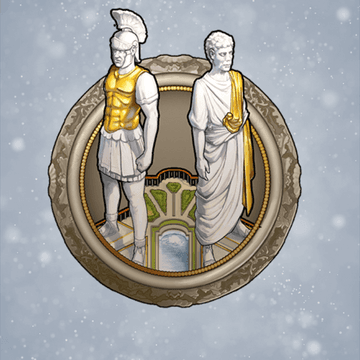
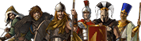
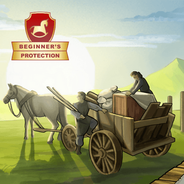
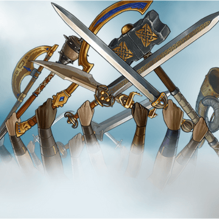
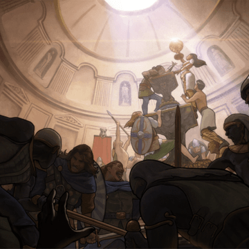

# What is Travian: Legends?

> Source: Unofficial Travian  
> URL: https://unofficialtravian.com/2025/01/08/what-is-travian-legends/  
> Written on February 23, 2023

---

**Disclaimer:** *With this article we open a series of guides, useful tips, feature explanations and other game-related topics that we plan to publish every Thursday in our Blog. These **Thursday Guides** are aimed to give a better experience to both our new and veteran users. And we would like to start with the post that will be helpful to complete newcomers so that they can better understand what the game Travian: Legends is about.*

#### ***Welcome to Travian: Legends!***

Travian: Legends is a free browser Build & Raid game. Players begin with a small, underwhelming village in an **Ancient Europe** setting and gradually develop it into a thriving community with immense armies thanks to intelligent economic, diplomatic, aggressive, and strategic decisions made throughout a single game world. The choices you make will have game-changing effects on your game world, both for you and other players!

To win, you must build a level 100 [**Wonder of the World**](https://support.travian.com/en/support/solutions/articles/7000067152-world-wonder). This *sounds* straightforward, but getting you to that glorious endgame and claiming victory is a different matter, so let’s bring you up to speed.

#### **YOUR CHOICES MATTER**

We weren’t joking when we said that your choices will have game-changing effects, and your first one is decided during your registration.

In Travian: Legends, you can play one of  [**six tribes**](https://support.travian.com/en/support/solutions/articles/7000061162), each with their own unique characteristics and preferable playstyle.

Do you favour a more aggressive playstyle? Then the **Huns** or **Teutons** are the best choices here. For all you defensive players out there, **Egyptians** and **Gauls** are more suited for you. And all-rounder Romans are ideal for players who do not seek immediate results but like the play until the end. Mid and endgame are where the **Romans** shine. The **Spartans** are having one of the best units in terms of power vs crop consumption, which is important for mid and late game.

#### **PLAYED IN ROUNDS**

Speaking of endgame, you need to know that Travian: Legends is played in rounds. This means that at some point, your game world will come to an end, and winners will be announced. Don’t worry, though! After the winners are declared, a new game world will begin. Players will re-register and take their first steps all over again—this time perhaps with a different strategy, tribe, or even a different server speed, allowing you to make your first strategic steps even faster!

#### **FIRST STEPS**

So, you’ve registered and found out that you are a small village leader surrounded by similar villages of other players. Now it’s time for you to put the first stones into the foundation of your future Mighty Empire! What will you prioritize? How will you play?

#### **EXPAND YOUR EMPIRE**

In your first few days of playing, you’ll be given [**beginner’s protection**](https://support.travian.com/en/support/solutions/articles/7000060689-beginner-s-protection).  This means that players will not be able to attack your village or steal your resources. Be sure to **use this time efficiently** and focus on economic development, settling your **[second village](https://unofficialtravian.com/2025/01/guides-fast-second-village/)**, adding a third, fourth and fifth, gradually developing into a flourishing community. Every village must need some form of protection, right?

As a wise ruler of a future empire, you’ll need to balance your **economic development and army**. If you focus too much on your economy, you might not be able to protect your valuable resources and citizens. Moreover, training your army too early and wasting resources on your troop upkeep will heavily put you back in economic development, making you unable to keep up with other players. You will need to make strategic decisions for the future expansion of your empire.

#### **HOW WILL YOU PLAY?**

Eventually, your [**beginner’s protection**](https://support.travian.com/en/support/solutions/articles/7000060689-beginner-s-protection) will expire, and you will need to make yet another strategic decision: **how to protect your resources from the raiders** and, at the same time, keep your successful economic development flowing. Will you build crannies and hide resources from raiders? Train a defensive army and make stealing from you unprofitable? Create an offensive army and cast fear into your neighbour’s hearts? Or perhaps you might **seek an alliance** and get the upper hand on the battlefield… *The choice is yours!*

#### **ALLIANCES AWAIT**

Remember, Travian: Legends is a game with a powerful social component. Soon, your neighbors will pay close attention to you and might even try to attack! So, **joining an alliance and uniting forces with other players might be the tactic you choose**. To do this, you will first need an Embassy, and it’s here that you can look for alliances with villages nearby that will support your growing empire.

For you master diplomatic managers out there, you’ll know that not all alliances are strong enough, nor will they exist for long. Just like in real life, many alliances are formed and broken quite easily. **Suppose you are active and keep developing your villages, protecting them from raids. In that case, recruiters from much stronger alliances will likely contact you.** Or, you can contact them first, make a name for yourself, and create a networked community, crushing anyone who stands before you and your allies.

#### **COOPERATION IS KEY**

Having an [**alliance**](https://support.travian.com/en/support/solutions/articles/7000060449-creating-joining-and-leaving-an-alliance) will offer you another level of the game experience, and one which is the **key to victory**. Only the best alliances fight for supremacy in the Travian: Legends world, conquering [**artefacts**](https://support.travian.com/en/support/solutions/articles/7000060687-artefacts) that give players special abilities. Players will also build the [**World Wonders**](https://support.travian.com/en/support/solutions/articles/7000067152-world-wonder), magnificent buildings that define who will be the world’s new ruler. With the final brick put on the World Wonder level 100, the game round ends, and winners are announced.

This ultimate task requires extreme cooperation, which creates real friendships, bonding you to others. It’s this feature that drives players to return to play game round after game round, year after year. This is true not only to the alliances formed but to the community as a whole. Should you want to experience even more features and content, however, Travian: Legends holds various exciting **[Tournaments](https://support.travian.com/en/support/solutions/articles/7000093211-travian-tournament-game-worlds-setup)** and **[Special gameworlds](https://support.travian.com/en/support/search/solutions?term=special+servers)**, too.

We hope this article has explained a little more about what Travian: Legends is. If you’re ready to step up and accept the challenge, be sure to register your account! Join our[**Official Discord server**](https://discord.gg/travianlegends) and [Unofficial Travian Discord Server](https://discord.gg/4PjjYpaAam) to be kept up to date with information, exciting events, and more.

**With all that said, be calculated, be cunning, but most of all, have fun.**

See you on the battlefield!