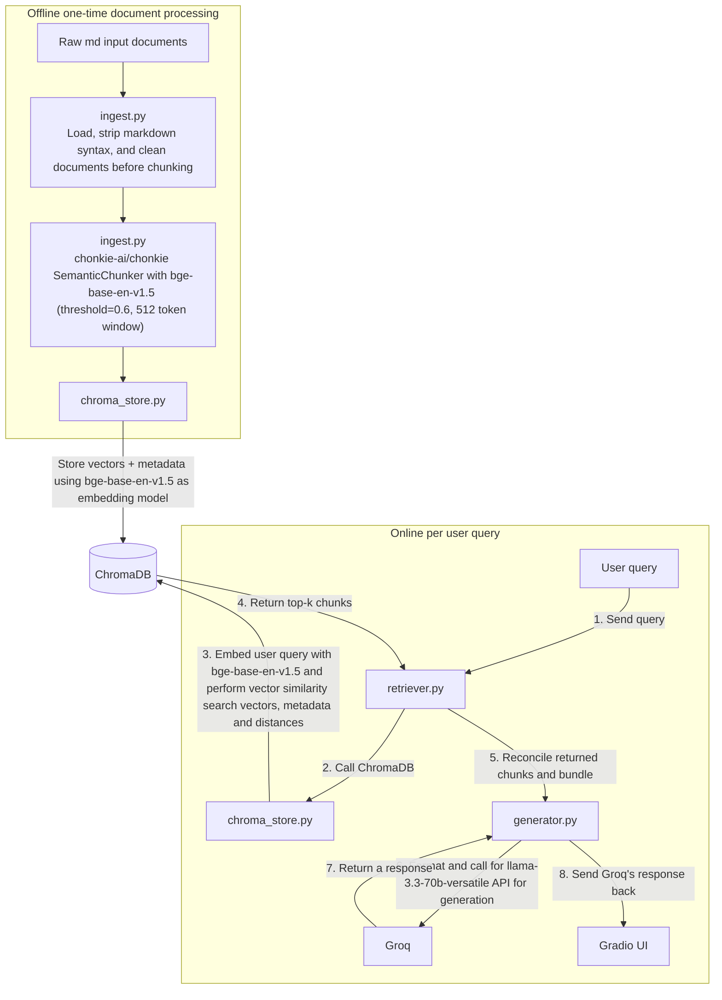

# Project 1 Planning: The Unofficial Guide

> Write this document before you write any pipeline code.
> Your spec and architecture diagram are what you'll use to direct AI tools (Claude, Copilot, etc.) to generate your implementation — the more specific they are, the more useful the generated code will be.
> Update the Retrieval Approach and Chunking Strategy sections if you change your approach during implementation.
> Update this file before starting any stretch features.

---

## Domain

<!-- What domain did you choose? Why is this knowledge valuable and hard to find through official channels? -->
Travian is a classic, browser-based massively multiplayer online real-time strategy (MMORTS) game originally released in 2004. The game has gone through several iterations and updates and have released over 4 versions and is still evolving on a regular basis. The game features several tribes, specializing in different strategic placements and combat abilities. The ever evolving nature has left the game with less up-to-date documents, combined with the deletion of official documents, the information becomes more difficult for players to find through just official channels.

---

## Documents

<!-- List your specific sources: URLs, subreddit names, forum threads, or file descriptions.
     Aim for at least 10 sources that together cover different subtopics or perspectives within your domain. -->

| # | Source | Description | URL or location |
|---|--------|-------------|-----------------|
| 1 | Official: The Tribes and Their Advantages | Tribes comparison before beginning the game | https://support.travian.com/en/articles/3-the-tribes-and-their-advantages |
| 2 | Official: Interacting with Other Players | Basic interaction with other players | https://support.travian.com/en/articles/11-interacting-with-other-players |
| 3 | Official: Beginner's Protection | Protection at the start of the server | https://support.travian.com/en/articles/12-beginner-s-protection |
| 4 | Official: Troop Upgrades and Smithy | Troop upgrades information | https://support.travian.com/en/articles/40-troop-upgrades-and-smithy |
| 5 | Official: Culture Points (CP) | Village expansion system and how to grow | https://support.travian.com/en/articles/51-culture-points-cp |
| 6 | Unofficial: Combat Basics (written by kirilloid) | Combat system formula | https://unofficialtravian.com/2025/01/game-secrets-combat-basics-written-by-kirilloid/ |
| 7 | Unofficial: Sniping waves | Advanced gameplay technique against offenders | https://unofficialtravian.com/2025/01/game-secrets-sniping-waves/ |
| 8 | Unofficial: Your very first steps in the game | First steps guide for first timers | https://unofficialtravian.com/2025/01/game-secrets-your-very-first-steps-in-the-game/ |
| 9 | Unofficial: How to avoid getting farmed? | Top tricks to avoid survive early gameworld | https://unofficialtravian.com/2025/01/how-to-avoid-getting-farmed/ |
| 10 | Unofficial: Developing your first villages | Development guide for first timers | https://unofficialtravian.com/2025/01/developing-your-first-villages/ |
| 11-202 | Official guides | The rest of official gameplay guides | Refer to /scraped.md |
| 203-266 | Unofficial guides | The rest of unofficial gameplay guides | Refer to /scraped.md |

---

## Chunking Strategy

<!-- How will you split documents into chunks?
     State your chunk size (in tokens or characters), overlap size, and explain why those
     numbers fit the structure of your documents.
     A review-heavy corpus warrants different chunking than a long FAQ. -->

**Chunking strategy:** Semantic chunking using chonkie-ai/chonkie's `SemanticChunker` with `bge-base-en-v1.5` via sentence-transformers

**Chunk size:** Up to 512 tokens (bge-base-en-v1.5 max token window)

**Overlap:** None — chonkie places boundaries at semantic similarity drops, so consecutive chunks are already semantically distinct

**Chunker parameters:**
- `threshold=0.6`: splits wherever cosine similarity drops below 0.6; selected by sweeping 0.3–0.7 across sample docs — 0.6 produces near one-chunk-per-Q&A on FAQ docs without over-fragmenting formula-heavy content
- `min_sentences_per_chunk=2`: prevents single-sentence orphan chunks
- `min_characters_per_sentence=50`: filters short bullet lines (e.g. `- Loyalty is not reduced.`) from being split candidates, reducing list fragmentation

**Pre-processing applied inside `clean_document()` before chunking:**
- `_attach_table_headers()`: removes the markdown separator row and repeats the header row before each data row, so every chunk containing a table row is self-contained for retrieval

**Reasoning:** Fixed-size chunking is inflexible considering each document tends to have differing writing styles, and can also have references across multiple files. Some documents have all the answers within 200-300 characters, while other span across paragraphs (1000-1500 characters.) Semantic chunking is chosen over recursive chunking in this case since there are a lot of documents that may have answers for different parts of the the question across different documents. It is better to chunk the text semantically to retain its meaning. While recursive chunking can still remain a good fallback as the documents are already formated with hierarchical structure. bge-base-en-v1.5 is chosen over all-MiniLM-L6-v2 in this case to handle higher token windows (256 tokens vs 512 tokens)

---

## Retrieval Approach

<!-- Which embedding model are you using (e.g., all-MiniLM-L6-v2 via sentence-transformers)?
     How many chunks will you retrieve per query (top-k)?
     If you were deploying this for real users and cost wasn't a constraint, what tradeoffs
     would you weigh in choosing a different embedding model — context length, multilingual
     support, accuracy on domain-specific text, latency? -->

**Embedding model:** bge-base-en-v1.5

**Top-k:** 10 with distance threshold below 0.4

**Production tradeoff reflection:** For production, I'd raise the top-k to be 10 to allow more related queries to be passed to Groq to provide a better cross-referenced response for queries with higher complexities. Without constraints, I'd choose Gemini Embedding 2 for multi-modal support since players may sometimes ask problems using screenshots of their game and it also supports multi-lingual, which supports non-English speakers who are main player base for this game. Gemini embedding 2 can also handle niche gaming jargons and responds with low latency, optimized for real-time needs.

---

## Evaluation Plan

<!-- List your 5 test questions with their expected correct answers.
     Questions should be specific enough that you can judge whether the system's response
     is right or wrong. "What are good dining halls?" is too vague.
     "What do students say about wait times at [dining hall name] during lunch?" is testable. -->

| # | Question | Expected answer |
|---|----------|-----------------|
| 1 | What is a wave sniping? |  Wave sniping is when defensive troops land into a very small time gap between two attacks – literally one second or so. |
| 2 | Given Travian Plus is off, what tribe can build both resource fields and building simultaneously | Romans |
| 3 | What is an operational hammer? | A mid-sized army, normally trained only in Barracks, Stables and Workshop (without Great Stables/Great Barracks) and which is used in everyday offense operations. |
| 4 | How do you win in normal Travian: Legends game? | The first player or alliance to build their World Wonder to **level 100** wins the server. |
| 5 | What are the strengths of Mongolian troops | No information could be found within the game guides regarding the provided question. |

---

## Anticipated Challenges

<!-- What could go wrong? Name at least two specific risks with reasoning.
     Consider: noisy or inconsistent documents, missing source attribution, off-topic
     retrieval, chunks that split key information across boundaries. -->

1. **Inconsistent information across official and unoffical guides:** Two guides are made at different dates, with the official guides being more up-to-date. The unofficial guides are accumulation of old official guides and user-posted guides, which can span across several versions of the game.

2. **Chunk size over token window limit for embedding:** Initial planning utilized `all-MiniLM-L6-v2` for tokenization and embedding, but then I soon realized the limitations of 256 tokens limit with the semantic chunking potentially using 400-512 tokens each chunk.

3. **Information mixed up:** There are quite a few different tribes in Travian with many similar strengths/weaknesses i.e. Gauls and Egyptians specializing in defense, but Gauls are fast while Egyptians are slow. The response may return Egyptians as high in defense and fast, from similar information about high defense from Gauls.

4. **Specific references for each paragraph for long query:** A query with multiple questions will trigger more retrievals to be used. This can make it difficult for the LLM to provide good reference at the right spot if there are 2 answers within the same paragraph.

5. **Names not recognized semantically:** There are several names i.e. Praetorian, Druidrider, Paladin, etc. The names may not be well connected to the information and context around it as the names contain no meanings within themselves.

6. **Abstract query phrasing mismatches domain-specific terminology:** When users ask abstract questions (e.g. "How do you win?" or "What is the victory condition?"), the embedding model may match on surface-level vocabulary rather than the underlying concept. "Victory condition" maps strongly to special server Victory Points content, while the normal server win condition ("build a World Wonder to level 100") never uses that phrasing. Without query expansion or hybrid search, pure semantic retrieval cannot bridge this gap.

---

## Architecture

<!-- Draw a diagram of your pipeline showing the five stages:
     Document Ingestion → Chunking → Embedding + Vector Store → Retrieval → Generation
     Label each stage with the tool or library you're using.
     You can use ASCII art, a Mermaid diagram, or embed a sketch as an image.
     You'll use this diagram as context when prompting AI tools to implement each stage. -->

---

## AI Tool Plan

<!-- For each part of the pipeline below, describe:
     - Which AI tool you plan to use (Claude, Copilot, ChatGPT, etc.)
     - What you'll give it as input (which sections of this planning.md, which requirements)
     - What you expect it to produce
     - How you'll verify the output matches your spec

     "I'll use AI to help me code" is not a plan.
     "I'll give Claude my Chunking Strategy section and ask it to implement chunk_text()
     with my specified chunk size and overlap" is a plan. -->

**Milestone 3 — Ingestion and chunking:** 
- Use Claude Code (Opus 4.8) to write a web scraping script to scrape all game guide articles from both official and unofficial Travian websites based on an instructional comment in `./scripts/scrape_articles.py`. The output of the web scraper would be a set of markdown documents with content from the online guides. The scraped guides will be spot checked for content and hierarchical correctness.
- Use Claude Code (Sonnet 4.6) to write `ingest.py` that would include document loading, markdown cleaning, semantic chunking using chonkie-ai/chonkie's `SemanticChunker` with bge-base-en-v1.5 for embedding. The inputs provided will be Chunking Strategy, Architecture, and a few documents from Documents as samples. The output should include `load_documents()`, `clean_document()`, `chunk_document(text, metadata)` and `semantic_chunking(text, metadata)`. The verification includes manual comparison of implementation against spec, running `py ingest.py` and spot check output chunks, and creation of `chroma_db` folder.

**Milestone 4 — Embedding and retrieval:** Use Claude Code to write `chroma_store.py` to store vectors and metadatas, and allow retrieval from ChromaDB, and `retriever.py` responsible for reconciling returned chunks for the generator. The inputs provided will be Retrieval Approach and Architecture. The output should include `get_collection_size()`, `embed_and_store(chunks)`, `query(query_text, n_results` and `retrieve(query, n_results)`. The verification includes manual comparison between specs and implementation and spot check retrieved chunks for the correct format and correct chunks against Evaluation Plan.

**Milestone 5 — Generation and interface:** Use Claude Code to write `generator.py` to call Groq and generate a response, and build an interface for chatting using Gradio in `app.py` and wire together all functionalities inside `app.py`. The response from generator should be grounded in the provided documents only and the LLM should be able to provide reference to each point it generates with the document name from where it gets the content. The inputs provided will be Architecture and grounding prompts + examples. The output should include `generate_response(query, retrieved_chunks)`, `run_ingestion()`, `chat(message, history)`, Gradio UI and a main function. The verification includes checking responses against Evaluation Plan and running `py ingest.py` and test messaging on localhost.

---

## Stretch Features

### 1. Hybrid Search

**Approach:** Combine semantic search (ChromaDB + bge-base-en-v1.5) with keyword search (BM25 via `bm25s`) and merge results using Reciprocal Rank Fusion (RRF). The BM25 index is built in-memory at startup from all stored chunks using an English Snowball stemmer (`PyStemmer`) so query tokens like "win", "wins", and "winning" match correctly. Both result lists are merged by RRF score and the top-k are returned. In hybrid mode the distance threshold is bypassed (`threshold=None`) so RRF acts as the quality signal rather than pre-filtering. This addresses the semantic mismatch problem identified in Anticipated Challenge #6.

**Changes:** New `build_bm25_index()`, `bm25_search()`, and `hybrid_retrieve()` in `retriever.py`; `retrieve()` gains optional `threshold` parameter; BM25 index built at app startup (not inside ingestion) so it runs every launch; UI toggle to switch between semantic-only and hybrid mode.

**Verification:** Run Evaluation Plan question #4 — confirmed "How do you win?" now surfaces `world-wonder.md` in hybrid mode. Root cause of original failure: "win" (query) vs "wins"/"winning" (document) required stemming to bridge; fixed with PyStemmer Snowball stemmer.

---

### 2. Chunking Strategy Comparison

**Approach:** Implement a second chunking strategy — recursive splitting using chonkie's `RecursiveChunker` — alongside the existing semantic chunker. `RecursiveChunker` is initialized with `tokenizer='BAAI/bge-base-en-v1.5'` and `chunk_size=512` so the limit is measured in actual model tokens (not characters), guaranteeing all chunks fit within the embedding model's 512-token window and keeping the comparison apples-to-apples. Store each strategy's chunks in a separate ChromaDB collection (`travian_guide_semantic` and `travian_guide_recursive`). Run the 5 Evaluation Plan queries against both and report which returned more relevant chunks and why.

**Changes:** New `recursive_chunking()` in `ingest.py`; second collection in `chroma_store.py`.

**Verification:** Spot-check chunks from both strategies for coherence; run all 5 evaluation queries and document findings in a comparison table in this file.

---

### 3. Metadata Filtering

**Approach:** Allow users to filter retrieved chunks by source type (Official / Unofficial / Both) via a radio button in the Gradio UI. The selected filter is passed to `retrieve()` and applied as a ChromaDB `where` clause before similarity search.

**Changes:** `retrieve()` gains an optional `source_type` parameter (`"official"`, `"unofficial"`, or `None` for both); `chat()` and `build_ui()` updated to pass the filter through; radio button added to sidebar.

**Verification:** Select "Official only" and confirm all returned chunks have `type == "official"`; repeat for "Unofficial only".

---

### 4. Conversational Memory

**Approach:** Pass the Gradio chat `history` into `generate_response()` so the LLM can answer follow-up questions with awareness of prior turns. History is formatted as alternating user/assistant messages and prepended to the prompt. A rolling window of the last 6 turns is kept to avoid exceeding Groq's context limit.

**Changes:** `generate_response()` gains an optional `history` parameter; `chat()` passes `history` through; system prompt updated to instruct the LLM to use prior context when relevant while still grounding factual claims in retrieved chunks only.

**Verification:** Ask "What are the strengths of Romans?" then follow up with "How do they compare to Gauls?" — confirm the second response understands "they" refers to Romans without re-stating the full question.
